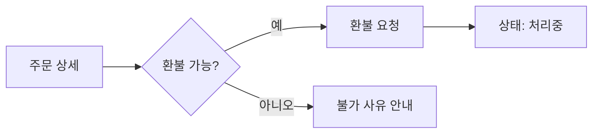

# 환불 버튼 기획 (샘플)

markdown 원문을 기획서 덱으로 변환하는 데모입니다. 우측 패널에서 원문을 그대로 볼 수 있습니다.

## 문제 정의

주문 상세 화면에서 환불을 셀프로 요청할 방법이 없어, 환불 문의가 상담 채널로 몰린다.

> [!WARNING]
> 부분 환불 / 전체 환불 정책이 아직 확정되지 않았다. 확정 후 이 덱을 갱신해야 한다.

## 목표

- 주문 상세에서 셀프 환불 요청
- 환불 상태를 주문 타임라인에 표시
- 상담 채널 환불 문의 30% 감소

## 사용자 플로우

## 기능 요구사항

| ID | 기능 | 우선순위 |
| --- | --- | --- |
| F1 | 환불 요청 버튼 | P0 |
| F2 | 부분 환불 금액 입력 | P1 |
| F3 | 환불 상태 배지 | P1 |
