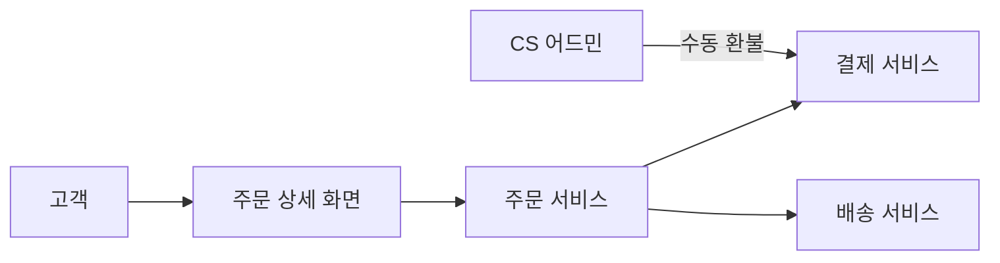
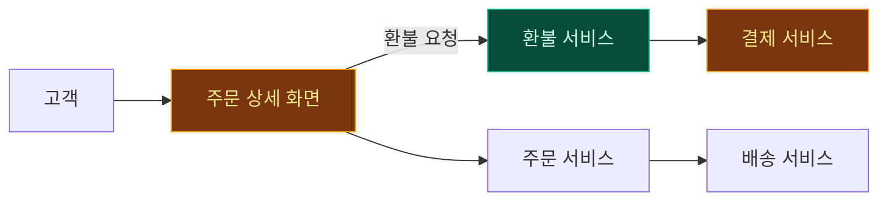

# 주문 환불 기능 기획서

## 배경 / 왜 지금인가

현재 환불은 CS 상담원이 어드민에서 **수동**으로 처리한다. 평균 처리 1.5일, 전체 CS 인입의 22%가 환불 문의다. 셀프 환불 수단이 없어 고객 이탈과 CS 비용이 함께 커지고 있고, 이는 3분기 "CS 비용 30% 절감" 목표와 정면으로 걸린다.

> [!IMPORTANT]
> 이 기능은 신규 **환불 서비스**를 추가하고, 기존 **주문 상세 화면**과 **결제 서비스**를 수정한다. 교환/반품은 이번 범위가 아니다.

## 전체 서비스 구조 (As-Is)

지금은 환불 경로가 없고, CS 어드민이 결제 서비스를 직접 조작한다.

## 이 기능의 위치 (To-Be)

신규 **환불 서비스**가 들어가고, 고객이 화면에서 직접 환불을 요청한다. 🟢 신규 · 🟡 수정 노드만 색으로 강조했다.

- 🟢 **신규**: 환불 서비스 (요청 접수·정책 판정·상태 관리)
- 🟡 **수정**: 주문 상세 화면(환불 버튼·상태 배지), 결제 서비스(부분/전체 환불 API)

## 변경점 (As-Is → To-Be)

| 영역 | 현재 (As-Is) | 변경 후 (To-Be) |
| --- | --- | --- |
| 환불 요청 | CS 상담원 수동 처리 | 고객이 주문 상세에서 셀프 요청 |
| 결제 서비스 | 전체 환불만 지원 | 부분/전체 환불 API 신설 |
| 주문 상세 | 환불 상태 표시 없음 | 환불 상태 배지 + 타임라인 |
| 처리 시간 | 평균 1.5일 | 즉시 접수, 자동 판정 |

## 목표 / 비목표

- 목표: 셀프 환불 요청, 부분 환불, 환불 상태 가시화
- 비목표: 교환/반품(별도 기획), 해외 결제 환불, 포인트 환불

## 기능 요구사항

| ID | 기능 | 우선순위 |
| --- | --- | --- |
| F1 | 주문 상세 환불 요청 버튼 | P0 |
| F2 | 부분 환불 금액 입력 | P1 |
| F3 | 환불 상태 배지·타임라인 | P1 |

## 성공지표

| 지표 | 현재 (baseline) | 목표 (3분기) |
| --- | --- | --- |
| CS 환불 인입 비중 | 22% | 15% |
| 평균 환불 처리 시간 | 1.5일 | 10분 |

## 예외처리

- 결제 서비스 응답 없음 → "처리중"으로 접수 후 재시도, 3회 실패 시 CS 이관
- 이미 환불된 주문 → 버튼 비활성 + 안내
