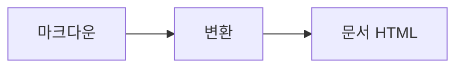

# 데크 문서 렌더 테스트 기획서

이 문서는 `action:deck` 문서 경로가 모든 블록 타입을 결정론적으로 렌더하는지
검증하기 위한 픽스처다. 원문에 없는 내용은 어디에도 나타나면 안 된다.

## 배경

markdown 만으로는 화면·흐름·데이터를 머릿속으로 재구성해야 해서 이해가 느리다.

> [!WARNING]
> 이 문단은 콜아웃(주의)으로 렌더되어야 한다.

## 목표 / 비목표

- 목표: 모든 블록 타입을 결정론적으로 렌더한다
- 비목표: 원문에 없는 내용을 지어내지 않는다

## 성공지표

| 지표 | 현재 | 목표 |
| --- | --- | --- |
| 렌더 시간 | 5s | 0.2s |
| 산출물 크기 | 4MB | 30KB |

## 사용자 플로우



## 기능 요구사항

| ID | 기능 | 우선순위 |
| --- | --- | --- |
| F1 | 문서 렌더 | P0 |
| F2 | mermaid 폴백 | P1 |
| F3 | <script>alert(1)</script> 이스케이프 | P2 |

## 작업 순서

1. 초안 작성
   - 개요 잡기
   - 초안 검토
2. 리뷰 반영
3. 배포

## 순수함수 · 파이프라인 (Pure functions & pipeline)

```
flow(
  normalizeInput,   // 원문 → 정규화된 값
  validateInput,    // 정규화된 값 → 검증 결과
  buildCommand,     // 검증 결과 → 명령
)
```

| # | 단계 | 받는 값 → 돌려주는 값 | 순수/부수효과 |
|---|---|---|---|
| 1 | normalizeInput | 원문 → 정규화된 값 | 순수 |
| 2 | validateInput | 정규화된 값 → 검증 결과 | 순수 |
| 3 | buildCommand | 검증 결과 → 명령 | 순수 |

- 부수효과 위치: 파이프라인 입구(원문 읽기)와 출구(명령 실행)에만 둔다.
- 재사용: normalizeInput 은 기존 입력 정규화 단계를 그대로 쓴다.

## 세부 계획

- 상위 항목
  - 하위 A
  - 하위 B
- 다른 상위 항목

### 리스크

일정 지연 가능성이 있다.

## 담당표

| 담당 지표관리자 | 현재상태 | 목표일자 |
| --- | --- | --- |
| 홍길동 | 진행중 | 3월 |

## 예외처리

```json
{ "offline": true, "fallback": "mermaid-source-text" }
```

## 화면 목업

```screen
{
  "title": "/campaigns",
  "nav": { "items": ["대시보드", "캠페인 관리"], "active": "캠페인 관리" },
  "body": [
    { "type": "header", "title": "전화번호부 관리" },
    { "type": "table", "columns": ["캠페인명", "상태"], "rows": [["월말 갱신 리마인드", { "badge": "대기", "tone": "muted" }]] }
  ]
}
```

## 깨진 화면 목업

```screen
{ this is not valid json,,, }
```
