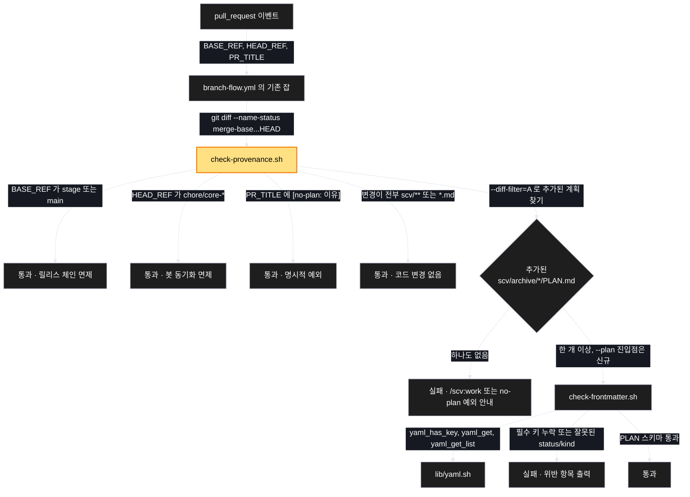

# Architecture — 계획 없는 구현 PR 을 CI 가 막는다 (프로버넌스 게이트)

> 이 계획의 구성 요소 흐름. **`/scv:work` 전에 검토하고 고칠 것** —
> 다이어그램은 LLM 이 생성한 것이라 부정확할 수 있다.

## 1. Component data flow

PR 하나가 게이트를 통과하는 경로. 노란색은 이 계획이 새로 만드는 것이다.
면제 네 갈래는 모두 통과로 빠지고, 남은 PR 만 본 검사와 스키마 검사를 받는다.

`lib/yaml.sh` 는 새로 만들지 않고 그대로 쓴다 — `yaml_get_list` 가 인라인
flow(`raw_sources: []`) 와 block 두 형식을 이미 처리하고, 실제 아카이브된 계획
8 개 중 7 개가 flow 형식이다.

## 2. Position in whole architecture

> Skipped — no graphify graph available.
> Run `/graphify` and re-run `/scv:promote` on this folder to generate diagram 2.
