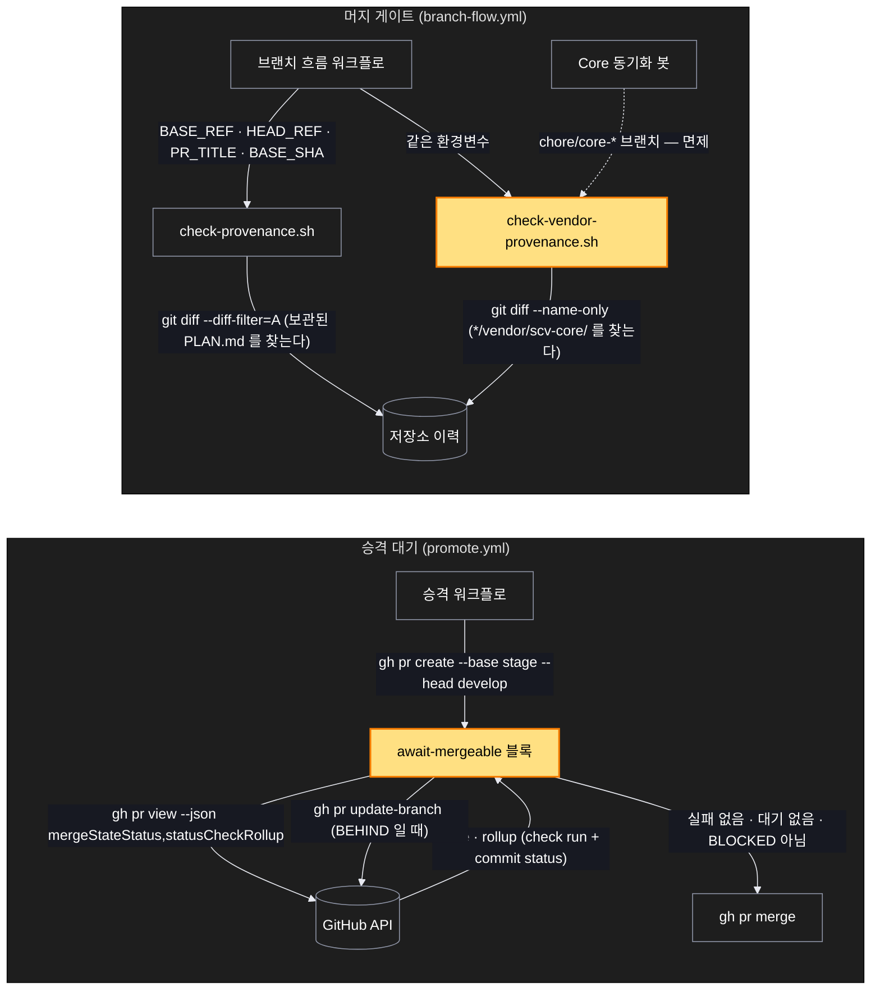

# Architecture — 승격 대기 판정과 벤더 게이트

> 이 기능의 두 갈래를 그림으로 본 것. **`/scv:work` 전에 검토하고 고칠 것** —
> 다이어그램은 생성된 것이고 부정확할 수 있다.

## 1. Component data flow

두 기계장치가 어디서 무엇을 묻는지. 왼쪽은 승격이 언제 머지해도 되는지 판정하는
경로, 오른쪽은 PR 이 머지될 자격이 있는지 판정하는 경로다. 둘은 서로를 모른다 —
같은 릴리스에서 고쳐질 뿐 결합돼 있지 않다.

세 화살표만 따로 짚어둔다.

- `GitHubAPI → AwaitBlock` 이 이 계획의 전부다. 예전에는 이 자리에서 **개수**를
  받았다. 지금은 판정(`mergeStateStatus`)과 원자료(rollup)를 함께 받아 세 조건을
  각각 확인한다.
- `SyncBot ⇢ VendGate` 가 점선인 이유는 봇이 게이트를 호출하지 않기 때문이다.
  봇은 브랜치 이름만 남기고, 게이트가 그 이름을 보고 비켜준다.
- `ProvGate` 와 `VendGate` 는 같은 저장소 이력을 읽지만 다른 질문을 한다. 앞은
  "무엇이 이 변경을 만들었나", 뒤는 "누가 핀을 옮겼나".

## 2. Position in whole architecture

> Source: omitted — first diagram only

graphify 그래프가 없어 생략한다. 이 계획은 시스템 구조를 바꾸지 않고 이미 있는 두
워크플로 안쪽만 고치므로, 두 번째 다이어그램이 더할 정보가 없다.
