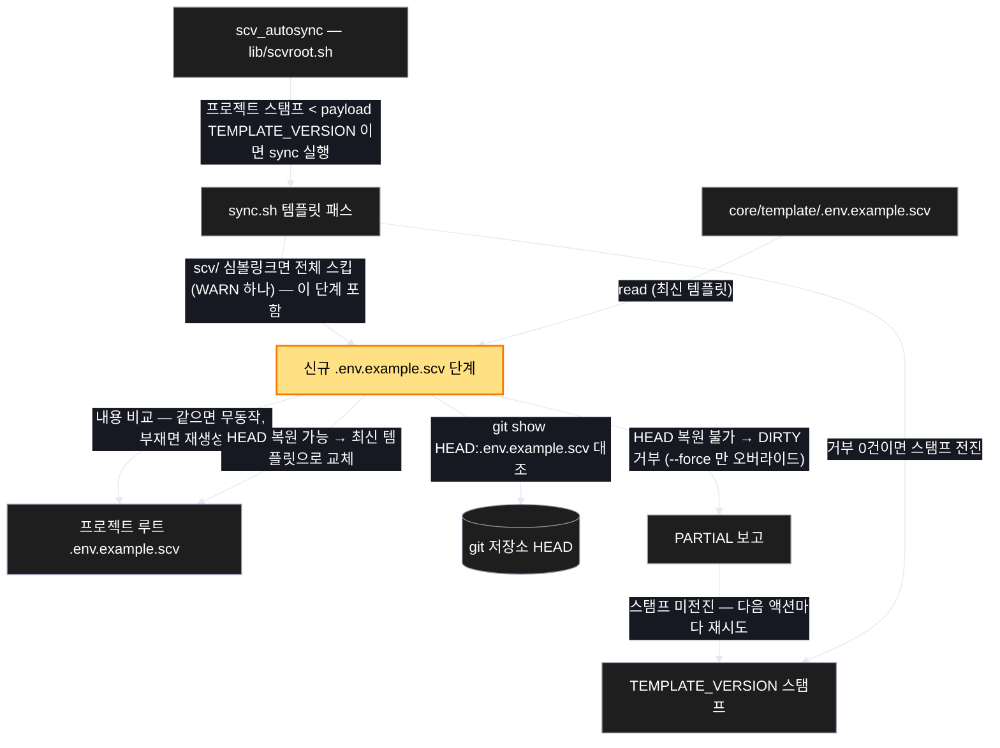
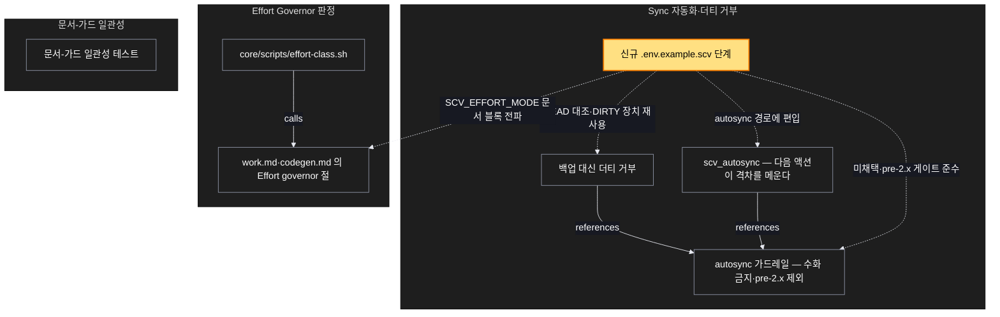

# Architecture — .env.example.scv 자동 최신화 — root 불가침의 명명된 예외

> Two-diagram view of this feature. **Review and edit before `/scv:work`** —
> diagrams are LLM-generated and may have inaccuracies.

## 1. Component data flow

How this feature's components interact.

## 2. Position in whole architecture

Where this feature sits in the system. New components highlighted in yellow.

> Source: graphify graph (built 2026-08-18)

