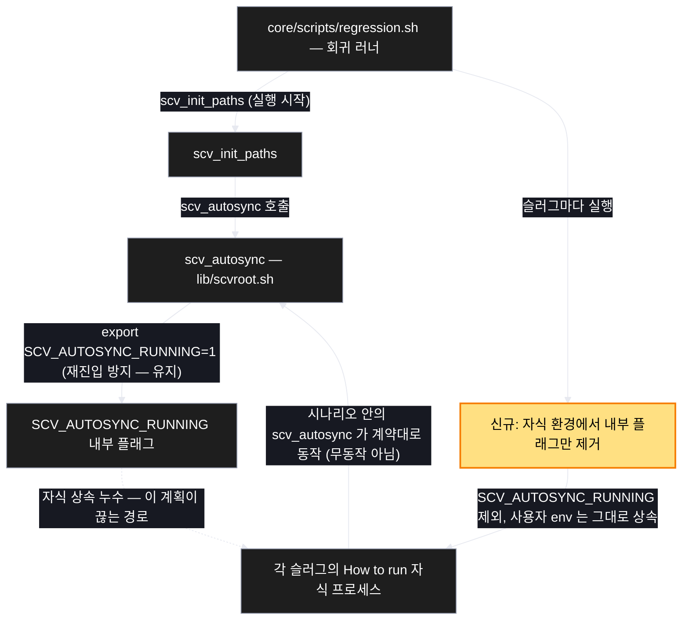

# Architecture — 회귀 러너의 autosync 가드 누수

> Two-diagram view of this feature. **Review and edit before `/scv:work`** —
> diagrams are LLM-generated and may have inaccuracies.

## 1. Component data flow

누수 인과 사슬과 이 계획이 끊는 지점.

## 2. Position in whole architecture

Where this feature sits in the system. New components highlighted in yellow.

> Source: graphify graph (built 2026-08-18)

