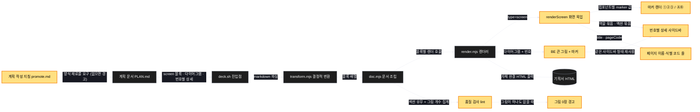
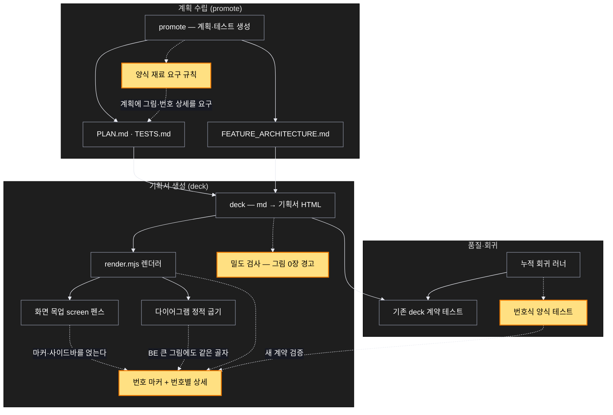

# Architecture — 번호식 화면설계서

> 이 기능의 두 장면. **작업 시작 전에 검토하고 고쳐 주세요** — 다이어그램은
> 자동 생성이라 부정확할 수 있습니다.

## 1. Component data flow

기획서를 만들 때 무엇이 무엇을 부르는지. 노란색이 이번에 새로 생기거나 바뀌는
부분입니다.



## 2. Position in whole architecture

이 기능이 SCV 전체에서 어디에 붙는지. 노란색이 이번에 새로 생기거나 바뀌는
부분입니다.

> Source: graphify graph (built 2026-08-26)



## 3. Screen mockups

이 기능이 만들어 낼 기획서 화면의 구조. 실제 스크린샷이 아니라 계획 내용에서
뽑은 와이어프레임입니다.

### FE 기획서 — 화면이 있는 경우

```screen
{
  "title": "회원가입 페이지",
  "pageCode": "FO-SU-02-01",
  "nav": { "items": ["거래소", "코인동향", "고객센터"], "active": "고객센터" },
  "body": [
    { "type": "header", "title": "회원가입", "subtitle": "만 19세 미만은 이용할 수 없습니다" },
    { "type": "form", "marker": "1", "fields": [{ "label": "이메일", "value": "" }] },
    { "type": "form", "marker": "2", "fields": [{ "label": "비밀번호 (8-16자)", "value": "" }] },
    { "type": "form", "marker": "3", "fields": [{ "label": "비밀번호 확인", "value": "" }] },
    { "type": "list", "marker": "4", "items": [
      { "label": "[필수] 만 19세 이상 서비스 이용 동의" },
      { "label": "[필수] 서비스 이용약관 동의" },
      { "label": "[선택] 마케팅 정보 수신 동의" }
    ] },
    { "type": "button", "marker": "A", "label": "회원가입", "variant": "primary" },
    { "type": "button", "marker": "B", "label": "로그인" }
  ],
  "functions": [
    { "marker": "1", "title": "이메일 인풋 박스", "step": "validateEmail", "notes": [
      "320자 초과 입력 막음 (앞자리 64자 + @ + 도메인 255자)",
      "포커스 아웃 시 형식 유효성 및 중복 여부 검사"
    ] },
    { "marker": "2", "title": "비밀번호 인풋 박스", "step": "validatePassword", "notes": [
      "8-16자 영문/숫자/기호 입력 가능, 16자 초과 입력 막음",
      "8자 미만 입력 시 검증 메시지 표시",
      "입력 시 실시간 가림 처리 + 보기 전환 제공"
    ] },
    { "marker": "3", "title": "비밀번호 확인 인풋 박스", "notes": [
      "비밀번호와 값이 다르면 검증 메시지 표시",
      "가림 처리는 하되 보기 전환은 제공하지 않음"
    ] },
    { "marker": "4", "title": "약관 동의 영역", "step": "collectConsents", "notes": [
      "개별 항목을 모두 체크하면 일괄 체크가 자동으로 켜진다",
      "필수 항목이 하나라도 빠지면 회원가입 버튼이 비활성 상태로 남는다"
    ] }
  ],
  "actions": [
    { "marker": "A", "title": "회원가입 버튼", "step": "buildSignupCommand", "notes": [
      "아래 조건을 모두 만족할 때만 활성화된다",
      "1) 이메일·비밀번호·비밀번호 확인이 모두 유효",
      "2) 필수 약관이 모두 체크됨",
      "실패 시: 어느 항목이 왜 막혔는지 해당 인풋 하단에 표시",
      "완료 시: 이메일 인증 안내로 이동 (PC: FO-SU-02-02)"
    ] },
    { "marker": "B", "title": "로그인 버튼", "notes": [
      "클릭 시 로그인 페이지로 이동 (PC: FO-SU-01-01)"
    ] }
  ],
  "states": [
    { "marker": "1", "label": "기본", "body": [
      { "type": "form", "fields": [{ "label": "이메일" }] }
    ] },
    { "marker": "1", "label": "입력 중", "body": [
      { "type": "form", "fields": [{ "label": "이메일", "value": "germ" }] }
    ] },
    { "marker": "1", "label": "Invalid", "body": [
      { "type": "form", "fields": [{ "label": "이메일", "value": "germ@" }] },
      { "type": "text", "value": "이메일 주소를 확인해주세요." }
    ] },
    { "marker": "2", "label": "가림 / 보기 전환", "body": [
      { "type": "form", "fields": [{ "label": "비밀번호", "value": "●●●●●●" }] }
    ] }
  ],
  "validations": [
    { "marker": "1, A", "when": "포커스 아웃 / 제출", "condition": "이메일 형식 오류", "message": "이메일 주소를 확인해주세요.", "shownAs": "인풋 하단 문구" },
    { "marker": "1", "when": "포커스 아웃", "condition": "이미 사용 중인 이메일", "message": "이미 사용 중인 이메일 주소입니다.", "shownAs": "인풋 하단 문구" },
    { "marker": "2, A", "when": "제출", "condition": "비밀번호가 8-16자를 벗어남", "message": "비밀번호는 8-16자로 입력해주세요.", "shownAs": "인풋 하단 문구" },
    { "marker": "3, A", "when": "제출", "condition": "비밀번호와 확인 값이 다름", "message": "비밀번호가 일치하지 않습니다.", "shownAs": "인풋 하단 문구" },
    { "marker": "4, A", "when": "제출", "condition": "필수 약관 미동의", "message": "필수 약관에 동의해주세요.", "shownAs": "약관 영역 하단 문구" },
    { "marker": "A", "when": "가입 완료", "condition": "정상 처리", "message": "회원가입을 완료하였습니다. 이메일 인증을 진행하시겠습니까?", "shownAs": "알림 팝업 (예 / 나중에)" }
  ]
}
```

### BE 기획서 — 화면이 없는 경우 (같은 골자)

화면이 없으므로 **구성도와 순서도가 큰 그림 자리를 대신**합니다. 맨 위에 **어느
화면의 어느 요소가 이 API를 부르는지**를 두어, 백엔드만 보는 사람도 맥락을 잃지
않게 합니다. 오른쪽 상세는 FE와 같은 형태로 **역할과 입출력만** 남기고, 순서는
순서도로, 실패는 표로, 데이터 모양은 스키마 카드로 옮겼습니다.

```screen
{
  "title": "인증 서비스 — 로그인",
  "pageCode": "BE-AUTH-01",
  "screenRefs": [
    { "calls": "1", "name": "로그인 페이지", "pageCode": "FO-SU-01-01", "element": "Ⓐ 로그인 버튼", "when": "필수 입력이 모두 유효할 때 클릭" },
    { "calls": "1", "name": "회원가입 완료", "pageCode": "FO-SU-02-02", "element": "자동 로그인", "when": "이메일 인증 완료 직후" },
    { "calls": "2", "name": "모든 화면", "pageCode": "-", "element": "토큰 만료 감지", "when": "접근 토큰 만료 시 갱신 요청" }
  ],
  "diagram": [
    { "label": "구성 — 무엇이 무엇을 부르는가", "code": "flowchart LR\n  C[클라이언트] -->|\"POST /auth/login\"| A[\"① 인증 API\"]\n  A -->|\"findByEmail\"| S[(\"③ users\")]\n  A -->|\"issueToken\"| T[\"② 토큰 발급\"]\n  T -->|\"insert\"| R[(\"④ refresh_tokens\")]\n  A -->|\"insert\"| L[(\"⑤ login_attempts\")]" },
    { "label": "순서 — 요청 하나가 어떻게 처리되는가", "code": "sequenceDiagram\n  autonumber\n  participant C as 클라이언트\n  participant A as ① 인증 API\n  participant S as ③ users\n  participant T as ② 토큰 발급\n  participant R as ④ refresh_tokens\n  participant L as ⑤ login_attempts\n  C->>A: POST /auth/login (이메일, 비밀번호)\n  A->>L: 최근 실패 횟수 조회\n  alt 임계치 초과\n    A-->>C: 423 잠금\n  else 통과\n    A->>S: findByEmail(email)\n    alt 없음 또는 해시 불일치\n      A->>L: 실패 1건 기록\n      A-->>C: 401 (어느 쪽인지 밝히지 않음)\n    else 일치\n      A->>T: issueToken(userId)\n      T->>R: 기존 토큰 폐기 + 새 토큰 해시 저장\n      A->>L: 성공 1건 기록\n      A-->>C: 200 접근 토큰 + 갱신 토큰\n    end\n  end" }
  ],
  "functions": [
    { "marker": "1", "title": "인증 API — POST /auth/login", "step": "authenticate", "notes": [
      "역할: 로그인 요청 하나를 토큰 한 쌍으로 바꾸는 입구. 판단만 하고 저장은 아래에 맡긴다",
      "받는 값 → 돌려주는 값: (이메일, 비밀번호) → (접근 토큰, 갱신 토큰)"
    ] },
    { "marker": "2", "title": "토큰 발급 함수 — issueToken(userId)", "step": "issueToken", "notes": [
      "역할: 사용자 식별자를 토큰 한 쌍으로 바꾸는 변환 + 갱신 토큰 저장",
      "받는 값 → 돌려주는 값: (사용자 식별자, 발급 시각) → (접근 토큰, 갱신 토큰)"
    ] },
    { "marker": "3", "title": "users — findByEmail(email)", "step": "findUser", "notes": [
      "역할: 이메일로 사용자와 비밀번호 해시를 찾아 주는 읽기 창구",
      "받는 값 → 돌려주는 값: (이메일) → (사용자 · 해시 · 상태) 또는 빈 값"
    ] },
    { "marker": "4", "title": "refresh_tokens", "notes": [
      "역할: 갱신 토큰의 유효성을 판단하는 유일한 근거"
    ] },
    { "marker": "5", "title": "login_attempts", "notes": [
      "역할: 잠금 판단과 사후 추적의 근거"
    ] }
  ],
  "statesTitle": "데이터 모양 (테이블 스키마)",
  "states": [
    { "marker": "3", "label": "users", "body": [
      { "type": "table", "columns": ["컬럼", "비고"], "rows": [
        ["id", "PK"],
        ["email", "UNIQUE 인덱스 — 없으면 로그인마다 전체 훑기"],
        ["password_hash", "원문 저장 금지"],
        ["status", "활성 / 휴면 / 탈퇴"]
      ] }
    ] },
    { "marker": "4", "label": "refresh_tokens", "body": [
      { "type": "table", "columns": ["컬럼", "비고"], "rows": [
        ["user_id", "인덱스"],
        ["token_hash", "원문이 아니라 해시만"],
        ["expires_at", "만료분 정리 작업 필요"],
        ["revoked_at", "재사용 감지 시 사용자 전체 폐기"]
      ] }
    ] },
    { "marker": "5", "label": "login_attempts", "body": [
      { "type": "table", "columns": ["컬럼", "비고"], "rows": [
        ["email", "(email, created_at) 복합 인덱스"],
        ["succeeded", "성공도 기록 — 빠지면 추적이 끊긴다"],
        ["created_at", "보관 기간을 정하지 않으면 계속 커진다"],
        ["source_ip", "사후 추적용"]
      ] }
    ] }
  ],
  "validations": {
    "title": "실패 · 응답 표",
    "columns": ["번호", "조건", "응답", "본문 · 메시지", "기록 · 데이터 영향"],
    "rows": [
      ["1", "최근 실패가 임계치 초과", "423", "잠시 후 다시 시도해주세요.", "⑤ 조회만"],
      ["1", "이메일 없음 / 비밀번호 해시 불일치", "401", "이메일 또는 비밀번호를 확인해주세요 (어느 쪽인지 밝히지 않음)", "⑤에 실패 1건"],
      ["1", "정상", "200", "접근 토큰 + 갱신 토큰", "⑤에 성공 1건, ④에 토큰 1건 — 한 트랜잭션"],
      ["2", "서명 키 부재", "500", "-", "④ 쓰기 없음 — 토큰 없이 200을 돌려주지 않는다"],
      ["2", "폐기된 갱신 토큰 재사용", "401", "다시 로그인해주세요.", "④ 해당 사용자 전체 폐기 (탈취 대응)"],
      ["3", "사용자 없음", "-", "예외 대신 빈 값", "호출 측이 401로 통일"]
    ]
  }
}
```
