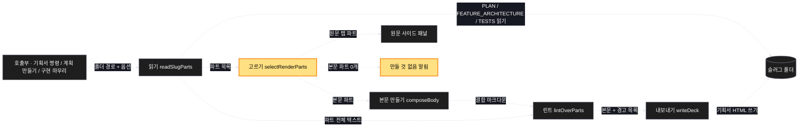

# Architecture — 기획서는 그림만

> 이 기능의 두 장짜리 그림. **구현 전에 읽고 고쳐주세요** — 그림은 생성된 것이라
> 틀린 데가 있을 수 있습니다.

## 1. Component data flow

기획서를 만드는 파이프라인이 어떻게 갈라지는가.



## 2. Position in whole architecture

> 건너뜀 — 지식 그래프를 갱신하지 않기로 했습니다.
> `/graphify` 를 돌린 뒤 이 폴더로 `/scv:promote` 를 다시 실행하면 그려집니다.

## 3. Screen mockups

### 기획서 조립 (화면 없음 — 구성 + 순서)

```screen
{
  "title": "기획서 조립 파이프라인",
  "pageCode": "DECK-BUILD-01",
  "screenRefs": [
    { "calls": "2", "name": "기획서 명령", "pageCode": "action:deck", "element": "폴더 경로 인자", "when": "사용자가 슬러그 폴더를 직접 넘길 때" },
    { "calls": "2", "name": "계획 만들기", "pageCode": "action:promote", "element": "기획서 생성 단계", "when": "계획 폴더를 만든 직후" },
    { "calls": "2", "name": "구현 마무리", "pageCode": "action:work", "element": "아카이브 후 재생성", "when": "계획을 아카이브한 뒤" }
  ],
  "diagram": [
    {
      "label": "구성 — 누가 무엇을 부르는가",
      "code": "flowchart LR\n  H[\"호출부\"] --> A[\"① 읽기\"]\n  A --> B[\"② 고르기\"]\n  B --> C[\"③ 본문 만들기\"]\n  C --> D[\"④ 린트\"]\n  D --> E[\"⑤ 내보내기\"]\n  B -.-> F[\"⑥ 만들 것 없음\"]\n  A --> G[(\"⑦ 슬러그 폴더\")]\n  E --> G"
    },
    {
      "label": "순서 — 한 번의 호출이 어떻게 갈라지는가",
      "code": "sequenceDiagram\n  autonumber\n  participant H as 호출부\n  participant A as ① 읽기\n  participant B as ② 고르기\n  participant E as ⑤ 내보내기\n  H->>A: 폴더 경로 + 옵션\n  A->>B: 있는 파트 목록\n  alt 되살리기 옵션 켜짐\n    B->>E: 본문 = 파트 전부\n    E-->>H: 기획서 HTML (예전과 동일)\n  else 기본값 · 그림 문서 있음\n    B->>E: 본문 = 그림 문서만\n    E-->>H: 기획서 HTML (그림만)\n  else 기본값 · 그림 문서 없음\n    B-->>H: 만들 것 없음 · 종료 0\n  end"
    }
  ],
  "functions": [
    {
      "marker": "1",
      "title": "읽기 (readSlugParts)",
      "step": "readSlugParts",
      "notes": [
        "역할 — 폴더에 실제로 있는 파트를 목록으로 만든다",
        "받는 값 → 돌려주는 값: 폴더 경로 → 파트 목록 (파일명 · 라벨 · 원문)",
        "하는 일: 계획 · 구조 · 테스트 세 파일을 읽는 순서대로 확인하고, 있는 것만 담는다",
        "실패: 셋 다 없으면 지금처럼 오류로 멈춘다 (변경 없음)",
        "부수효과: 파일 읽기 — 파이프라인의 입구"
      ]
    },
    {
      "marker": "2",
      "title": "고르기 (selectRenderParts) — 새로 생기는 단계",
      "step": "selectRenderParts",
      "notes": [
        "역할 — 무엇을 본문으로 삼고 무엇을 원문 탭으로 넘길지 나눈다",
        "받는 값 → 돌려주는 값: (파트 목록, 옵션) → { 본문 파트, 원문 탭 파트 }",
        "하는 일: 기본값이면 본문 = 구조 문서 하나, 되살리기 옵션이면 본문 = 파트 전부. 원문 탭은 어느 쪽이든 있는 파트 전부",
        "실패: 본문 파트가 0개면 ⑥으로 빠진다 — 오류가 아니다",
        "순수 — 값만 다룬다"
      ]
    },
    {
      "marker": "3",
      "title": "본문 만들기 (composeBody)",
      "step": "composeBody",
      "notes": [
        "역할 — 고른 파트를 하나의 마크다운으로 잇는다",
        "받는 값 → 돌려주는 값: 본문 파트 → 결합 마크다운",
        "하는 일: 첫 파트가 제목을 갖고, 나머지는 라벨 밑으로 들어간다 (지금 규칙 그대로). 본문 파트가 하나면 구분선과 라벨을 붙이지 않는다",
        "순수"
      ]
    },
    {
      "marker": "4",
      "title": "린트 (lintOverParts) — 입력이 바뀌는 단계",
      "step": "lintOverParts",
      "notes": [
        "역할 — 기획서에 있어야 할 절이 빠졌는지 알린다",
        "받는 값 → 돌려주는 값: (결합 마크다운, 파트 목록 전체) → 경고 목록",
        "하는 일: 절 존재 판정은 파트 전체를 훑고, 그림 밀도 판정은 본문을 훑는다. 판정 규칙 자체는 바꾸지 않는다",
        "실패: 여기서 본문만 훑으면 계획 문서를 뺀 순간 비목표 · 성공지표 · 인수기준 · 예외처리 · 순수함수 경고가 전부 거짓으로 뜬다 — 이 단계가 존재하는 이유",
        "순수"
      ]
    },
    {
      "marker": "5",
      "title": "내보내기 (writeDeck)",
      "step": "writeDeck",
      "notes": [
        "역할 — 완성된 본문과 경고를 하나의 HTML 파일로 쓴다",
        "받는 값 → 돌려주는 값: (본문, 경고) → 기획서 HTML 경로",
        "하는 일: 지금과 동일. 원문 사이드 패널에는 ②가 넘긴 파트 전부가 탭으로 들어간다",
        "부수효과: 파일 쓰기 — 파이프라인의 출구"
      ]
    },
    {
      "marker": "6",
      "title": "만들 것 없음 알림 — 새로 생기는 길",
      "notes": [
        "역할 — 그림 문서가 없을 때 빈 문서 대신 사실을 알린다",
        "하는 일: HTML 을 쓰지 않고 사유 한 줄을 출력한 뒤 정상 종료한다",
        "실패: 호출부가 이걸 오류로 받아 흐름을 멈추면 안 된다 — 종료 코드 0",
        "근거: 계획과 테스트 내용은 이미 계획 문서와 테스트 문서에 있다"
      ]
    },
    {
      "marker": "7",
      "title": "슬러그 폴더 (읽고 쓰는 자리)",
      "notes": [
        "역할 — 입력 세 파일이 있고, 출력 기획서 HTML 이 놓이는 곳",
        "읽기: 계획 · 구조 · 테스트 (①이 읽음)",
        "쓰기: 기획서 HTML 한 개 (⑤가 씀)",
        "영향: 그림 문서가 없는 폴더는 이번 변경 뒤 새 HTML 이 생기지 않는다. 이미 있던 파일은 지우지 않으므로 그대로 남는다"
      ]
    }
  ],
  "statesTitle": "본문이 갖는 세 가지 모습 (②의 상태)",
  "states": [
    {
      "marker": "2",
      "label": "기본값 · 그림 문서 있음",
      "body": [
        { "type": "list", "items": [
          { "label": "본문 — 구조 문서만" },
          { "label": "원문 탭 — 계획 · 구조 · 테스트" }
        ] }
      ]
    },
    {
      "marker": "2",
      "label": "기본값 · 그림 문서 없음",
      "body": [
        { "type": "list", "items": [
          { "label": "본문 — 없음 (HTML 만들지 않음)" },
          { "label": "출력 — 사유 한 줄, 종료 0" }
        ] }
      ]
    },
    {
      "marker": "2",
      "label": "되살리기 옵션",
      "body": [
        { "type": "list", "items": [
          { "label": "본문 — 계획 · 구조 · 테스트 전부" },
          { "label": "원문 탭 — 동일 (예전과 같은 결과)" }
        ] }
      ]
    }
  ],
  "validations": {
    "title": "갈림길 · 결과 표",
    "columns": ["번호", "조건", "결과", "알림 문구", "종료 코드 · 영향"],
    "rows": [
      ["2", "기본값 · 구조 문서 있음", "그림만 렌더", "없음", "0 · 기획서 HTML 1개"],
      ["2, 6", "기본값 · 구조 문서 없음", "만들지 않음", "그림 문서가 없어 기획서를 만들지 않았습니다", "0 · 파일 변화 없음"],
      ["2", "되살리기 옵션", "전체 결합", "없음", "0 · 예전과 같은 결과"],
      ["1", "세 파일 모두 없음", "오류", "폴더에 계획 · 구조 · 테스트가 없습니다", "1 · 지금 동작 그대로"],
      ["4", "본문에 그림이 하나도 없음", "만들되 경고", "그림이 없습니다", "0 · 경고 1건"]
    ]
  }
}
```
