# Architecture — 기획서 그림이 서로 겹친다

> 이 문서의 그림들 자체가 이번 고침의 재료다. 지금은 셋 다 같은 id 를 받으므로,
> 고치기 전에는 겹쳐 보이는 것이 정상이다.

## 1. Component data flow

기획서가 만들어지는 마지막 단계. 바깥 두 곳만 파일과 브라우저를 만지고, 가운데
다섯 단계는 문자열만 다룬다. **id 를 만드는 단계 하나만 갈아 끼운다.**

```mermaid
%%{init: {'theme':'base', 'themeVariables': {'primaryColor':'#1e1e1e','primaryTextColor':'#fff','primaryBorderColor':'#9096a8','lineColor':'#e7e9f0','secondaryColor':'#2d2d2d','tertiaryColor':'#1e1e1e','background':'#171922','edgeLabelBackground':'#171922'}}}%%
flowchart LR
  Browser[("헤드리스 브라우저")]
  Extract["① 그림 조각 뽑기"]
  Derive["② id 만들기 (교체 대상)"]
  Rewrite["③ 참조 갈아 끼우기"]
  Size["④ 크기 싣기"]
  Splice["⑤ 문서에 되돌려 넣기"]
  DeckFile[("기획서 파일")]

  Browser -->|"그려진 문서 HTML"| Extract
  Extract -->|"그림 조각 목록"| Derive
  Derive -->|"조각 + 그 조각의 고유 id"| Rewrite
  Rewrite -->|"스타일·화살촉 참조가 새 id 로"| Size
  Size -->|"폭·높이가 실린 조각"| Splice
  Splice -->|"완성된 문서 HTML"| DeckFile
```



## 2. Position in whole architecture

이 고침이 시스템 어디에 앉는지. 새로 생기는 것은 노란색이다.

> Source: graphify graph (built 2026-08-26).

```mermaid
%%{init: {'theme':'base', 'themeVariables': {'primaryColor':'#1e1e1e','primaryTextColor':'#fff','primaryBorderColor':'#9096a8','lineColor':'#e7e9f0','secondaryColor':'#2d2d2d','tertiaryColor':'#1e1e1e','background':'#171922','edgeLabelBackground':'#171922'}}}%%
flowchart TB
  subgraph C5["Mermaid Rendering Repair"]
    M1["SVG 정규화 4단계"]
    M2["인라인 색 제거의 대가"]
    M3["제일 큰 원인은 색이 아니라 크기"]
  end
  subgraph C11["Numbered Wireframe Sample"]
    W1["화면설계 시트 레이아웃"]
    W2["번호 마커 체계"]
  end
  subgraph C1["Deck Theme & Effort Policy"]
    T1["다크 전용 결정"]
    T2["단일 테마·렌더러 결정"]
  end

  N1["그림별 고유 id"]:::new
  N2["빈 그림 없애기"]:::new

  M1 --> M2
  M2 --> M3
  T1 --> T2
  W1 --> W2

  N1 -.->|"정규화 4단계 중 id 단계를 교체"| M1
  N1 -.->|"바이트 안정성 계약을 그대로 물려받음"| T2
  N2 -.->|"시트 레이아웃에서 폭이 0으로 측정"| W1
  N2 -.->|"크기 문제라는 같은 계열"| M3

  classDef new fill:#FFE082,stroke:#F57C00,stroke-width:2px,color:#000
```



## 3. Screen mockups

화면이 없는 고침이라 큰 그림 자리는 증상도가 대신한다. 번호는 그림과 아래 설명이
같은 것을 가리킨다.

### 지금 무슨 일이 일어나는가

```screen
{
  "title": "같은 id 가 만드는 겹침",
  "pageCode": "SCV-DECK-MMD-01",
  "autoMarkers": false,
  "diagram": [
    { "label": "증상",
      "code": "flowchart TB\n  D1[\"① 그림 A\"] --> X{{\"② 같은 id\"}}\n  D2[\"① 그림 B\"] --> X\n  D3[\"① 그림 C\"] --> X\n  X --> S[\"③ 스타일·화살촉이 서로 섞임\"]\n  S --> R[\"④ 겹쳐 보임\"]" }
  ],
  "functions": [
    { "marker": "1", "title": "한 문서의 그림들", "step": "extractSvgs",
      "notes": ["구조 문서 두 장과 화면설계 시트 한 장."] },
    { "marker": "2", "title": "고정 id", "step": "deriveId",
      "notes": ["재빌드해도 파일이 안 변하게 하려고 값을 하나로 고정했다."] },
    { "marker": "3", "title": "참조가 섞인다", "step": "rewriteRefs",
      "notes": ["머메이드는 id 로 스타일과 화살촉을 한정한다."] },
    { "marker": "4", "title": "겹쳐 보인다", "step": "spliceBack",
      "notes": ["여기에 빈 그림까지 더해져 크기가 무너진다."] }
  ],
  "validations": {
    "title": "고침 전후",
    "columns": ["항목", "지금", "고친 뒤"],
    "rows": [
      ["한 문서의 그림 id", "전부 같음", "그림마다 다름"],
      ["같은 그림, 다른 위치", "구분 불가", "같은 id 유지"],
      ["재빌드 산출물", "동일 (유지해야 함)", "동일"],
      ["화면설계 시트의 그림", "빈 그래픽", "내용과 크기 있음"]
    ]
  }
}
```
