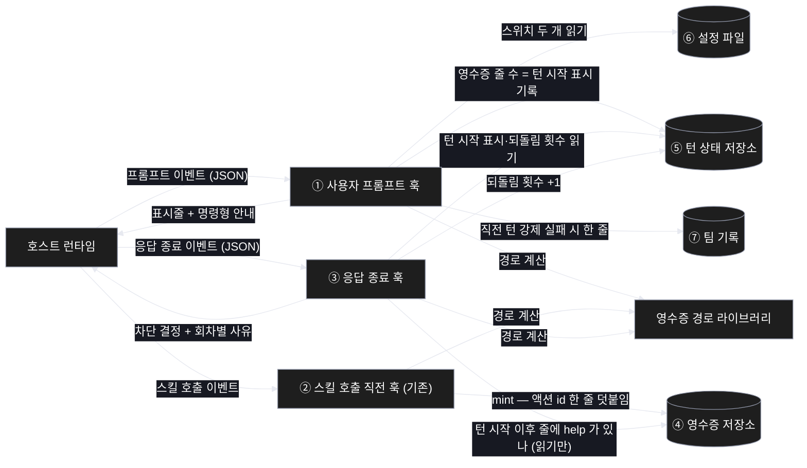
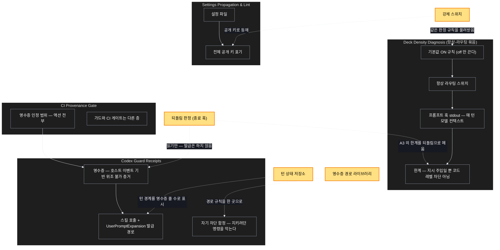

# Architecture — 일반 대화에서 scv:help 를 실제로 강제한다

> 이 기능을 두 장으로 본다. **`/scv:work` 전에 검토하고 고칠 것** — 다이어그램은
> 자동 생성이라 부정확할 수 있다.

## 1. Component data flow

세 훅이 각각 한 가지를 맡고, 저장소 세 곳을 공유한다. 판정의 근거가 되는 영수증은
**스킬 훅만 쓰고 종료 훅은 읽기만 한다** — 그 비대칭이 위조 불가라는 성질을 지킨다.



## 2. Position in whole architecture

이 기능이 시스템 어디에 앉는지. 새로 생기는 것은 노란색이다.

> Source: graphify graph (built 2026-08-26). 무리 이름은 graphify 가 붙인 것을 그대로
> 썼다. 다만 `Deck Density Diagnosis` 무리는 이름과 달리 **항상-라우팅 스위치 묶음**을
> 담고 있다 — 이번 기능의 전신이 거기 있어 그대로 두었다.



## 3. Screen mockups

화면이 없는 변경이라 큰 그림 자리는 구성도가 대신한다. 번호는 그림과 아래 설명이
같은 것을 가리킨다. 상세 계약은 계획서 본문에 있다.

### 강제 되돌림 — 구성과 판정

```screen
{
  "title": "help 강제 되돌림",
  "pageCode": "SCV-HOOK-FORCE-01",
  "autoMarkers": false,
  "screenRefs": [
    { "calls": "1", "name": "호스트 — 사용자 프롬프트 제출", "pageCode": "HOST-EV-PROMPT",
      "element": "사용자가 메시지를 보냄", "when": "매 턴 시작" },
    { "calls": "2", "name": "호스트 — 스킬 호출 직전", "pageCode": "HOST-EV-SKILL",
      "element": "모델이 액션을 호출", "when": "액션이 시작될 때" },
    { "calls": "3", "name": "호스트 — 응답 종료 직전", "pageCode": "HOST-EV-STOP",
      "element": "모델이 답을 끝내려 함", "when": "매 턴 종료, 되돌릴 때마다" }
  ],
  "diagram": [
    { "label": "구성",
      "code": "flowchart LR\n  H[\"호스트\"] --> P[\"① 프롬프트 훅\"]\n  H --> K[\"② 스킬 훅\"]\n  H --> S[\"③ 종료 훅\"]\n  P --> T[(\"⑤ 턴 상태\")]\n  P --> C[(\"⑥ 설정\")]\n  P --> J[(\"⑦ 팀 기록\")]\n  K --> R[(\"④ 영수증\")]\n  S --> T\n  S --> R\n  S -->|\"되돌림\"| H" }
  ],
  "functions": [
    { "marker": "1", "title": "사용자 프롬프트 훅", "step": "markTurnStart",
      "notes": ["이번 턴의 기준선을 세우고 표시줄을 띄운다."] },
    { "marker": "2", "title": "스킬 호출 직전 훅", "step": "mint",
      "notes": ["호출된 액션 id 를 영수증에 남긴다. 이번 변경 없음."] },
    { "marker": "3", "title": "응답 종료 훅", "step": "classifyTurn → decideStop",
      "notes": ["help 영수증이 없으면 되돌려 세운다. 자체 상한 없음."] },
    { "marker": "4", "title": "영수증 저장소", "step": "readTurnFacts",
      "notes": ["②만 쓰고 ③은 읽기만 한다 — 위조 불가라는 성질이 여기서 나온다."] },
    { "marker": "5", "title": "턴 상태 저장소", "step": "markTurnStart",
      "notes": ["턴 시작 표시와 되돌림 횟수 두 값. 세션과 함께 사라진다."] },
    { "marker": "6", "title": "설정 파일", "step": "readSettings",
      "notes": ["강제 스위치와 전체 라우팅 스위치."] },
    { "marker": "7", "title": "팀 기록", "step": "emitLines",
      "notes": ["끝내 실패한 턴을 한 줄 남긴다."] }
  ],
  "validations": {
    "title": "판정 표 — 무엇이 되돌리고 무엇이 통과하는가",
    "columns": ["조건", "결정", "사유 강도"],
    "rows": [
      ["영수증 없음 · 1회차", "되돌림", "요청"],
      ["영수증 없음 · 2회차", "되돌림", "첫 행동으로 지정"],
      ["영수증 없음 · 3회차", "되돌림", "규칙 위반 명시"],
      ["영수증 없음 · 4회차", "되돌림", "호출 형태 제시"],
      ["영수증 없음 · 5회차 이상", "되돌림", "최대 강도 고정"],
      ["턴 시작 이후 help 영수증 있음", "통과", "—"],
      ["다른 액션 영수증만 있음", "통과", "—"],
      ["턴 시작 표시 없음 · 저장소 불가", "통과", "고장은 열림으로"],
      ["하위 작업자 턴 · 스위치 off · scv 폴더 없음", "통과", "—"]
    ]
  }
}
```
