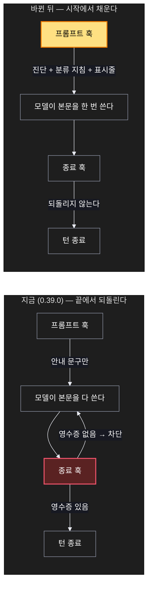
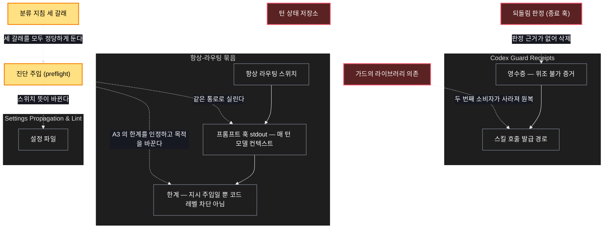

# Architecture — 강제를 preflight 로

> 바뀌는 것은 **강제 지점의 위치** 하나다. 턴의 끝에서 시작으로 옮기면 반복할
> 일 자체가 없어진다.

## 1. Component data flow

지금과 바뀐 뒤를 나란히 둔다. 위가 지금, 아래가 바뀐 뒤다.



## 2. Position in whole architecture

이 변경이 시스템 어디에 앉는지. 새로 생기는 것은 노란색, 없어지는 것은 붉은색이다.

> Source: graphify graph (built 2026-08-26).



## 3. Screen mockups

화면이 없는 변경이라 큰 그림 자리는 순서도가 대신한다. 번호는 그림과 아래 설명이
같은 것을 가리킨다.

### 한 턴에 무슨 일이 일어나는가

```screen
{
  "title": "preflight 로 바뀐 한 턴",
  "pageCode": "SCV-HOOK-PRE-01",
  "autoMarkers": false,
  "diagram": [
    { "label": "순서",
      "code": "sequenceDiagram\n  autonumber\n  participant H as 호스트\n  participant P as ① 프롬프트 훅\n  participant M as 모델\n  participant S as ② 종료 훅\n  H->>P: 사용자 메시지\n  P->>P: ③ 상태 점검 실행\n  P-->>H: 진단 + 분류 지침 + 표시줄\n  alt 앞을 보는 턴\n    M->>M: 대화 모드 호출\n  else 뒤를 보는 턴\n    M->>M: 아카이브 검색 호출\n  else 둘 다 아님\n    M->>M: 주입된 진단만 보고 답한다\n  end\n  M-->>H: 본문 (한 번)\n  H->>S: 응답 종료\n  S-->>H: 통과 — 되돌리지 않는다" }
  ],
  "functions": [
    { "marker": "1", "title": "프롬프트 훅", "step": "readSwitches → emitLines",
      "notes": ["턴 시작에 진단·지침·표시줄을 싣는다. 이것이 preflight 다."] },
    { "marker": "2", "title": "종료 훅", "step": "(없음)",
      "notes": ["강제 블록이 삭제된다. 저널 기록만 남는다."] },
    { "marker": "3", "title": "상태 점검", "step": "runProbe → trimToDiagnosis",
      "notes": ["전체 5,898바이트 중 진단 3,148바이트만 싣는다. 실측 0.45초."] }
  ],
  "validations": {
    "title": "전후 비교",
    "columns": ["항목", "지금 (0.39.0)", "바뀐 뒤"],
    "rows": [
      ["본문 생성", "되돌린 횟수만큼 반복", "항상 한 번"],
      ["강제 지점", "턴의 끝", "턴의 시작"],
      ["매 턴 주입", "안내 문구만", "진단 + 분류 지침"],
      ["앞도 뒤도 아닌 턴", "그래도 되돌림", "그냥 답한다"],
      ["가드", "라이브러리를 읽음", "다시 홀로 선다"],
      ["표시줄", "있음", "있음 (유지)"]
    ]
  }
}
```
