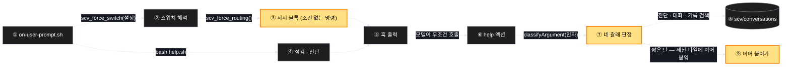

# Architecture — 분류를 걷어내고 무조건 부르게

> 판단이 어디서 어디로 옮겨가는지를 보는 그림. **작업 전에 읽고 고칠 것.**

## 1. Component data flow

굵은 노란 칸이 바뀌는 자리다. 판단은 ②에서 ⑥으로 옮겨가고, ⑨는 돌려보내지 않고 기록한다.



## 2. Position in whole architecture

> Skipped — 지식그래프 갱신을 생략했다.
> `/graphify` 를 돌리고 이 폴더로 `/scv:promote` 를 다시 실행하면 두 번째 그림이 생긴다.

## 3. Screen mockups

### 지시 블록 — 판단이 옮겨가는 자리

```screen
{
  "title": "preflight 지시 블록",
  "pageCode": "CORE-DIRECTIVE-01",
  "diagram": [
    {
      "label": "구성",
      "code": "flowchart LR\n  H[\"① 훅\"] --> S[\"② 스위치\"]\n  S --> D[\"③ 지시 (명령 하나)\"]\n  H --> P[\"④ 점검\"]\n  D --> O[\"⑤ 출력\"]\n  P --> O\n  O --> A[\"⑥ help 액션\"]\n  A --> C[\"⑦ 네 갈래 판정\"]\n  C --> W[(\"⑧ 대화 파일\")]\n  C --> E[\"⑨ 이어 붙이기\"]"
    },
    {
      "label": "순서",
      "code": "sequenceDiagram\n  autonumber\n  participant U as 사용자 메시지\n  participant D as ③ 지시\n  participant M as 모델\n  participant A as ⑥ help\n  U->>D: 턴 시작\n  D->>M: 판단하지 말고 지금 부르라\n  alt 이미 SCV 액션이 실렸거나 자동 알림\n    M-->>M: 부르지 않는다 (예외 둘)\n  else 그 외 전부\n    M->>A: 메시지 전문을 인자로 호출\n    A->>A: ⑦ 인자를 보고 갈래 판정\n    alt 새 주제다\n      A->>A: ⑧ 대화 파일을 연다\n    else 짧은 턴이다\n      A->>A: ⑨ 세션 파일에 이어 붙인다\n    end\n  end"
    }
  ],
  "functions": [
    {
      "marker": "1",
      "title": "프롬프트 훅",
      "step": "emitBlock",
      "notes": [
        "역할: 매 턴 지시와 진단을 실어 보내는 바깥층",
        "받는 값 → 돌려주는 값: 프롬프트 입력 → 지시 + 진단",
        "이번 변경 없음"
      ]
    },
    {
      "marker": "2",
      "title": "스위치 해석",
      "step": "readSwitches",
      "notes": [
        "역할: 라우팅을 켤지 끌지 정한다",
        "받는 값 → 돌려주는 값: 설정 값 → 켬/끔",
        "끄면 지시도 진단도 나가지 않는다 — 이번에도 그대로"
      ]
    },
    {
      "marker": "3",
      "title": "지시 블록",
      "step": "renderDirective",
      "notes": [
        "역할: 이 턴에 무엇을 할지 알려주는 명령 — 이번에 다시 쓰는 자리",
        "받는 값 → 돌려주는 값: 스위치 → 조건 없는 명령 문자열",
        "지금: 세 갈래를 제시하고 고르게 한다 (21줄)",
        "바뀜: 명령 하나 + 예외 둘 + 이유. 갈래·분류·조건 없음. 더 짧아진다",
        "남기는 것: 부르지 않으면 논의가 남지 않는다는 이유, 재조회 금지를 진단으로만 좁힌 문장"
      ]
    },
    {
      "marker": "4",
      "title": "점검 · 진단",
      "step": "probeProject",
      "notes": [
        "역할: 이번 턴의 프로젝트 상태를 만든다",
        "이번 변경 없음"
      ]
    },
    {
      "marker": "5",
      "title": "훅 출력",
      "step": "emitBlock",
      "notes": [
        "역할: 지시 → 진단 순서로 내보낸다",
        "요구하는 블록은 하나뿐이다 — 둘이면 서로를 약화시킨다"
      ]
    },
    {
      "marker": "6",
      "title": "help 액션",
      "step": "classifyArgument",
      "notes": [
        "역할: 호출을 받아 무엇을 할지 정한다",
        "받는 값 → 돌려주는 값: 메시지 전문 → 갈래 하나",
        "이번에 판단을 넘겨받는 쪽이다"
      ]
    },
    {
      "marker": "7",
      "title": "네 갈래 판정",
      "step": "classifyArgument",
      "notes": [
        "역할: 인자를 보고 진단 / 대화 / 기록 검색 중 하나를 고른다 — 어느 쪽이든 기록은 남는다",
        "돌려보내는 갈래는 두지 않는다. 초안에 있었고, 출구를 자리만 옮긴 것이라 뺐다",
        "짧은 턴은 대화 갈래로 가되 새 파일이 아니라 세션 파일에 이어 붙는다",
        "순수 함수다 — 인자만 보고 정한다"
      ]
    },
    {
      "marker": "8",
      "title": "대화 파일",
      "step": "classifyArgument",
      "notes": [
        "역할: 오간 말이 세션 뒤에도 남는 자리",
        "쓰기: 남길 논의가 있을 때만"
      ]
    },
    {
      "marker": "9",
      "title": "이어 붙이기",
      "step": "classifyArgument",
      "notes": [
        "역할: 짧은 턴의 종착지 — 새 파일을 만들지 않고 세션의 대화 파일에 한 줄 더한다",
        "돌려보내지 않는다. help 는 어떤 인자로 불려도 기록을 남긴다",
        "세션 파일이 아직 없으면 그때 하나를 연다"
      ]
    }
  ],
  "validations": {
    "title": "턴별 동작",
    "columns": ["번호", "이 턴은", "지시가 시키는 것", "help 의 판정", "파일"],
    "rows": [
      ["3", "만들자 · 고치자 · 바꾸자", "지금 호출", "대화 모드", "기록함"],
      ["3", "찾아줘 · 지난 · 어떻게 했었지", "지금 호출", "기록 검색", "세션 파일에 추가"],
      ["3", "고마워 · 응 · 짧은 맞장구", "지금 호출", "이어 붙이기", "세션 파일에 추가"],
      ["3", "이미 SCV 액션이 실린 턴", "부르지 않음 (예외 1)", "—", "—"],
      ["3", "사람이 쓰지 않은 자동 알림", "부르지 않음 (예외 2)", "—", "—"],
      ["2", "라우팅 스위치가 꺼짐", "아무 것도 주입하지 않음", "—", "—"],
      ["1", "scv 폴더가 없는 프로젝트", "출력 없음", "—", "—"]
    ]
  }
}
```
