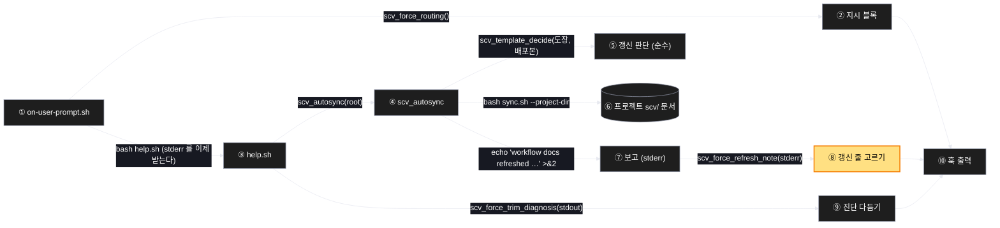

# Architecture — 갱신은 이미 자동이다

> 이 기능의 두 장짜리 그림. **작업 전에 읽고 고칠 것** — 그림은 생성된 것이라
> 틀릴 수 있다.

## 1. Component data flow

프롬프트 훅이 한 턴에 하는 일. 굵은 노란 칸이 이번에 새로 만드는 단계다.



## 2. Position in whole architecture

> Skipped — 지식그래프 갱신을 생략했다.
> `/graphify` 를 돌리고 이 폴더로 `/scv:promote` 를 다시 실행하면 두 번째 그림이 생긴다.

## 3. Screen mockups

### 프롬프트 훅 — 한 턴의 구성과 순서

```screen
{
  "title": "프롬프트 훅 (UserPromptSubmit)",
  "pageCode": "CORE-HOOK-01",
  "diagram": [
    {
      "label": "구성",
      "code": "flowchart LR\n  H[\"① 훅\"] --> D[\"② 지시 블록\"]\n  H --> P[\"③ 점검 (help.sh)\"]\n  P --> A[\"④ 자동 갱신\"]\n  A --> J[\"⑤ 판단 (순수)\"]\n  A --> S[(\"⑥ 프로젝트 문서\")]\n  A --> R[\"⑦ 보고 (stderr)\"]\n  R --> K[\"⑧ 갱신 줄 고르기\"]\n  P --> T[\"⑨ 진단 다듬기\"]\n  D --> O[\"⑩ 출력\"]\n  K --> O\n  T --> O"
    },
    {
      "label": "순서",
      "code": "sequenceDiagram\n  autonumber\n  participant H as ① 훅\n  participant P as ③ 점검\n  participant A as ④ 자동 갱신\n  participant K as ⑧ 고르기\n  H->>P: 실행 (stdout·stderr 둘 다 받음)\n  P->>A: scv_autosync(root)\n  alt 도장이 다르다\n    A->>A: sync.sh 실행\n    A-->>P: stderr — refreshed / PARTIAL / failed\n  else 도장이 같다\n    A-->>P: 아무 말 없음\n  end\n  P-->>H: stdout 진단 + stderr 보고\n  H->>K: stderr 넘김\n  alt 갱신 줄이 있다\n    K-->>H: 한 줄\n  else 없다\n    K-->>H: 빈 값\n  end\n  H->>H: 지시 + (보고) + 진단 출력, exit 0"
    }
  ],
  "functions": [
    {
      "marker": "1",
      "title": "프롬프트 훅",
      "step": "emitBlock",
      "notes": [
        "역할: 한 턴의 preflight 블록을 조립해 내보내는 바깥층",
        "받는 값 → 돌려주는 값: 프롬프트 입력 → 지시 블록 + (갱신 보고) + 진단",
        "하는 일: ②를 만들고, ③을 실행해 stdout·stderr 를 각각 ⑨·⑧로 넘긴 뒤 순서대로 출력",
        "바뀌는 곳: 지금은 ③을 2>/dev/null 로 부른다. stderr 를 받도록 바꾼다",
        "실패: 무엇이 실패해도 종료 코드는 0. 막지 않는다"
      ]
    },
    {
      "marker": "2",
      "title": "지시 블록",
      "step": "routingDirective",
      "notes": [
        "역할: 이 턴에 어떤 액션을 부를지 알려주는 명령 블록",
        "받는 값 → 돌려주는 값: 스위치 값 → 문자열",
        "이번 변경 없음 — 순수 함수 그대로"
      ]
    },
    {
      "marker": "3",
      "title": "점검 (help.sh)",
      "step": "probeProject",
      "notes": [
        "역할: 프로젝트 상태를 진단하고, 시작 줄에서 ④를 부른다",
        "받는 값 → 돌려주는 값: 프로젝트 경로 → stdout 진단, stderr 보고",
        "부수효과: 여기서 실제 갱신이 일어난다"
      ]
    },
    {
      "marker": "4",
      "title": "자동 갱신 (scv_autosync)",
      "step": "probeProject",
      "notes": [
        "역할: 도장이 어긋나면 sync 를 직접 돌린다",
        "받는 값 → 돌려주는 값: 프로젝트 루트 → (문서 갱신) + stderr 한 줄",
        "성공: refreshed / 일부 거부: PARTIAL / 실패: failed — 셋 다 stderr",
        "이번 변경 없음 — 로직은 이미 옳다"
      ]
    },
    {
      "marker": "5",
      "title": "갱신 판단",
      "step": "probeProject",
      "notes": [
        "역할: 갱신할지 말지를 정하는 순수 함수",
        "받는 값 → 돌려주는 값: (프로젝트 도장, 배포본 도장) → skip | refresh",
        "번호가 같아도 내용 지문이 다르면 갱신한다 — 0.41.0 이 그 경우였다"
      ]
    },
    {
      "marker": "6",
      "title": "프로젝트 문서",
      "step": "probeProject",
      "notes": [
        "역할: 갱신 대상 — 프로젝트의 워크플로 문서",
        "쓰기: sync 가 덮어쓴다. 편집 중인 파일은 거부되고 다음 액션에서 다시 시도한다"
      ]
    },
    {
      "marker": "7",
      "title": "보고 (stderr)",
      "step": "probeProject",
      "notes": [
        "역할: 무슨 일이 있었는지 알리는 한 줄",
        "지금 문제: ①이 이 줄을 통째로 버린다. 갱신은 됐는데 아무도 모른다"
      ]
    },
    {
      "marker": "8",
      "title": "갱신 줄 고르기",
      "step": "pickRefreshReport",
      "notes": [
        "역할: stderr 에서 템플릿 갱신에 관한 줄만 고른다 — 이번에 새로 만드는 유일한 단계",
        "받는 값 → 돌려주는 값: stderr 전체 → 0줄 또는 1줄",
        "순수 함수. 파일도 프로세스도 건드리지 않는다",
        "고르지 않은 stderr 는 버린다 — 통째로 쏟으면 출력 위생이 무너진다"
      ]
    },
    {
      "marker": "9",
      "title": "진단 다듬기",
      "step": "trimDiagnosis",
      "notes": [
        "역할: 진단에서 개요·명령 목록을 떼고 상태 부분만 남긴다",
        "이번 변경 없음"
      ]
    },
    {
      "marker": "10",
      "title": "훅 출력",
      "step": "emitBlock",
      "notes": [
        "역할: 지시 → (갱신 보고) → 진단 순서로 내보낸다",
        "보고는 있을 때만 낀다. 없으면 지금과 한 글자도 다르지 않다"
      ]
    }
  ],
  "validations": {
    "title": "상황별 출력",
    "columns": ["번호", "상황", "훅 출력", "종료 코드"],
    "rows": [
      ["8", "도장이 다르고 갱신 성공", "갱신 보고 한 줄 + 지시 + 진단", "0"],
      ["8", "도장이 다르고 일부 파일 거부", "부분 갱신 보고 + 거부된 파일 이름", "0"],
      ["8", "도장이 다르고 갱신 실패", "실패 보고 + sync 를 손으로 돌리라는 안내", "0"],
      ["8", "도장이 같다", "갱신 관련 줄 없음 — 지시 + 진단만", "0"],
      ["4", "자동 갱신 스위치가 꺼짐", "낡았다는 기존 안내 (파일은 안 건드림)", "0"],
      ["3", "점검이 비정상 종료", "지시 블록만. 진단도 보고도 없음", "0"],
      ["1", "scv 폴더가 없는 프로젝트", "아무 출력 없음", "0"]
    ]
  }
}
```
