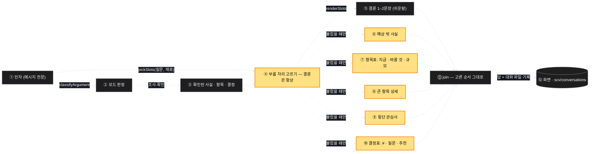

# Architecture — help 의 답 모양

> 답이 조립되는 순서를 보는 그림. 선택이 먼저고 렌더링이 뒤다. 굵은 노란 칸이 이번에 규약으로 명시되는 것이다.

## 1. Component data flow



## 2. Position in whole architecture

> Skipped — 지식그래프 갱신을 생략했다.
> `/graphify` 를 돌리고 이 폴더로 `/scv:promote` 를 다시 실행하면 두 번째 그림이 생긴다.

## 3. Screen mockups

### help 의 답 — 여섯 자리와 빈 자리 생략

```screen
{
  "title": "help 답 모양 — 질문이 부르는 자리만",
  "pageCode": "CORE-HELP-SHAPE-01",
  "diagram": [
    {
      "label": "구성",
      "code": "flowchart TB\n  Q0[\"① 질문\"] --> P[\"④ 부를 자리 고르기\"]\n  F[\"③ 확인된 사실·항목·결정\"] --> P\n  P --> L[\"⑤ 결론 (항상)\"]\n  P -.-> S[\"⑥ 예상 밖 사실\"]\n  P -.-> T[\"⑦ 항목표\"]\n  P -.-> D[\"⑧ 상세\"]\n  P -.-> C[\"⑨ 횡단 관심사\"]\n  P -.-> Q[\"⑩ 결정표\"]\n  L --> J[\"⑪ 고른 순서로 합침\"]\n  S --> J\n  T --> J\n  D --> J\n  C --> J\n  Q --> J"
    },
    {
      "label": "순서",
      "code": "sequenceDiagram\n  autonumber\n  participant U as 사용자\n  participant H as help\n  participant J as ⑪ 합치기\n  U->>H: 메시지\n  H->>H: ③ 조사 — 사실에 '확인됨' 표시\n  H->>H: ④ 질문이 부르는 자리를 고른다 (결론은 항상)\n  H->>J: ⑤ 결론\n  opt 불렀다\n    H->>J: ⑥ 예상 밖 사실\n  end\n  opt 불렀다\n    H->>J: ⑦ 표 — 기존 코드 없으면 '지금'=없음\n  end\n  opt 불렀다\n    H->>J: ⑧ 상세 · ⑨ 횡단\n  end\n  alt 독립 결정을 불렀다\n    H->>J: ⑩ 추천 붙여 번호표\n  else 의존 질문이 남았다\n    H->>J: 질문 하나\n  end\n  J-->>U: 고른 자리만, 정해진 순서로"
    }
  ],
  "functions": [
    { "marker": "3", "title": "확인된 사실 · 항목 · 결정", "step": "classifyArgument",
      "notes": ["역할: 답의 재료. 조사해서 확인한 것에는 '확인됨' 을 붙이고 추정과 섞지 않는다",
                "받는 값 → 돌려주는 값: 인자 + 코드·기록 조사 → 사실 목록 · 항목 목록 · 결정 목록"] },
    { "marker": "4", "title": "부를 자리 고르기", "step": "pickSlots",
      "notes": ["역할: 질문이 무엇을 요구하는지 보고 여섯 자리 중 필요한 것만 고른다 — 이번 변경의 핵심",
                "받는 값 → 돌려주는 값: 질문 + 재료 → 부를 자리 목록 (결론은 항상 포함)",
                "점검표가 아니라 어휘다. 완성돼 보이려고 자리를 더하지 않는다",
                "짧은 맞장구 → 결론만. 백지 아이디어 → 결론·표(·결정). 항목 여럿 점검 → 여섯 다"] },
    { "marker": "5", "title": "결론 1–2문장", "step": "renderSlots",
      "notes": ["역할: 항상 부르는 유일한 자리. 쉬운말 규칙이 다스린다"] },
    { "marker": "6", "title": "예상 밖 사실", "step": "renderSlots",
      "notes": ["역할: 조사 전엔 몰랐고 결정에 영향을 주는 것. 부르면 결론 바로 뒤에 온다"] },
    { "marker": "7", "title": "항목표", "step": "renderSlots",
      "notes": ["역할: 항목 / 지금(확인됨) / 바꿀 것 / 규모(작음·큼·설정만)",
                "기존 코드가 없으면 '지금' 열이 '없음' — 그것은 사실이지 부르지 말아야 할 표가 아니다"] },
    { "marker": "8", "title": "큰 항목 상세", "step": "renderSlots",
      "notes": ["역할: 규모 '큼' 인 항목만 소절로 풀어쓴다"] },
    { "marker": "9", "title": "횡단 관심사", "step": "renderSlots",
      "notes": ["역할: 속도·비용·운영처럼 항목을 가로지르는 것 한 문단"] },
    { "marker": "10", "title": "결정표", "step": "renderSlots",
      "notes": ["역할: 서로 독립인 결정을 # / 질문 / 추천 으로 모아 번호로 답하게 한다",
                "추천 열은 필수다. 의존 질문이 남아 있으면 이 자리를 부르지 않고 질문 하나로 끝낸다"] },
    { "marker": "11", "title": "고른 순서로 합침", "step": "join",
      "notes": ["역할: 부른 자리들을 정해진 상대 순서로 잇는다. 지울 것은 없다 — 선택이 앞에 있었으므로"] }
  ],
  "validations": {
    "title": "턴 종류별 부르는 자리",
    "columns": ["번호", "이 턴은", "⑤ 결론", "⑥ 사실", "⑦ 표", "⑧ 상세", "⑨ 횡단", "⑩ 결정"],
    "rows": [
      ["4", "항목 여럿 점검 요구", "있음", "있으면", "있음", "큰 것만", "있으면", "독립이면 표"],
      ["4", "백지 아이디어", "있음", "보통 없음", "있음 — 지금=없음", "큰 것만", "있으면", "독립이면 표"],
      ["4", "짧은 맞장구", "부름", "안 부름", "안 부름", "안 부름", "안 부름", "안 부름"],
      ["4", "기록 검색", "있음", "없음", "없음 (기록 목록)", "없음", "없음", "없음"],
      ["4", "진단 (인자 없음)", "있음", "있으면", "진단 표", "없음", "없음", "다음 액션 1개"],
      ["10", "의존 질문이 남은 턴", "있음", "있으면", "있으면", "있으면", "있으면", "표 대신 질문 하나"]
    ]
  }
}
```
