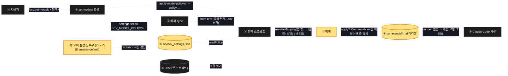

# Architecture — 명령이 세션 모델을 바꾸지 않는다

> 정책이 어디서 읽혀 명령 파일에 어떻게 닿는지. 굵은 노란 칸이 바뀌는 자리다.

## 1. Component data flow



## 2. Position in whole architecture

> Skipped — 지식그래프 갱신을 생략했다.
> `/graphify` 를 돌리고 이 폴더로 `/scv:promote` 를 다시 실행하면 두 번째 그림이 생긴다.

## 3. Screen mockups

### 모델 정책 — 읽기에서 명령 파일까지

```screen
{
  "title": "모델 정책의 흐름",
  "pageCode": "WRAP-MODEL-01",
  "diagram": [
    {
      "label": "구성",
      "code": "flowchart LR\n  U[\"① 사용자\"] --> S[\"② set-models\"]\n  S --> F[(\"③ 설정 파일\")]\n  S --> A[\"④ 정책 스크립트\"]\n  Y[\"⑤ 래퍼 sync\"] --> A\n  F --> A\n  E[(\"⑥ .env 옛 호환\")] -.-> A\n  A --> M[\"⑦ 매핑\"]\n  M --> C[(\"⑧ 명령 파일 머리말\")]\n  C --> K[\"⑨ Claude Code 세션\"]\n  R[\"⑩ 코어 등록부\"] --> F"
    },
    {
      "label": "순서",
      "code": "sequenceDiagram\n  autonumber\n  participant U as 사용자\n  participant P as 플러그인 갱신\n  participant A as ④ 정책 스크립트\n  participant C as ⑧ 명령 파일\n  participant K as ⑨ 세션\n  P->>C: 새 캐시 — model 줄 없음 (새 기본)\n  U->>K: help 호출\n  K-->>U: 세션 모델 그대로 답한다\n  opt 사용자가 매핑을 켰다\n    U->>A: set-models recommended\n    A->>C: help=opus, status=haiku 줄 추가\n    A->>A: ③ 설정 파일에 저장\n    P->>C: 다음 갱신 — 줄 사라짐\n    U->>A: /scv:sync\n    A->>A: ③ 읽고 (없으면 ⑥)\n    A->>C: 줄 다시 추가\n  end"
    }
  ],
  "functions": [
    { "marker": "2", "title": "set-models 명령", "step": "readPolicy",
      "notes": ["역할: 사용자의 정책 선택을 받아 적용하고 저장한다",
                "바뀜: 첫 선택지가 session-default. 저장은 사라진 env-set.sh 대신 코어 settings-set.sh 로"] },
    { "marker": "3", "title": "설정 파일", "step": "readPolicy",
      "notes": ["역할: 정책이 살아남는 자리 — 플러그인 갱신 뒤 sync 가 여기서 읽는다",
                "바뀜: 새 키 SCV_MODEL_POLICY. 기본값 session-default. 기존 키·값 불변"] },
    { "marker": "4", "title": "정책 스크립트", "step": "resolveMapping",
      "notes": ["역할: 정책 이름 → 명령별 모델 → 머리말 갱신. 멱등",
                "바뀜: 기본이 빈 매핑(session-default). 재적용 모드가 설정 파일을 먼저 읽고 .env 는 호환으로",
                "불변: recommended·all-opus·all-sonnet·all-haiku 의 동작"] },
    { "marker": "7", "title": "매핑", "step": "resolveMapping",
      "notes": ["역할: 정책을 {명령: 모델} 표로. 순수 함수",
                "session-default → 빈 표. recommended → help/promote/work… opus, status/update… haiku"] },
    { "marker": "8", "title": "명령 파일 머리말", "step": "applyToCommands",
      "notes": ["역할: Claude Code 가 읽는 자리. model 줄이 있으면 그 명령이 도는 동안 세션 모델이 바뀐다",
                "바뀜: 저장소에 커밋된 15개 파일에서 줄을 걷어낸다. 새 설치 = 줄 없음"] },
    { "marker": "10", "title": "코어 설정 등록부", "step": "readPolicy",
      "notes": ["역할: 모든 프로젝트 설정 파일의 원본 — 키·기본값·설명",
                "바뀜: SCV_MODEL_POLICY 등록. 하이드레이트와 자동 갱신이 새 프로젝트 설정에 이 키를 넣는다"] }
  ],
  "validations": {
    "title": "상황별 결과",
    "columns": ["번호", "상황", "명령 파일의 model 줄", "help 가 도는 모델"],
    "rows": [
      ["8", "새로 설치 (정책 미설정)", "없음", "세션 모델 그대로 (예: Fable 5.1)"],
      ["4", "recommended 를 켬", "help·promote·work 등 opus / status·update 등 haiku", "Opus 5 · Haiku"],
      ["4", "all-haiku 를 켬", "전부 haiku", "Haiku"],
      ["4", "session-default 로 되돌림", "없음", "세션 모델 그대로"],
      ["3", "매핑 켠 채 플러그인 갱신", "없음 (새 캐시) → /scv:sync 뒤 복원", "sync 전엔 세션 모델, 뒤엔 매핑"],
      ["6", "옛 프로젝트, .env 에만 정책", "sync 가 .env 를 호환 읽기로 적용", "정책대로"],
      ["4", "잘못된 정책 값", "무변경 + 오류", "세션 모델 그대로"]
    ]
  }
}
```
