# Architecture — 깊은 질문은 배경 조사로

> 스위치가 어디서 읽혀 훅의 블록이 되고, 그 블록이 답하는 모델을 어떻게 배경 조사로
> 이끄는지. 굵은 노란 칸이 새로 생기는 자리다. 세션 effort 는 어느 칸도 건드리지 않는다.

## 1. Component data flow

```mermaid
%%{init: {'theme':'base', 'themeVariables': {'primaryColor':'#1e1e1e','primaryTextColor':'#fff','primaryBorderColor':'#9096a8','lineColor':'#e7e9f0','secondaryColor':'#2d2d2d','tertiaryColor':'#1e1e1e','background':'#171922','edgeLabelBackground':'#171922'}}}%%
flowchart LR
  Settings[("① scv/scv_settings.json")] -->|"readSwitch — SCV_DELEGATE_EFFORT"| Hook["② 매 턴 훅 (on-user-prompt.sh)"]
  Registry["③ 코어 설정 등록부 (키 + 기본 off)"]:::new -->|"hydrate · 자동 갱신"| Settings
  Hook -->|"normalizeOnOnly(값) → on | off"| Norm["④ on 만 on 정규화"]:::new
  Norm -->|"renderDelegate(on) → 블록 본문 ≤ 12줄"| Block["⑤ 위임 블록"]:::new
  Block -->|"emitHook — 기존 블록 셋 뒤"| Model["⑥ 답하는 모델 (세션 effort 그대로)"]
  Model -->|"얕은 질문 → 그냥 답"| User["⑦ 사용자"]
  Model -->|"깊은 질문 → 배경 실행 (에이전트가 있을 때만)"| Agent["⑧ scv-investigator (래퍼 agents/)"]:::new
  Model -->|"'깊은 결과가 뒤따른다' 한 줄"| User
  Agent -->|"조사 결과 전문"| Raw[("⑨ scv/raw/<날짜>-research-<slug>.md")]:::new
  Agent -.->|"완료 알림 (요약만) — 입력 없이 도착"| Model
  Tool["⑩ 위임 도구 (호출별 단계 지원 시)"] -.->|"깊이에 맞춘 단계, 아니면 세션 그대로"| Agent
  classDef new fill:#FFE082,stroke:#F57C00,stroke-width:2px,color:#000
```



## 2. Position in whole architecture

> Skipped — 지식그래프 갱신을 생략했다.
> `/graphify` 를 돌리고 이 폴더로 `/scv:promote` 를 다시 실행하면 두 번째 그림이 생긴다.

## 3. Screen mockups

### 스위치에서 배경 조사까지

```screen
{
  "title": "깊은 질문의 흐름",
  "pageCode": "CORE-DELEGATE-01",
  "diagram": [
    {
      "label": "구성",
      "code": "flowchart LR\n  F[(\"① 설정 파일\")] --> H[\"② 매 턴 훅\"]\n  R[\"③ 코어 등록부\"] --> F\n  H --> N[\"④ on 만 on 정규화\"]\n  N --> B[\"⑤ 위임 블록\"]\n  B --> M[\"⑥ 답하는 모델\"]\n  M --> U[\"⑦ 사용자\"]\n  M --> A[\"⑧ scv-investigator\"]\n  A --> W[(\"⑨ scv/raw 결과 파일\")]\n  A -.-> M\n  T[\"⑩ 위임 도구\"] -.-> A"
    },
    {
      "label": "순서",
      "code": "sequenceDiagram\n  autonumber\n  participant U as ⑦ 사용자\n  participant H as ② 훅\n  participant M as ⑥ 모델\n  participant A as ⑧ 조사 에이전트\n  participant W as ⑨ raw 파일\n  U->>H: 메시지\n  H->>H: ① 스위치 읽기 → ④ 정규화\n  alt off (기본)\n    H-->>M: 기존 블록 셋만\n    M-->>U: 지금과 같은 답\n  else on\n    H-->>M: 기존 셋 + ⑤ 위임 블록\n    alt 얕은 질문\n      M-->>U: 세션 effort 로 답\n    else 깊은 질문, 에이전트 있음\n      M->>A: 배경 실행 (단계는 ⑩ 지원 시 깊이에 맞춤)\n      M-->>U: 답 + '깊은 결과가 뒤따른다'\n      A->>W: 결과 전문 저장\n      A-->>M: 완료 알림 (요약) — 입력 없이\n      M-->>U: 요약 + 파일 위치\n    else 깊은 질문, 에이전트 없음\n      M-->>U: 그냥 답 (아무 일도 없음)\n    end\n  end"
    }
  ],
  "screenRefs": [
    { "calls": "2", "name": "모든 일반 대화 턴", "pageCode": "HOOK-EVERY-TURN",
      "element": "매 턴 훅", "when": "사용자가 메시지를 보낼 때마다" }
  ],
  "functions": [
    { "marker": "1", "title": "설정 파일", "step": "readSwitch",
      "notes": ["역할: 스위치가 사는 자리. 기존 `_scv_read` 로 읽는다",
                "받는 값 → 돌려주는 값: 키 이름 → 원시 문자열(없으면 빈값)",
                "바뀜: 새 키 SCV_DELEGATE_EFFORT. 기본 off. 기존 키·값 불변"] },
    { "marker": "3", "title": "코어 설정 등록부", "step": "readSwitch",
      "notes": ["역할: 모든 프로젝트 설정 파일의 원본 — 키·기본값·설명",
                "바뀜: 키 등록(공개 키 목록 + 예시 _doc + 기본 off). 하이드레이트와 자동 갱신이 새 프로젝트에 넣는다",
                "함정: 템플릿 지문 재계산 — 0.45.0 때 빠뜨려 회귀 4건"] },
    { "marker": "4", "title": "on 만 on 정규화", "step": "normalizeOnOnly",
      "notes": ["역할: 원시 값 → on / off. 새 순수 함수",
                "받는 값 → 돌려주는 값: 'on'·'ON'·따옴표 붙은 on → on, 빈값·off·maybe·그 외 전부 → off",
                "왜 새로: 기존 정규화는 빈값을 on 으로 본다(off 만 끄는 스위치용). 이 스위치는 on 만 켠다"] },
    { "marker": "5", "title": "위임 블록", "step": "renderDelegate",
      "notes": ["역할: 답하는 모델에게 주는 지시문. 새 순수 함수, printf 만",
                "받는 값 → 돌려주는 값: on → 12줄 이내 본문 / off → 빈 문자열",
                "내용: 세션 그대로 답 · 깊으면 scv-investigator 있을 때 배경 위임 · 결과는 scv/raw 파일, 알림은 요약 · 위임 도구가 단계를 지원하면 깊이에 맞춤",
                "제약: 호스트 이름·모델 이름·단계 이름 없음. 기존 라우팅 지시문에 덧붙이지 않음"] },
    { "marker": "6", "title": "답하는 모델", "step": "emitHook",
      "notes": ["역할: 매 턴 답한다. 세션 effort 그대로 — SCV 는 여기를 건드리지 않는다",
                "하는 일: 깊이 판단 → 얕으면 답 / 깊으면 ⑧ 배경 실행 + '뒤따른다' 한 줄",
                "실패: 에이전트가 없는 호스트면 위임 없이 답. 아무 일도 없다"] },
    { "marker": "8", "title": "scv-investigator", "step": "emitHook",
      "notes": ["역할: 깊은 질문 하나를 받아 저장소를 읽고 근거 붙은 보고를 만든다. 래퍼 agents/ 한 파일",
                "머리말: 배경 실행, 모델 상속, 읽기 전용 도구, effort 줄 없음",
                "실측(2.1.260): 정의 파일 effort 줄은 안 먹음 → 세션 effort 로 돈다. 단계 선택은 ⑩ 이 있을 때만",
                "비용 실측: 도구 36회 · 출력 139k 토큰 · 보고까지 3분 28초 (세션 xhigh)"] },
    { "marker": "9", "title": "결과 파일", "step": "emitHook",
      "notes": ["역할: 조사 결과의 원문이 사는 자리. 알림은 약 4.5천 자에서 잘리므로 전문은 여기",
                "위치: scv/raw/<날짜>-research-<slug>.md — 다음 promote 의 재료가 된다",
                "규칙: 비밀 없음. 기존 raw 를 지우지 않음"] },
    { "marker": "10", "title": "위임 도구", "step": "emitHook",
      "notes": ["역할: 호출별 노력 단계를 지원하는 호스트에서만 깊이에 맞춰 단계를 고른다",
                "실측: 워크플로 도구의 호출별 effort 는 기록에 반영됨(세션 xhigh 에서 high). 정의 파일은 아님",
                "없으면: 세션 effort 그대로 배경 실행"] }
  ],
  "statesTitle": "스위치 값과 결과",
  "validations": {
    "title": "상황별 결과",
    "columns": ["번호", "상황", "훅에 실리는 것", "모델이 하는 일"],
    "rows": [
      ["4", "스위치 없음 · off · OFF · maybe", "기존 블록 셋만 (지금과 바이트 동일)", "지금과 같은 답"],
      ["5", "on, 얕은 질문", "기존 셋 + 위임 블록", "세션 effort 로 답. 위임 없음"],
      ["8", "on, 깊은 질문, 에이전트 있음", "기존 셋 + 위임 블록", "답 + '뒤따른다' · 배경 조사 · raw 파일 · 요약 알림"],
      ["6", "on, 깊은 질문, 에이전트 없음 (Codex 등)", "기존 셋 + 위임 블록", "그냥 답. 아무 일도 없음"],
      ["10", "on, 위임 도구가 단계 지원", "같음", "깊이에 맞춘 단계로 배경 실행"],
      ["10", "on, 단계 미지원", "같음", "세션 effort 그대로 배경 실행"],
      ["3", "플러그인 갱신 뒤 새 프로젝트", "키가 off 로 생김", "지금과 같은 답"]
    ]
  }
}
```
