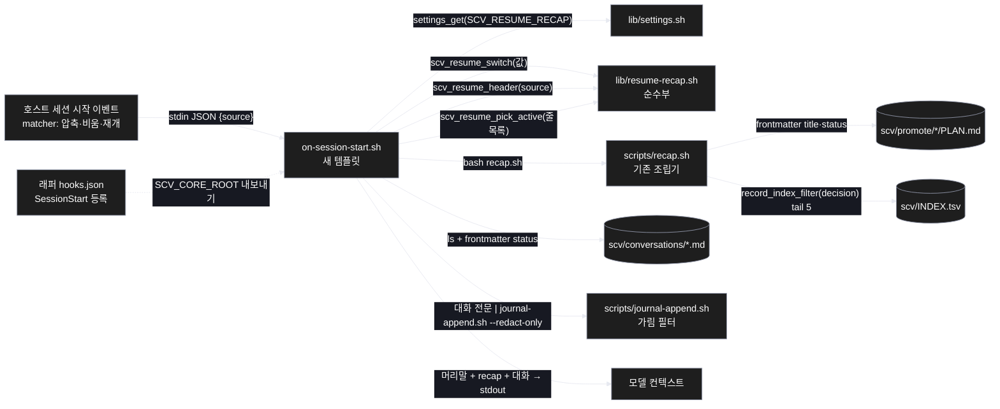
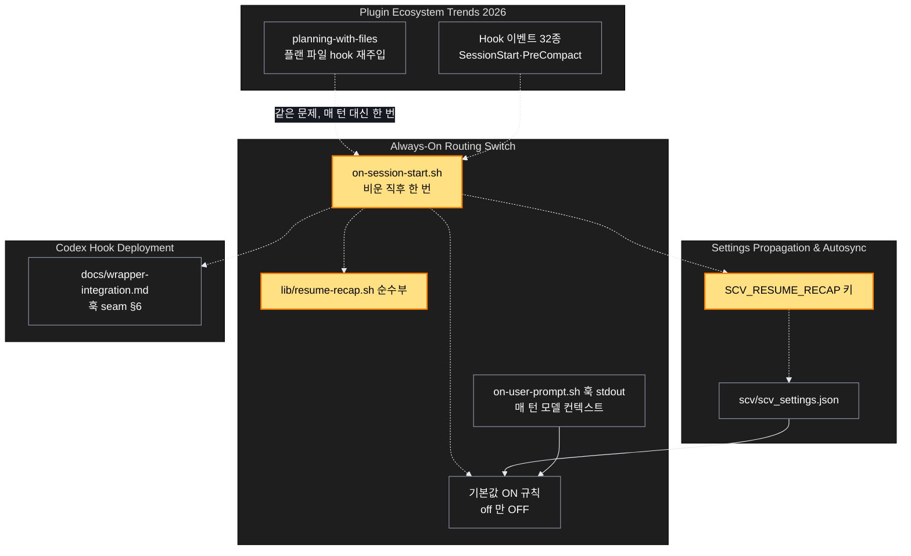

# Architecture — 비운 뒤에도 이어진다 — 압축·/clear·재개 뒤 진행 상황 재주입

> Two-diagram view of this feature. **Review and edit before `/scv:work`** —
> diagrams are LLM-generated and may have inaccuracies.

## 1. Component data flow

호스트의 세션 시작 이벤트가 새 훅 템플릿을 부르고, 템플릿은 읽기만 해서 블록 하나를 stdout 으로 낸다.



## 2. Position in whole architecture

문서 그래프의 공동체 위에서 이 계획이 닿는 곳. 새 요소는 노란색.

> Source: graphify graph (built 2026-09-11)



## 3. Screen mockups

### 세션 시작 훅 — 되찾기 블록 조립 (BE)

```screen
{
  "title": "세션 시작 훅 — 되찾기 블록 조립",
  "screenRefs": [
    { "calls": "1", "name": "Claude Code 세션", "element": "/clear · 자동 압축 · --resume", "when": "세션이 비워지거나 압축되거나 재개될 때 (새 세션 시작은 제외)" }
  ],
  "diagram": [
    { "label": "구성", "code": "flowchart LR\n  E[\"① 호스트 세션 시작 이벤트\"] --> H[\"② on-session-start.sh\"]\n  H --> S[\"③ settings.sh (스위치)\"]\n  H --> P[\"④ resume-recap.sh (순수부)\"]\n  H --> R[\"⑤ recap.sh\"]\n  R --> D1[(\"⑥ promote/ · INDEX.tsv\")]\n  H --> D2[(\"⑦ conversations/\")]\n  H --> F[\"⑧ journal-append.sh --redact-only\"]\n  H --> O[\"⑨ stdout → 모델 컨텍스트\"]" },
    { "label": "순서", "code": "sequenceDiagram\n  autonumber\n  participant E as ① 이벤트\n  participant H as ② 훅\n  participant S as ③ 설정\n  participant R as ⑤ recap\n  participant C as ⑦ 대화\n  participant F as ⑧ 가림\n  E->>H: stdin JSON {source}\n  alt scv/ 없음\n    H-->>E: exit 0, 빈 출력\n  end\n  H->>S: settings_get(SCV_RESUME_RECAP)\n  alt 값이 off\n    H-->>E: exit 0, 빈 출력\n  end\n  H->>H: 머리말(source)\n  H->>R: bash recap.sh\n  R-->>H: 진행 중 계획 · 최근 결정 5 · 미결\n  H->>C: 최상위 *.md frontmatter status\n  C-->>H: 활성 중 최신 1건 전문 (+나머지 경로)\n  H->>F: 대화 전문\n  F-->>H: 가림 처리된 본문\n  H-->>E: 블록 stdout, exit 0" }
  ],
  "functions": [
    { "marker": "1", "title": "호스트 세션 시작 이벤트", "notes": ["역할: 비움·압축·재개 세 경우에만 훅을 부른다 (래퍼 matcher 소유)", "받는 값: 없음 → 주는 값: stdin JSON (session_id, source 등)", "새 세션 시작(startup)은 등록하지 않는다 — 첫 메시지 preflight 가 상태를 싣는다"] },
    { "marker": "2", "title": "on-session-start.sh", "step": "assemble", "notes": ["역할: 읽어서 조립만 한다 — 어디에도 쓰지 않는다", "받는 값: stdin JSON → 돌려주는 값: 블록 텍스트(stdout), 항상 exit 0", "성공: 머리말 + recap + 활성 대화 1건 전문", "실패: 어떤 오류든 exit 0 — 잘못된 JSON 이면 일반 머리말로 계속", "데이터 영향: 없음 (읽기 전용)"] },
    { "marker": "3", "title": "settings.sh — 스위치", "step": "readSwitch", "notes": ["역할: SCV_RESUME_RECAP 값을 읽는다", "off 만 끈다. 없음·on·다른 값 = on (기존 세 스위치와 같은 규칙)"] },
    { "marker": "4", "title": "resume-recap.sh — 순수부", "step": "pickActive", "notes": ["역할: 스위치 해석 · 머리말 만들기 · 활성 대화 고르기", "받는 값: 문자열/줄 목록 → 돌려주는 값: 문자열. 파일·stdout 을 만지지 않는다 (@pure)", "활성 대화: 경로<TAB>status<TAB>mtime 줄들에서 status=active 중 mtime 최신 1건"] },
    { "marker": "5", "title": "recap.sh — 기존 조립기", "notes": ["역할: 진행 중 계획(제목·상태), 최근 결정 5건(색인 줄 + 펼치는 명령), 막힌 것, 최근 미결", "수정 없음이 목표 — 그대로 부른다"] },
    { "marker": "6", "title": "promote/ · INDEX.tsv", "notes": ["읽기만: PLAN.md frontmatter, 결정 색인 줄. 본문은 읽지 않는다"] },
    { "marker": "7", "title": "conversations/", "notes": ["읽기만: 최상위 *.md 의 frontmatter status 와 mtime. archive/ 는 보지 않는다", "활성 1건은 전문, 나머지 활성은 경로만 한 줄씩, promoted/archived 는 생략"] },
    { "marker": "8", "title": "journal-append.sh --redact-only", "notes": ["역할: 대화 전문을 stdout 에 내기 전 가림 필터 통과", "쓸 때 이미 가림됐지만 새는 경로를 하나 더 막는다"] },
    { "marker": "9", "title": "stdout → 모델 컨텍스트", "notes": ["세션 시작 이벤트의 평문 stdout 은 모델에 닿는다 (공식 문서)", "상한 없음 (사용자 결정) — 실측 크기를 CHANGELOG 에 기록"] }
  ],
  "validations": {
    "title": "실패 · 응답 표",
    "columns": ["번호", "조건", "출력", "종료 코드", "기록 · 데이터 영향"],
    "rows": [
      ["2", "scv/ 없음 (미하이드레이트)", "없음", "0", "없음"],
      ["3", "SCV_RESUME_RECAP=off", "없음 (바이트 단위 빈 출력)", "0", "없음"],
      ["2", "stdin 이 JSON 이 아님 / source 없음", "일반 머리말 + recap + 대화", "0", "없음"],
      ["5", "recap.sh 없음·실패", "머리말 + 대화만", "0", "없음"],
      ["7", "conversations/ 없음", "머리말 + recap 만", "0", "없음"],
      ["7", "활성 대화 여럿", "최신 1건 전문 + 나머지 경로 줄", "0", "없음"],
      ["8", "본문에 token=… 등 비밀값", "[REDACTED] 로 치환", "0", "없음"]
    ]
  }
}
```
