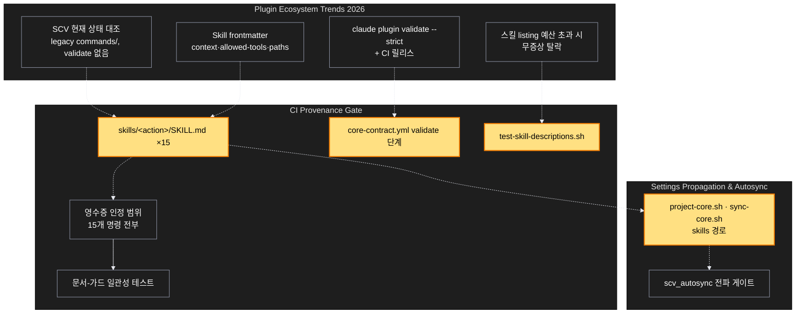

# Architecture — 명령을 skills 로 — 플러그인 구조·설명 길이를 CI 가 지킨다

> Two-diagram view of this feature. **Review and edit before `/scv:work`** —
> diagrams are LLM-generated and may have inaccuracies.

## 1. Component data flow

코어 protocol 본문과 adapter 소유 frontmatter 가 새 자리(`skills/<action>/SKILL.md`)로 투영되고, PR 게이트 둘이 그 결과를 지킨다.

```mermaid
%%{init: {'theme':'base', 'themeVariables': {'primaryColor':'#1e1e1e','primaryTextColor':'#fff','primaryBorderColor':'#9096a8','lineColor':'#e7e9f0','secondaryColor':'#2d2d2d','tertiaryColor':'#1e1e1e','background':'#171922','edgeLabelBackground':'#171922'}}}%%
flowchart LR
  Protocols[(core/protocols/*.md<br/>13 코어 소유)] -->|"본문 읽기"| Project[scripts/project-core.sh<br/>투영]
  Skills[(skills/&lt;action&gt;/SKILL.md ×15<br/>name · description · allowed-tools)] -->|"frontmatter 만 읽기"| Project
  Project -->|"frontmatter + 본문 = SKILL.md (--check: PROJECTION_MISMATCH)"| Skills
  SyncCore[scripts/sync-core.sh<br/>소유 규칙] -->|"scopes: skills · adapter_owned: update, set-models"| Skills
  ModelPolicy[scripts/apply-model-policy.sh] -->|"skills/*/SKILL.md 의 model: 줄 추가·제거"| Skills
  Contract[tests/test-core-contract.sh] -->|"skills/&lt;action&gt;/SKILL.md 존재 · model 줄 없음"| Skills
  CI[.github/workflows/core-contract.yml<br/>PR 게이트] -->|"claude plugin validate . --strict"| Validate[Claude Code CLI validate]
  Validate -->|"매니페스트 · skills/ · agents/ · hooks/ 구조"| Skills
  CI -->|"bash tests/test-skill-descriptions.sh"| DescCheck[core/tests/test-skill-descriptions.sh<br/>새 검사]
  DescCheck -->|"name==디렉터리 · 개별≤1536 · 합계≤8000 · model 없음"| Skills
  Codex[(scv-codex skills/ 구조)] -.->|"참고만 — 무변경"| Skills
```

## 2. Position in whole architecture

문서 그래프의 공동체 위에서 이 계획이 닿는 곳. 새 요소는 노란색.

> Source: graphify graph (built 2026-09-11)



## 3. Screen mockups

### 스킬 투영과 PR 게이트 (BE)

```screen
{
  "title": "스킬 투영과 PR 게이트",
  "screenRefs": [
    { "calls": "3", "name": "Claude Code 세션", "element": "/scv:<action> 열다섯", "when": "사용자가 명령을 치거나 모델이 description 으로 자동 호출할 때 — 이름은 이전과 같다" },
    { "calls": "6", "name": "래퍼 Pull Request", "element": "Contract (ubuntu · macos) 잡", "when": "PR 이 열리거나 갱신될 때" }
  ],
  "diagram": [
    { "label": "구성", "code": "flowchart LR\n  P[(\"① core/protocols/*.md\")] --> J[\"② project-core.sh 투영\"]\n  J --> S[(\"③ skills/<action>/SKILL.md ×15\")]\n  Y[\"④ sync-core.sh 소유 규칙\"] --> S\n  M[\"⑤ apply-model-policy.sh\"] --> S\n  C[\"⑥ core-contract.yml PR 게이트\"] --> V[\"⑦ claude plugin validate --strict\"]\n  C --> D[\"⑧ test-skill-descriptions.sh\"]\n  V --> S\n  D --> S" },
    { "label": "순서", "code": "sequenceDiagram\n  autonumber\n  participant Dev as 개발자\n  participant J as ② 투영\n  participant S as ③ skills/\n  participant C as ⑥ CI\n  participant V as ⑦ validate\n  participant D as ⑧ 설명 검사\n  Dev->>S: git mv commands/<a>.md skills/<a>/SKILL.md + name:\n  Dev->>J: project-core.sh --check\n  alt 본문 ≠ protocol\n    J-->>Dev: PROJECTION_MISMATCH, 실패\n  end\n  Dev->>C: PR 열기\n  C->>V: claude plugin validate . --strict\n  alt 경고·오류\n    V-->>C: exit 1 → PR 차단\n  end\n  C->>D: bash tests/test-skill-descriptions.sh\n  alt name 불일치 · 개별>1536 · 합계>8000 · model 줄\n    D-->>C: FAIL → PR 차단\n  end\n  C-->>Dev: 녹색" }
  ],
  "functions": [
    { "marker": "1", "title": "core/protocols/*.md", "notes": ["역할: 열세 코어 소유 명령의 본문 원천. 이 계획으로 바뀌지 않는다"] },
    { "marker": "2", "title": "project-core.sh — 투영", "notes": ["역할: adapter 소유 frontmatter + 코어 본문 = SKILL.md", "받는 값: protocol 경로, skills/<action>/SKILL.md → 돌려주는 값: 갱신된 파일 또는 PROJECTION_MISMATCH", "실패: skills/<action>/SKILL.md 가 없으면 'missing Claude command adapter' 와 같은 문구로 exit 1"] },
    { "marker": "3", "title": "skills/<action>/SKILL.md ×15", "step": "parseSkillMeta", "notes": ["역할: 호출 단위. 디렉터리명 = 이전 파일 stem = /scv:<action>", "frontmatter: name(필수, 디렉터리명과 같음) · description · argument-hint · allowed-tools. model·context 줄 없음", "commands/ 는 같은 커밋에서 삭제"] },
    { "marker": "4", "title": "sync-core.sh — 소유 규칙", "notes": ["역할: 코어 갱신 시 무엇이 코어 소유이고 무엇이 adapter 소유인지", "scopes 에 skills, adapter_owned 에 skills/update/SKILL.md · skills/set-models/SKILL.md, 'frontmatter 만 adapter' 규칙은 skills/**/SKILL.md"] },
    { "marker": "5", "title": "apply-model-policy.sh", "notes": ["역할: 정책에 따라 model: 줄 추가·제거. 대상 glob skills/*/SKILL.md", "session-default(기본) 이면 줄 없음, 두 번 적용해도 같다"] },
    { "marker": "6", "title": "core-contract.yml — PR 게이트", "notes": ["역할: 기존 계약 검사에 두 단계 추가 (Linux 잡)", "paths 가 commands/** 대신 skills/** 를 본다"] },
    { "marker": "7", "title": "claude plugin validate --strict", "notes": ["역할: 매니페스트·skills·agents·hooks 구조 검사, 경고도 실패", "CLI 는 npm 으로 버전 고정 설치. 인증 없이 도는지는 첫 실행이 검증 — 안 되면 코어 셸 검사로 대체하고 CHANGELOG 에 기록"] },
    { "marker": "8", "title": "test-skill-descriptions.sh", "step": "checkOne", "notes": ["역할: name==디렉터리 · description 개별 ≤1,536 · 합계 ≤8,000 · model 줄 없음", "코어 검사(옆 체크아웃 있을 때만) — 래퍼에도 투영되어 래퍼 CI 에서 돈다", "상한은 인자 (기본 1536 · 8000)"] }
  ],
  "validations": {
    "title": "실패 · 응답 표",
    "columns": ["번호", "조건", "응답", "PR 영향", "기록"],
    "rows": [
      ["2", "SKILL.md 본문 ≠ protocol", "PROJECTION_MISMATCH: skills/<a>/SKILL.md", "차단", "없음"],
      ["2", "skills/<a>/SKILL.md 없음", "ERROR: missing … adapter, exit 1", "차단", "없음"],
      ["7", "미인식 필드·메타데이터 누락", "validate exit 1 (--strict)", "차단", "없음"],
      ["8", "name ≠ 디렉터리명", "✖ FAIL", "차단", "없음"],
      ["8", "description > 1,536자", "✖ FAIL (개별)", "차단", "없음"],
      ["8", "합계 > 8,000자", "✖ FAIL (합계)", "차단", "없음"],
      ["8", "model: 줄 존재", "✖ FAIL (0.45.0 원칙)", "차단", "없음"],
      ["3", "commands/ 가 남아 있음", "test-core-contract FAIL", "차단", "없음"]
    ]
  }
}
```
