# Architecture — help 본문 다이어트

> Two-diagram view of this feature. **Review and edit before `/scv:work`** —
> diagrams are LLM-generated and may have inaccuracies.

## 1. Component data flow

부속 파일이 코어에서 플러그인 캐시까지 **기존 경로로** 실려가고, 실행 시 분기에서만 읽히는 흐름.

```mermaid
%%{init: {'theme':'base', 'themeVariables': {'primaryColor':'#1e1e1e','primaryTextColor':'#fff','primaryBorderColor':'#9096a8','lineColor':'#e7e9f0','secondaryColor':'#2d2d2d','tertiaryColor':'#1e1e1e','background':'#171922','edgeLabelBackground':'#171922'}}}%%
flowchart LR
  subgraph core["코어 저장소 (scv-core)"]
    HelpMd["core/protocols/help.md<br/>본문 ≤14,000B + 포인터 5"]
    SubMd["core/protocols/help/*.md<br/>분기 본문 5 (신설)"]:::new
    Budget["core/tests/test-help-budget.sh (신설)"]:::new
    Export["tools/export-core.sh"]
    Verify["tools/verify-core.sh<br/>find -maxdepth 1"]
  end
  subgraph wrapper["래퍼 저장소 (무변경)"]
    Vendor[("vendor/scv-core/core")]
    Materialize["tools/materialize-profile.sh"]
    Project["scripts/project-core.sh"]
    Skill["skills/help/SKILL.md"]
    Tree["protocols/help/*.md<br/>(= 플러그인 캐시 루트)"]
  end
  Model["호스트 모델<br/>(help 실행 중)"]
  HelpSh["scripts/help.sh<br/>--with-context: 파싱 머리만<br/>--archive-index: 목록만"]

  HelpMd -->|"Read \`\${SCV_CORE_ROOT}/protocols/help/<name>.md\` now (분기 5)"| SubMd
  Budget -->|"본문 바이트 · 참조 1회 · 부속 청결"| HelpMd
  Verify -->|"규약 수 15 (최상위만)"| HelpMd
  HelpMd -->|"cp -R core/"| Export
  SubMd -->|"cp -R core/ (같은 복사)"| Export
  Export -->|"vendor-core.sh"| Vendor
  Vendor -->|"find … -name '*.md' 재귀 → perl s/SCV_CORE_ROOT/…/"| Materialize
  Materialize -->|"protocols/*.md 최상위만 → frontmatter + 본문"| Project
  Project -->|"cat protocol >> SKILL.md"| Skill
  Materialize -->|"compare_or_replace_tree(protocols/) — diff -qr 재귀"| Tree
  Skill -->|"매 턴 본문 로드 (≈5k tok)"| Model
  Model -.->|"분기 진입 시에만 Read (+파일 크기)"| Tree
  HelpSh -->|"매 턴 --with-context (≤1KB)"| Model
  HelpSh -.->|"archive 검색 분기에서만 --archive-index"| Model
  classDef new fill:#FFE082,stroke:#F57C00,stroke-width:2px,color:#000
```



## 2. Position in whole architecture

> Skipped — graphify graph is stale (built 2026-09-11) and was not rebuilt for this promote.
> Run `/graphify` and re-run `/scv:promote` on this folder to generate diagram 2.

## 3. Screen mockups

### help 실행 경로 (BE — 화면 없음)

```screen
{
  "title": "help 본문 로드와 분기 읽기",
  "screenRefs": [
    { "calls": "1", "name": "매 턴 훅 preflight", "element": "SCV: 이 턴의 첫 행동 — help 를 부르라", "when": "사람이 쓴 모든 턴" },
    { "calls": "1", "name": "직접 호출", "element": "/scv:help [\"…\"]", "when": "사용자가 명령을 칠 때" }
  ],
  "diagram": [
    { "label": "구성", "code": "flowchart LR\n  S[\"⑥ help.sh --with-context\"] --> B[\"② 분기 판정\"]\n  A[\"① SKILL.md 본문 (help.md)\"] --> B\n  B --> C[\"③ 부속 파일 protocols/help/*.md\"]\n  A --> D[\"④ 검사: test-help-budget · run-dry HELP_ALL\"]\n  E[\"⑤ 배송: export → materialize → project-core\"] --> A\n  E --> C" },
    { "label": "순서", "code": "sequenceDiagram\n  autonumber\n  participant H as 호스트\n  participant M as 모델\n  participant F as 부속 파일\n  H->>M: SKILL.md 본문 (≤14,000B)\n  M->>M: 모드·분기 판정 (A / B / B' / 짧은 턴)\n  alt 분기 전용 절이 필요할 때 (hydrate · 언어 첫 설정 · 옛 대화 이사 · archive 검색 · promote 넘김)\n    M->>F: Read ${SCV_CORE_ROOT}/protocols/help/<name>.md\n    F-->>M: 분기 본문\n  end\n  M->>H: 답 (동작은 이전과 동일)" }
  ],
  "functions": [
    { "marker": "1", "title": "SKILL.md 본문", "step": "readProtocol", "notes": ["역할: 매 턴 실리는 규약 본문 — 기록 원칙 · 언어 · 쉬운 말 · 답 모양 · 스크립트 실행 · 의도 분류 · 대화 루프", "받는 값 → 돌려주는 값: 호출 인자 → 모드 판정과 다음 행동", "성공: ≤14,000B(약 5k tok) 로 로드", "데이터 영향: 없음 (읽기 전용)"] },
    { "marker": "2", "title": "분기 판정", "step": "collectRefs", "notes": ["역할: 진단(A) · 대화(B) · archive 검색(B') · 짧은 턴 중 하나를 고르고, 분기 전용 절이 필요한지 본다", "받는 값 → 돌려주는 값: 헬퍼 출력(ARG_CONTEXT · UNFINISHED · LEGACY · hydrate 여부) → 읽을 부속 파일 이름 또는 없음"] },
    { "marker": "3", "title": "부속 파일 5", "step": "checkRefs", "notes": ["역할: 분기 본문 — language-setup · legacy-migration · hydrate · archive-search · promote-handoff", "받는 값 → 돌려주는 값: Read → 그 분기의 질문·선택지·처리 순서 (이전 본문과 동일 문구)", "실패: 파일이 없으면 검사 T2 가 릴리스 전에 잡는다 — 실행 시 고아 참조는 없다"] },
    { "marker": "4", "title": "검사", "step": "measureBudget", "notes": ["역할: 본문 상한 14,000B · 부속 파일 5 존재·참조 1회 · 부속 청결 · 기존 앵커 전부 유지", "실패: 상한 초과 · 고아 참조/파일 · 쉬운 말 절 중복 → 코어 CI 실패"] },
    { "marker": "6", "title": "보조 스크립트 help.sh", "notes": ["역할: 매 턴 파싱 머리(ARG_CONTEXT · UNFINISHED · LEGACY)만 찍는다 — 배너·진단은 인자 없음 형태에만, archive 목록은 --archive-index 에만", "받는 값 → 돌려주는 값: 플래그 → 그 형태의 출력", "데이터 영향: 읽기 전용 · 인자 없음/위치 인자 출력은 바이트 단위 불변"] },
    { "marker": "5", "title": "배송", "notes": ["역할: 기존 경로 그대로 — export-core.sh(통째 복사) → materialize-profile.sh(재귀 치환) → 래퍼 project-core.sh(트리 교체 + 최상위만 스킬로)", "데이터 영향: 래퍼 스크립트 무변경 · protocols/help/ 트리가 늘 뿐"] }
  ],
  "validations": {
    "title": "실패 · 검사 표",
    "columns": ["번호", "조건", "검사", "결과"],
    "rows": [
      ["1", "본문 > 14,000B", "test-help-budget T1", "✖ exit 1"],
      ["1, 3", "참조는 있는데 파일 없음 / 파일은 있는데 참조 없음 / 참조 2회", "test-help-budget T2", "✖ 고아·중복"],
      ["1", "포인터가 명령형 한 문장이 아님 (Read … now)", "test-help-budget T3", "✖"],
      ["3", "부속 파일에 쉬운 말 절·언어 절·호스트 이름", "test-help-budget T4 · test-host-neutral", "✖"],
      ["1", "앵커 문장 삭제 (T18·T19 · never changes that dial · action:promote · 쉬운 말 절 변경)", "test-force-help · test-delegate-effort · test-guidance · test-help-shape T7", "✖"],
      ["5", "규약 수 세기가 재귀라 15 초과", "verify-core.sh (-maxdepth 1 로 수정)", "✖ 수정 전 / ✓ 수정 후"],
      ["5", "치환 누락 (부속 파일에 SCV_CORE_ROOT 리터럴)", "T6 materialize 검사", "✖"],
      ["6", "--with-context 출력에 진단·배너·archive 목록이 남음", "test-help-budget T10", "✖"],
      ["6", "인자 없음/위치 인자 출력이 바뀜", "run-dry 2279 · 713", "✖"],
      ["1, 6", "매 턴 스택 합 > 18,000B", "test-help-budget T12", "✖"]
    ]
  }
}
```
