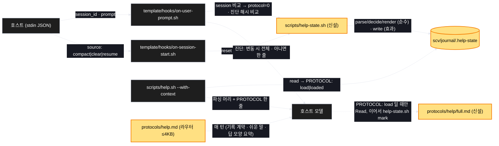

# Architecture — help 규약은 세션당 한 번만

> Two-diagram view of this feature. **Review and edit before `/scv:work`** —
> diagrams are LLM-generated and may have inaccuracies.

## 1. Component data flow



## 2. Position in whole architecture

> Skipped — graphify graph is stale (built 2026-09-11) and was not rebuilt for this promote.

## 3. Screen mockups

### 세션 상태 흐름 (BE — 화면 없음)

```screen
{
  "title": "세션당 한 번 읽기 — 상태 표식",
  "screenRefs": [
    { "calls": "1", "name": "매 턴 훅", "element": "UserPromptSubmit stdin(session_id)", "when": "사람이 쓴 모든 턴" },
    { "calls": "2", "name": "되찾기 훅", "element": "SessionStart(compact|clear|resume)", "when": "컨텍스트가 비워진 직후" }
  ],
  "diagram": [
    { "label": "구성", "code": "flowchart LR\n  A[\"① 매 턴 훅\"] --> S[(\"③ .help-state\")]\n  B[\"② 되찾기 훅\"] --> S\n  S --> H[\"④ help.sh --with-context\"]\n  H --> R[\"⑤ 라우터 help.md\"]\n  R -.-> F[\"⑥ full.md (세션당 1회)\"]\n  F --> M[\"⑦ help-state.sh mark\"] --> S" },
    { "label": "순서", "code": "sequenceDiagram\n  autonumber\n  participant K as 훅\n  participant S as .help-state\n  participant H as help.sh\n  participant M as 모델\n  K->>S: session_id 비교 (다르면 protocol=0)\n  K->>M: 지시 + 진단(변동 시 전체 / 아니면 한 줄)\n  M->>H: --with-context\n  H->>S: read\n  alt protocol=0\n    H-->>M: PROTOCOL: load\n    M->>M: Read full.md\n    M->>S: help-state.sh mark (protocol=1)\n  else protocol=1\n    H-->>M: PROTOCOL: loaded\n  end\n  M->>M: 라우터 계약대로 기록·답" }
  ],
  "functions": [
    { "marker": "1", "title": "매 턴 훅", "step": "decideReload", "notes": ["역할: 세션 번호 변화 감지와 진단 해시 비교", "받는 값 → 돌려주는 값: stdin JSON + 표식 → 표식' + 훅 출력(지시 + 전체/한 줄 진단)", "실패: exit 0, 전체 진단, 표식 미변경"] },
    { "marker": "2", "title": "되찾기 훅", "step": "decideReload", "notes": ["역할: 컨텍스트 비움 뒤 protocol=0", "받는 값 → 돌려주는 값: source → 표식'(session 유지)"] },
    { "marker": "3", "title": "표식 파일", "step": "renderState", "notes": ["역할: 한 줄 JSON {session, protocol, diag, diag_at}", "데이터 영향: scv/journal/ 안, ignore 대상, 임시 파일 뒤 mv"] },
    { "marker": "4", "title": "help.sh --with-context", "step": "parseState", "notes": ["역할: 파싱 머리 + PROTOCOL: load|loaded (읽기만)", "실패: 표식 없음·깨짐 → load"] },
    { "marker": "5", "title": "라우터 help.md", "notes": ["역할: 매 턴 계약 — 기록 · 짧은 턴 · 언어 · 쉬운 말 · 답 모양 요약 · PROTOCOL 처리", "성공: ≤ 4,000B"] },
    { "marker": "6", "title": "full.md", "notes": ["역할: 규약 전체(1단계 본문에서 라우터로 올라간 것 제외)", "받는 값 → 돌려주는 값: Read → 세 모드·분기 포인터"] },
    { "marker": "7", "title": "help-state.sh mark", "step": "writeState", "notes": ["역할: protocol=1 기록 — 유일한 세움 경로", "실패: 다음 턴에 다시 load (자기 회복)"] }
  ],
  "validations": {
    "title": "실패 · 검사 표",
    "columns": ["번호", "조건", "검사", "결과"],
    "rows": [
      ["1, 3", "session_id 다름", "T2", "protocol=0 → load"],
      ["2, 3", "compact / clear / resume", "T3", "protocol=0 → load"],
      ["1", "진단 해시 같음", "T4", "한 줄 요약"],
      ["3, 4", "표식 없음 · 깨짐 · 쓰기 불가", "T5", "load + 전체 진단, exit 0"],
      ["7", "mark 없이 Read 만", "T2", "다음 턴 다시 load"],
      ["5", "라우터 > 4,000B / 매 턴 스택 > 9,000B", "T6", "✖"],
      ["5, 6", "앵커 재조준 누락", "T7", "기존 검사 ✖"]
    ]
  }
}
```
