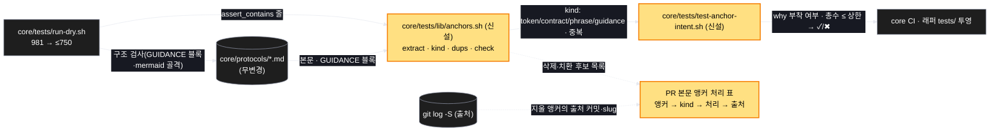

# Architecture — run-dry 다이어트

> Two-diagram view of this feature. **Review and edit before `/scv:work`** —
> diagrams are LLM-generated and may have inaccuracies.

## 1. Component data flow



## 2. Position in whole architecture

> Skipped — graphify graph is stale (built 2026-09-11) and was not rebuilt for this promote.

## 3. Screen mockups

### 앵커 처리 흐름 (BE — 화면 없음)

```screen
{
  "title": "앵커 분류와 되돌아감 방지",
  "screenRefs": [
    { "calls": "1", "name": "코어 CI", "element": "run-dry + core/tests/test-*.sh", "when": "모든 PR" }
  ],
  "diagram": [
    { "label": "구성", "code": "flowchart LR\n  A[\"① run-dry.sh\"] --> B[\"② anchors.sh 순수부\"]\n  P[(\"③ protocols/*.md\")] --> B\n  B --> C[\"④ test-anchor-intent.sh\"]\n  B -.-> T[\"⑤ PR 처리 표\"]\n  G[(\"⑥ git log -S\")] -.-> T" },
    { "label": "순서", "code": "sequenceDiagram\n  autonumber\n  participant D as 개발자\n  participant L as anchors.sh\n  participant I as intent lint\n  D->>L: run-dry 앵커 추출·분류\n  L-->>D: token / contract / phrase / guidance · 중복\n  D->>D: phrase·guidance → 삭제 또는 구조 검사, contract → why 부착 (출처는 git log -S)\n  D->>I: 검사 실행\n  alt why 없음 또는 총수 > 상한\n    I-->>D: ✖\n  else\n    I-->>D: ✓\n  end" }
  ],
  "functions": [
    { "marker": "1", "title": "run-dry.sh", "notes": ["역할: 코어 회귀 본체 — 스크립트 실행 검사는 그대로, 문장 고정만 준다", "성공: 총 ≤ 750, 실행 검사 241 동일"] },
    { "marker": "2", "title": "anchors.sh", "step": "classifyAnchor", "notes": ["역할: 앵커 추출·분류·중복 탐지 (순수)", "받는 값 → 돌려주는 값: run-dry 문자열 + 규약 본문 → 앵커 목록과 kind"] },
    { "marker": "3", "title": "protocols/*.md", "notes": ["역할: 분류의 기준 본문 — 무변경", "데이터 영향: 읽기만"] },
    { "marker": "4", "title": "test-anchor-intent.sh", "step": "checkIntent", "notes": ["역할: 문장 고정마다 # why: 강제, 총수 상한(120)", "실패: why 없음 · 상한 초과 → CI ✖"] },
    { "marker": "5", "title": "PR 처리 표", "notes": ["역할: 지운·바꾼 앵커의 출처와 처리 근거 — 리뷰의 증거", "실패: 누락 행 → T5 ✖"] },
    { "marker": "6", "title": "git log -S", "notes": ["역할: 앵커를 넣은 커밋·계획 찾기", "실패: 못 찾으면 contract 로 보수적 유지"] }
  ],
  "validations": {
    "title": "실패 · 검사 표",
    "columns": ["번호", "조건", "검사", "결과"],
    "rows": [
      ["1", "assert_out_*/assert_file 수 감소", "T1", "✖"],
      ["2", "중복 > 0 또는 guidance kind > 0", "T2", "✖"],
      ["4", "why 없는 문장 고정 / 총수 > 상한", "T3", "✖"],
      ["3", "지시자·classDef·GUIDANCE 표식·질문 블록 결손", "T4 구조 검사", "✖"],
      ["5", "처리 표 누락", "T5", "✖"]
    ]
  }
}
```
