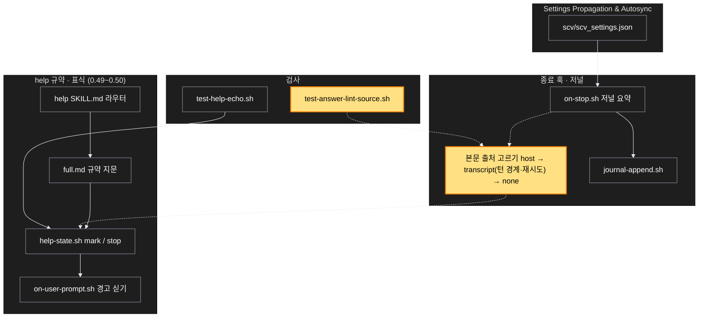

# Architecture — 답 모양 검사는 이번 턴의 답만 본다 — 기록 경합 제거

> Two-diagram view of this feature. **Review and edit before `/scv:work`** —
> diagrams are LLM-generated and may have inaccuracies.

## 1. Component data flow

종료 훅이 본문을 얻는 세 갈래와, 표식 스크립트가 그것을 판정해 파일에 남기기까지.

```mermaid
%%{init: {'theme':'base', 'themeVariables': {'primaryColor':'#1e1e1e','primaryTextColor':'#fff','primaryBorderColor':'#9096a8','lineColor':'#e7e9f0','secondaryColor':'#2d2d2d','tertiaryColor':'#1e1e1e','background':'#171922','edgeLabelBackground':'#171922'}}}%%
flowchart LR
  Host[호스트 Stop 이벤트] -->|"stdin JSON {last_assistant_message?, transcript_path}"| OnStop[on-stop.sh]
  OnStop -->|"hostText 비어 있으면"| Wait[waitForTurnText]
  Wait -->|"tail 400 · 최대 4회 × 250ms"| Transcript[(대화 원본 JSONL)]
  Transcript -->|"JSONL 텍스트"| Slice[sliceTurnText]
  Slice -->|"마지막 사용자 프롬프트 이후 어시스턴트 텍스트"| Pick[pickSource]
  OnStop -->|"hostText"| Pick
  Pick -->|"{src, text} · stop --src"| HS[help-state.sh stop]
  HS -->|"text, cap"| Lint[lintAnswer — 따옴표·괄호 비우고 셈]
  HS -->|"대화 파일 마지막 Turn (변경 없음)"| Echo[scv_echo_check]
  Lint -->|"위반 줄들"| Decide[decideDrift]
  Echo -->|"ok / missing / mismatch"| Decide
  Decide -->|"reload, warn"| Line[renderDriftLine — 끝에 src=…]
  Line -->|"append"| Drift[(.help-drift)]
  Decide -->|"reload=1 이면"| State[(.help-state · .help-warn)]
```



## 2. Position in whole architecture

이 변경이 닿는 곳은 종료 훅 한 곳과 표식 스크립트의 린트 절뿐이다. 새 상자는 노란색.

> Source: graphify graph (built 2026-09-11) — 문서 그래프 기준으로 관련 군집만 추렸다



## 3. Screen mockups

화면이 없는 백엔드(훅) 계획이라 그림 자리는 구성·순서 두 다이어그램이다.

### 종료 훅 — 본문 출처 고르기

```screen
{
  "title": "종료 훅 — 본문 출처 고르기",
  "pageCode": "HOOK-STOP-01",
  "screenRefs": [
    { "calls": "1", "name": "호스트 턴 종료 (Stop 이벤트)", "pageCode": "HOST-STOP", "element": "훅 실행", "when": "모델이 답을 끝낼 때마다" }
  ],
  "diagram": [
    { "label": "구성", "code": "flowchart LR\n  A[\"① on-stop.sh\"] --> B[\"② pickSource\"]\n  A --> C[\"③ waitForTurnText\"]\n  C --> D[\"④ 대화 원본 JSONL\"]\n  B --> E[\"⑤ help-state.sh stop\"]\n  E --> F[\"⑥ lintAnswer\"]\n  E --> G[\"⑦ .help-drift\"]\n  E --> H[\"⑧ .help-state · .help-warn\"]" },
    { "label": "순서", "code": "sequenceDiagram\n  autonumber\n  participant H as 호스트\n  participant S as ① on-stop.sh\n  participant T as ④ 원본\n  participant K as ⑤ help-state stop\n  H->>S: stdin JSON\n  alt last_assistant_message 있음\n    S->>K: text, --src host\n  else 없음\n    loop 최대 4회 × 250ms\n      S->>T: tail 400 → 이번 턴 텍스트?\n    end\n    alt 찾음\n      S->>K: text, --src transcript\n    else 못 찾음\n      S->>K: \"\", --src none (린트 생략)\n    end\n  end\n  K->>K: echo 검사 (변경 없음) · lint\n  K-->>H: exit 0" }
  ],
  "functions": [
    { "marker": "1", "title": "on-stop.sh", "step": "readStopInput", "notes": ["역할: stdin JSON 에서 호스트 값과 원본 경로를 꺼낸다", "받는 값: JSON 한 덩어리 → 돌려주는 값: hostText, transcriptPath", "실패: JSON 아님·경로 없음 → exit 0, 아무것도 안 씀"] },
    { "marker": "2", "title": "pickSource", "step": "pickSource", "notes": ["역할: 출처 우선순위 host → transcript → none", "받는 값: hostText, turnText → {src, text}", "순수 — 파일·시각 안 만짐"] },
    { "marker": "3", "title": "waitForTurnText", "step": "waitForTurnText", "notes": ["역할: 원본이 따라잡을 때까지 짧게 기다린다", "받는 값: 경로, 횟수(4), 간격(250ms) → 텍스트 또는 \"\"", "상한 1초 — 호스트 값이 있으면 아예 안 돈다"] },
    { "marker": "4", "title": "대화 원본 JSONL", "notes": ["역할: 호스트가 비동기로 적는 기록 — 늦을 수 있다(공식 문서 명시)", "이번 턴 = 마지막 사람 프롬프트 항목 이후. tool_result 항목은 경계가 아니다"] },
    { "marker": "5", "title": "help-state.sh stop", "notes": ["역할: 지문 검사(변경 없음) + 린트 + 판정 + 파일 쓰기", "받는 값: stdin 본문, --src, 스위치 → 드리프트 한 줄·표식·경고", "본문이 비면 린트 생략 (lint=0, src=none) — 통과로 세지 않는다"] },
    { "marker": "6", "title": "lintAnswer", "step": "lintAnswer", "notes": ["역할: 첫 문단 문장 수·코드값·결정표 추천 열 검사", "수정: 따옴표·괄호 안을 비운 뒤 문장 끝을 센다"] },
    { "marker": "7", "title": ".help-drift", "notes": ["역할: 관찰 로그 — 기존 토큰 그대로, 끝에 src=host|transcript|none", "무시 파일 — 커밋되지 않음"] },
    { "marker": "8", "title": ".help-state · .help-warn", "notes": ["역할: reload=1 이면 protocol=0 과 다음 턴 경고 한 줄 예약", "변경 없음"] }
  ],
  "statesTitle": "데이터 모양 (파일 형식)",
  "states": [
    { "marker": "7", "label": "드리프트 한 줄", "body": [ { "type": "text", "value": "2026-09-16T21:06:49+09:00 turn=4 echo=ok lint=1 reload=1 src=host" } ] }
  ],
  "validations": {
    "title": "출처 · 결과 표",
    "columns": ["번호", "조건", "결과", "로그", "다음 턴"],
    "rows": [
      ["2", "호스트 값 있음", "그 값으로 린트", "src=host", "위반 시 경고 + 재읽기"],
      ["2, 3", "값 없음 · 원본에 이번 턴 답 있음", "원본 텍스트로 린트", "src=transcript", "위반 시 경고 + 재읽기"],
      ["2, 3", "값 없음 · 재시도 뒤에도 없음", "린트 생략", "src=none lint=0 reload=0", "경고 없음"],
      ["5", "스위치 둘 다 off", "읽지도 쓰지도 않음", "(없음)", "0.49.1 과 동일"],
      ["1", "stdin 깨짐 · jq 없음", "exit 0", "(없음)", "영향 없음"]
    ]
  }
}
```
