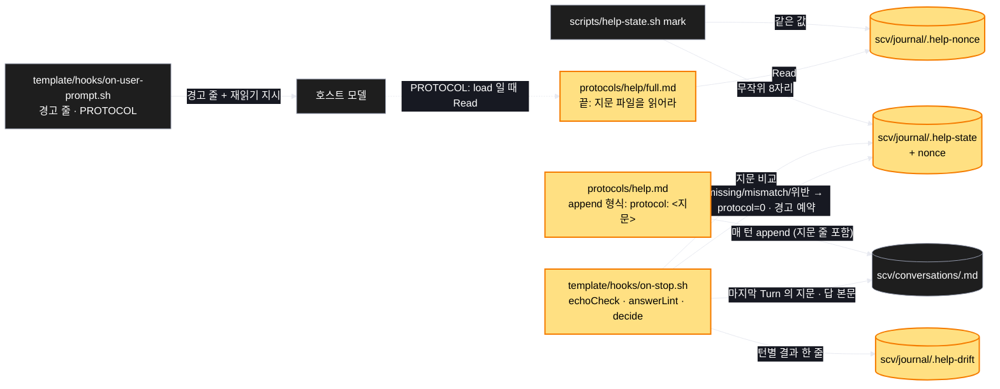

# Architecture — 규약 지문 메아리

> Two-diagram view of this feature. **Review and edit before `/scv:work`** —
> diagrams are LLM-generated and may have inaccuracies.

## 1. Component data flow



## 2. Position in whole architecture

> Skipped — graphify graph is stale (built 2026-09-11) and was not rebuilt for this promote.

## 3. Screen mockups

### 체크섬 루프 (BE — 화면 없음)

```screen
{
  "title": "지문 메아리와 답 모양 린트",
  "screenRefs": [
    { "calls": "4", "name": "종료 훅", "element": "Stop stdin(마지막 답)", "when": "모델이 답을 마칠 때" },
    { "calls": "6", "name": "매 턴 훅", "element": "UserPromptSubmit", "when": "다음 사용자 턴" }
  ],
  "diagram": [
    { "label": "구성", "code": "flowchart LR\n  A[\"① mark: 지문 생성\"] --> S[(\"② 표식+지문 파일\")]\n  F[\"③ full.md 읽기 → 지문 획득\"] --> M[\"모델\"]\n  M --> C[(\"대화 파일 append: protocol: 지문\")]\n  C --> T[\"④ Stop 훅: 메아리 검사 · 답 모양 린트\"]\n  T --> S\n  T --> D[(\"⑤ 드리프트 로그\")]\n  S --> P[\"⑥ 매 턴 훅: 경고 + load\"]" },
    { "label": "순서", "code": "sequenceDiagram\n  autonumber\n  participant M as 모델\n  participant C as 대화 파일\n  participant T as Stop 훅\n  participant S as 표식\n  participant P as 매 턴 훅\n  M->>C: Turn append (protocol: 지문)\n  M-->>T: 답 본문\n  T->>C: 마지막 Turn 의 지문 읽기\n  T->>S: 지문 비교 · 린트 결과\n  alt 지문 없음/다름 또는 모양 위반\n    T->>S: protocol=0, 경고 예약\n    P-->>M: 다음 턴 경고 + PROTOCOL: load\n  else 정상\n    P-->>M: 평소대로 (loaded)\n  end" }
  ],
  "functions": [
    { "marker": "1", "title": "mark", "notes": ["역할: 규약을 읽은 직후 8자리 무작위 지문 생성 (효과부)", "성공: 표식 nonce + .help-nonce 동일값", "실패: 생성 못 하면 nonce 비움 → 메아리 검사 skip"] },
    { "marker": "2", "title": "표식 + 지문 파일", "notes": ["역할: 정답 보관 — 라우터·훅 출력엔 절대 노출 안 함", "데이터 영향: scv/journal/ 안 두 파일, ignore"] },
    { "marker": "3", "title": "full.md 끝 지시", "notes": ["역할: '이 세션의 규약 지문은 .help-nonce 를 읽어라' — 지문이 규약을 읽은 컨텍스트에만 존재하게 하는 장치"] },
    { "marker": "4", "title": "Stop 훅", "step": "echoCheck", "notes": ["역할: 마지막 Turn append 의 지문 ↔ 표식 비교, 답 본문 린트", "실패: stdin 없음·JSON 아님 → 아무 것도 안 씀, exit 0"] },
    { "marker": "5", "title": "드리프트 로그", "notes": ["역할: 턴별 한 줄(지문 ok/missing · 위반 수) — 세션 뒤 '흐려진 턴' 집계"] },
    { "marker": "6", "title": "매 턴 훅", "step": "decideReload", "notes": ["역할: 예약된 경고 줄 출력, PROTOCOL: load 유도", "받는 값 → 돌려주는 값: 표식 → 지시 블록 + 경고"] }
  ],
  "validations": {
    "title": "판정 · 결과 표",
    "columns": ["번호", "조건", "판정", "다음 턴"],
    "rows": [
      ["4", "protocol=0 (읽기 전)", "skip", "평소대로"],
      ["4", "append 지문 == 표식", "ok", "loaded 유지"],
      ["4", "append 에 지문 없음", "missing", "경고 + load"],
      ["4", "지문 다름(옛 세션 값)", "mismatch", "경고 + load"],
      ["4", "결론 > 상한 / 추천 열 없음 / 첫 문단 코드값", "위반 n", "경고 + load"],
      ["4", "stdin 비거나 JSON 아님", "—", "아무 것도 안 씀"]
    ]
  }
}
```
