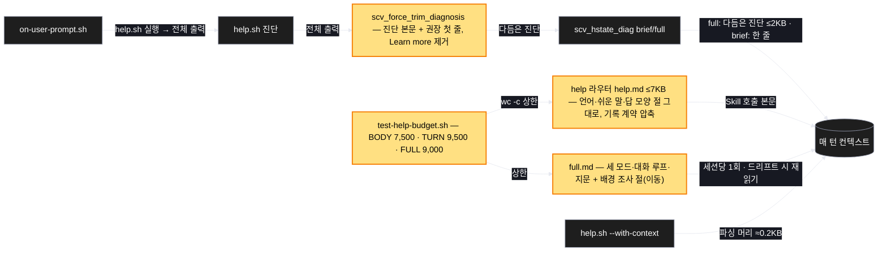
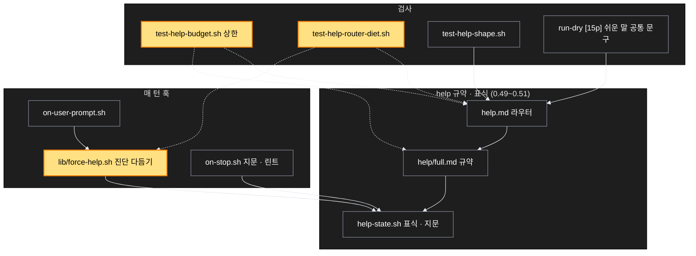

# Architecture — 매 턴 라우터 다이어트

> Two-diagram view of this feature. **Review and edit before `/scv:work`** —
> diagrams are LLM-generated and may have inaccuracies.

## 1. Component data flow

매 턴 컨텍스트에 실리는 세 덩어리와, 이번에 줄어드는 자리(노란색).



## 2. Position in whole architecture

> Source: graphify graph (built 2026-09-11) — 문서 그래프 기준으로 관련 군집만 추렸다



## 3. Screen mockups

화면이 없는 계획이라 그림 자리는 구성·순서 두 다이어그램이다.

### 매 턴 컨텍스트 — 무엇이 얼마나 실리나

```screen
{
  "title": "매 턴 컨텍스트 — 무엇이 얼마나 실리나",
  "pageCode": "HELP-TURN-01",
  "screenRefs": [
    { "calls": "1", "name": "사용자 메시지 제출 (UserPromptSubmit)", "pageCode": "HOST-PROMPT", "element": "훅 실행", "when": "매 턴" }
  ],
  "diagram": [
    { "label": "구성", "code": "flowchart LR\n  A[\"① 훅 블록 ≈1.5KB\"] --> C[\"④ 컨텍스트\"]\n  B[\"② 라우터 help.md 9.7→≤7KB\"] --> C\n  D[\"③ 헬퍼 출력 0.2KB\"] --> C\n  E[\"⑤ full.md 7.2→≤9KB (세션당 1회)\"] -.-> C\n  F[\"⑥ 전체 진단 3.3→≤2KB (변동 턴만)\"] --> A" },
    { "label": "순서", "code": "sequenceDiagram\n  autonumber\n  participant H as 호스트\n  participant P as ① on-user-prompt.sh\n  participant S as ② help 라우터\n  participant K as help-state\n  H->>P: 프롬프트\n  P->>P: help.sh 실행 → 다듬기(⑥)\n  P->>K: diag 해시 비교\n  alt 변동 없음\n    P-->>H: 한 줄\n  else 변동\n    P-->>H: 다듬은 진단 ≤2KB\n  end\n  H->>S: Skill 호출 (≤7KB)\n  S->>K: PROTOCOL load/loaded\n  alt load\n    S->>S: full.md 읽기 (⑤)\n  end" }
  ],
  "functions": [
    { "marker": "1", "title": "훅 블록", "notes": ["역할: 강제 호출 지시 + 쉬운 말 5줄 + preflight", "변동 없는 턴 ≈1.5KB — 이번엔 손대지 않는다"] },
    { "marker": "2", "title": "라우터 help.md", "step": "sectionSizes", "notes": ["역할: 매 턴 Skill 호출 본문", "남기는 절: 언어 · 쉬운 말 · 답 모양(바이트 동일) · 기록 계약(압축)", "옮기는 절: 배경 조사 → full.md · 지우는 절: Final notes"] },
    { "marker": "3", "title": "헬퍼 출력", "notes": ["역할: PROTOCOL load/loaded · 대화 파일 목록", "변경 없음 ≈0.2KB"] },
    { "marker": "4", "title": "컨텍스트", "notes": ["역할: 모델이 이번 턴에 읽는 것", "목표: 변동 없는 턴 합 ≤ 9.5KB (지금 ≈12.6KB)"] },
    { "marker": "5", "title": "full.md", "notes": ["역할: 세션당 한 번 읽는 규약", "배경 조사 절이 여기로 — 상한 9,000B"] },
    { "marker": "6", "title": "전체 진단 다듬기", "step": "trimDiagnosis", "notes": ["역할: 훅 경로에서만 안내문 제거", "남김: 진단 본문 · 권장 행동 제목 + 첫 줄 / 뺌: Learn more · hydrate 방법", "직접 /scv:help 는 그대로"] }
  ],
  "statesTitle": "데이터 모양 (상한 검사)",
  "states": [
    { "marker": "2", "label": "상한", "body": [ { "type": "text", "value": "BODY ≤ 7,500 · TURN ≤ 9,500 · FULL ≤ 9,000 · TOTAL ≤ 32,000 (test-help-budget.sh)" } ] }
  ],
  "validations": {
    "title": "계약 · 검사 표",
    "columns": ["번호", "조건", "검사", "결과"],
    "rows": [
      ["2", "언어·쉬운 말·답 모양 절 바이트 동일", "T2 md5 · run-dry [15p]", "라우터 절 3개 그대로"],
      ["2", "기록 템플릿·명령 셋 존재", "T4 grep 7건 · test-help-echo", "지문 규칙 유지"],
      ["5", "배경 조사 절 문구 그대로 이동", "T3 · test-delegate-effort", "위치만 바뀜"],
      ["6", "훅 전체 진단에 Learn more 없음", "T6 · T8 순수부", "≤ 2,000B"],
      ["6", "help.sh 직접 출력은 그대로", "T6 비교", "안내문 유지"],
      ["4", "brief/full 전환 그대로", "T7", "해시는 다듬은 텍스트"]
    ]
  }
}
```
