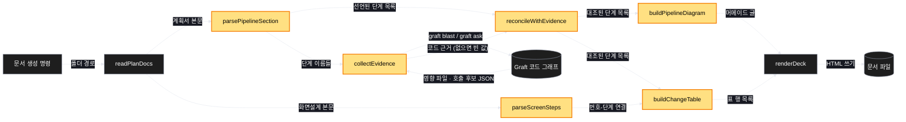
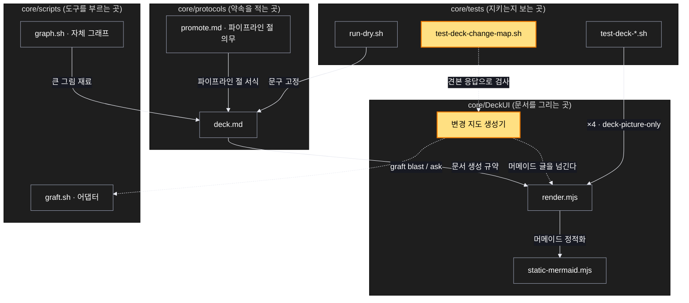

# Architecture — 계획서가 바뀔 함수를 먼저 말하고, 문서가 그것을 그림으로 보여준다

> 이 기능을 두 장의 그림으로 본다. **`/scv:work` 전에 읽고 고칠 것** —
> 그림은 모델이 그린 것이라 틀릴 수 있다.

## 1. Component data flow

이 기능의 부품들이 어떻게 주고받는가.



노란색이 이번에 새로 만드는 부품이다. 양 끝의 읽기와 쓰기는 이미 있는 것을 그대로 쓴다.

## 2. Position in whole architecture

이 기능이 전체 어디에 앉는가. 새로 생기는 것은 노란색이다.

> Source: scv graph (built 2026-09-17)



## 3. Screen mockups

### 문서의 변경 지도 절

```screen
{
  "title": "기획서 — 변경 지도 절",
  "body": [
    {
      "type": "header",
      "title": "이번에 바뀌는 함수",
      "subtitle": "계획서가 선언하고, 코드가 대조한다"
    },
    {
      "type": "card",
      "title": "파이프라인 그림",
      "body": [
        {
          "type": "text",
          "value": "선언한 순서대로 단계를 잇고, 추가·변경·삭제를 색으로 나눈다. 삭제로 가는 선은 점선."
        }
      ]
    },
    {
      "type": "table",
      "columns": [
        "#",
        "단계",
        "받는 값 → 돌려주는 값",
        "상태",
        "코드 대조"
      ],
      "rows": [
        [
          "2",
          "parsePipelineSection",
          "계획서 본문 → 선언된 단계 목록",
          {
            "badge": "추가",
            "tone": "good"
          },
          {
            "badge": "근거없음",
            "tone": "muted"
          }
        ],
        [
          "5",
          "reconcileWithEvidence",
          "선언 + 근거 → 대조된 단계 목록",
          {
            "badge": "추가",
            "tone": "good"
          },
          {
            "badge": "이미 있음",
            "tone": "warn"
          }
        ],
        [
          "8",
          "renderDeck",
          "그림 + 표 → 문서",
          {
            "badge": "변경",
            "tone": "info"
          },
          {
            "badge": "일치",
            "tone": "good"
          }
        ]
      ]
    },
    {
      "type": "card",
      "title": "코드 대조 표시",
      "body": [
        {
          "type": "list",
          "items": [
            {
              "label": "일치 — 선언과 코드가 맞는다"
            },
            {
              "label": "이미 있음 — 추가라고 했는데 코드에 있다"
            },
            {
              "label": "근거없음 — 대조할 코드를 못 봤다"
            }
          ]
        }
      ]
    },
    {
      "type": "card",
      "title": "Graft 가 없을 때",
      "body": [
        {
          "type": "text",
          "value": "대조 열이 모두 근거없음이 되고, 설치 명령 한 줄이 터미널에 안내된다. 그림과 표는 그대로 나온다."
        }
      ]
    }
  ],
  "functions": [
    {
      "marker": "1",
      "title": "파이프라인 그림",
      "step": "buildPipelineDiagram",
      "notes": [
        "단계를 선언한 순서대로 잇는다",
        "추가·변경·삭제를 색으로 나눈다",
        "삭제로 가는 선은 점선"
      ]
    },
    {
      "marker": "2",
      "title": "변경 표",
      "step": "buildChangeTable",
      "notes": [
        "단계마다 한 행",
        "상태가 적히지 않았으면 미지정",
        "삭제가 없으면 삭제 행을 만들지 않는다"
      ]
    },
    {
      "marker": "3",
      "title": "코드 대조 표시",
      "step": "reconcileWithEvidence",
      "notes": [
        "일치 · 이미 있음 · 근거없음 셋 중 하나",
        "선언을 고치지 않는다 — 어긋남만 표시"
      ]
    },
    {
      "marker": "4",
      "title": "Graft 가 없을 때",
      "step": "collectEvidence",
      "notes": [
        "빈 값을 돌려주고 문서 생성은 계속된다",
        "설치 명령 한 줄을 터미널에 안내한다",
        "설치·초기화·빌드를 직접 실행하지 않는다"
      ]
    }
  ],
  "validations": {
    "title": "상태와 대조 — 무엇을 보여주는가",
    "columns": [
      "번호",
      "조건",
      "보여지는 것",
      "보여주지 않는 것"
    ],
    "rows": [
      [
        "1, 2",
        "계획서에 상태가 적혀 있음",
        "선언한 상태 그대로",
        "코드에서 추측한 상태"
      ],
      [
        "1, 2",
        "상태 칸이 없는 옛 서식",
        "미지정",
        "빈칸을 지어낸 값으로 채우기"
      ],
      [
        "2",
        "삭제가 적혀 있지 않음",
        "삭제 행 없음",
        "'삭제 없음' 같은 지어낸 문구"
      ],
      [
        "3, 4",
        "Graft 없음",
        "근거없음 + 설치 명령 안내",
        "빈 그림이나 오류"
      ],
      [
        "3",
        "선언은 추가인데 코드에 이미 있음",
        "이미 있음 표시",
        "선언을 '변경' 으로 바꿔 쓰기"
      ]
    ]
  }
}
```
