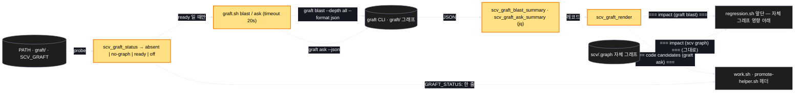
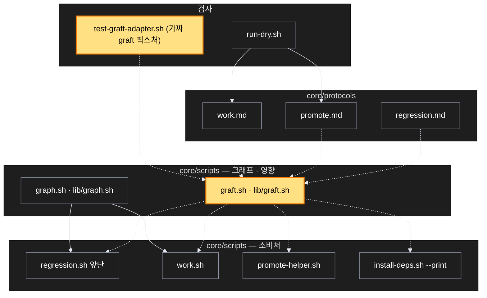

# Architecture — Graft 어댑터

> Two-diagram view of this feature. **Review and edit before `/scv:work`** —
> diagrams are LLM-generated and may have inaccuracies.

## 1. Component data flow



## 2. Position in whole architecture

> Source: scv graph (built 2026-09-17) — 군집·핵심 노드는 scv/.graph/GRAPH_REPORT.md 기준.



## 3. Screen mockups

화면이 없는 계획이라 그림 자리는 구성·순서 두 다이어그램이다.

### 회귀·구현 앞단의 두 번째 제공자

```screen
{
  "title": "회귀·구현 앞단의 두 번째 제공자",
  "pageCode": "GRAFT-01",
  "screenRefs": [
    { "calls": "1", "name": "회귀 (action:regression)", "pageCode": "REGRESSION", "element": "앞단 정보 블록", "when": "변경 파일이 있고 graft ready 일 때" },
    { "calls": "1", "name": "구현·계획 (action:work · promote)", "pageCode": "WORK", "element": "헤더", "when": "매 호출 — 상태 한 줄, ready 면 후보 블록" }
  ],
  "diagram": [
    { "label": "구성", "code": "flowchart LR\n  A[\"① graft.sh status\"] --> B{\"② ready?\"}\n  B -- no --> C[\"③ GRAFT_STATUS 한 줄 (absent · no-graph · off)\"]\n  B -- yes --> D[\"④ blast --depth all --format json\"]\n  B -- yes --> E[\"⑤ ask <task> --json\"]\n  D --> F[\"⑥ 요약 (jq) → 텍스트\"]\n  E --> F\n  F --> G[\"⑦ 자체 그래프 블록 아래에 덧붙임\"]" },
    { "label": "순서", "code": "sequenceDiagram\n  autonumber\n  participant R as regression.sh\n  participant S as ① graft.sh\n  participant G as graft CLI\n  R->>R: === impact (scv graph) === (기존)\n  R->>S: blast --base <ref>\n  S->>S: status (PATH · graft/ · SCV_GRAFT)\n  alt ready\n    S->>G: graft blast --depth all --format json (timeout 20s)\n    alt JSON 정상\n      G-->>S: JSON\n      S-->>R: === impact (graft blast) ===\n    else 실패 · 타임아웃 · 깨진 JSON\n      S-->>R: (빈 출력, stderr 한 줄, exit 0)\n    end\n  else absent · no-graph · off\n    S-->>R: (빈 출력)\n  end" }
  ],
  "functions": [
    { "marker": "1", "title": "graft.sh status", "step": "scv_graft_status", "notes": ["역할: PATH 의 graft, graft/ 폴더, SCV_GRAFT 스위치로 상태 판정", "받는 값: 환경 → absent | no-graph | ready | off (exit 0)"] },
    { "marker": "2", "title": "ready 판정", "notes": ["ready 가 아니면 graft 를 부르지 않는다 — 사용자의 그래프 상태를 바꾸지 않는다(build 도 안 함)"] },
    { "marker": "3", "title": "상태 한 줄", "notes": ["work/promote 헤더에는 늘 GRAFT_STATUS: 한 줄", "regression 은 ready 가 아니면 줄 자체를 내지 않는다"] },
    { "marker": "4", "title": "blast", "step": "scv_graft_blast_summary", "notes": ["받는 값: --base <ref> (origin/main 있으면 그것, 없으면 HEAD) → JSON", "요약: 파일 수 · 심볼 수 · 상위 파일 10 (심볼 수 내림차순)", "실패: 빈 출력 + stderr 한 줄, exit 0"] },
    { "marker": "5", "title": "ask", "step": "scv_graft_ask_summary", "notes": ["받는 값: 계획 제목(또는 인자) → JSON", "요약: 점수 내림차순 상위 10, path:line — label", "0건 → (후보 없음)"] },
    { "marker": "6", "title": "요약 → 텍스트", "step": "scv_graft_render", "notes": ["순수 — 레코드만 받는다", "JSON 모양이 다르면 '요약 불가 — 원문 N바이트' 한 줄"] },
    { "marker": "7", "title": "덧붙임", "notes": ["자체 그래프 블록·문구는 그대로, 그 아래에", "안내는 install-deps --print 의 선택 항목 한 줄뿐"] }
  ],
  "statesTitle": "데이터 모양 (요약 레코드)",
  "states": [
    { "marker": "4", "label": "blast 요약", "body": [ { "type": "text", "value": "files\\x1fsymbols\\x1ftop  →  \"3\\x1f7\\x1fa.ts:4 b.ts:2 c.ts:1\"" } ] },
    { "marker": "5", "label": "ask 후보", "body": [ { "type": "table", "columns": ["path:line", "label", "score"], "rows": [["src/auth/login.ts:42", "validateSession", "0.91"], ["src/auth/token.ts:10", "issueToken", "0.77"]] } ] }
  ],
  "validations": {
    "title": "실패 · 응답 표",
    "columns": ["번호", "조건", "응답", "본문 · 메시지", "기록 · 데이터 영향"],
    "rows": [
      ["1", "graft 없음", "GRAFT_STATUS: absent", "소비처는 한 줄만 · regression 은 줄 없음", "없음"],
      ["1", "graft 있음 · graft/ 없음", "GRAFT_STATUS: no-graph", "안내 한 줄, 호출 없음", "없음"],
      ["1", "SCV_GRAFT=off", "GRAFT_STATUS: off", "호출 없음", "없음"],
      ["4, 5", "타임아웃(20s) · 비정상 종료 · 깨진 JSON", "빈 출력, stderr 한 줄, exit 0", "소비처 진행", "없음"],
      ["6", "JSON 필드 모양이 다름", "요약 불가 한 줄 + 원문 크기", "실패로 세지 않음", "없음"],
      ["5", "후보 0건 (예: bash 저장소)", "(후보 없음)", "정상", "없음"]
    ]
  }
}
```
