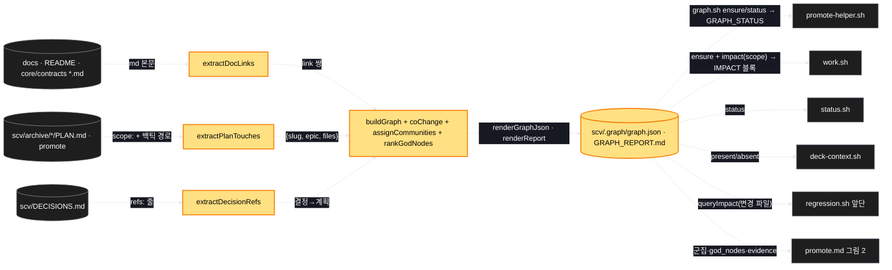
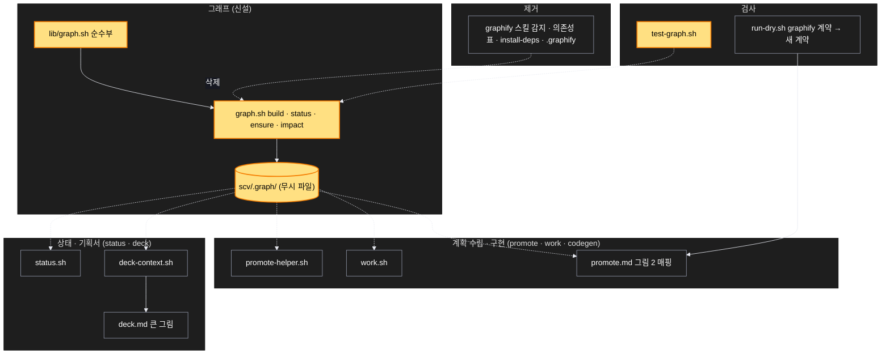

# Architecture — SCV 자체 그래프

> Two-diagram view of this feature. **Review and edit before `/scv:work`** —
> diagrams are LLM-generated and may have inaccuracies.

## 1. Component data flow

재료 셋이 순수부를 지나 그래프 파일이 되고, 소비처 넷과 영향 조회가 그것을 읽는다. 노란색이 새로 생기는 것.



## 2. Position in whole architecture

> Source: scv graph (built 2026-09-17) — 이 계획이 만든 그래프로 그린 첫 그림 2. 군집·핵심 노드는 scv/.graph/GRAPH_REPORT.md 기준.



## 3. Screen mockups

화면이 없는 계획이라 그림 자리는 구성·순서 두 다이어그램이다.

### 그래프 빌드와 영향 조회

```screen
{
  "title": "그래프 빌드와 영향 조회",
  "pageCode": "GRAPH-01",
  "screenRefs": [
    { "calls": "1", "name": "계획 수립 (action:promote)", "pageCode": "PROMOTE", "element": "promote-helper.sh", "when": "매 promote 시작 — ensure" },
    { "calls": "6", "name": "구현 (action:work / codegen)", "pageCode": "WORK", "element": "work.sh 헤더", "when": "계획 로드 때 — 계획 scope 의 영향" },
    { "calls": "6", "name": "회귀 (action:regression)", "pageCode": "REGRESSION", "element": "앞단 정보 블록", "when": "변경 파일이 있을 때" }
  ],
  "diagram": [
    { "label": "구성", "code": "flowchart LR\n  A[\"① graph.sh ensure\"] --> B[\"② listSources\"]\n  B --> C[\"③ 추출 셋 (links · touches · refs)\"]\n  C --> D[\"④ buildGraph · coChange · communities · godNodes\"]\n  D --> E[\"⑤ scv/.graph/graph.json + REPORT\"]\n  E --> F[\"⑥ impact <path>…\"]\n  E --> G[\"⑦ 소비처 넷 (GRAPH_STATUS · 그림 2 · 큰 그림)\"]" },
    { "label": "순서", "code": "sequenceDiagram\n  autonumber\n  participant P as promote-helper\n  participant G as ① graph.sh\n  participant S as ② 재료\n  participant O as ⑤ scv/.graph\n  P->>G: ensure\n  G->>O: status (mtime 비교)\n  alt built\n    G-->>P: GRAPH_STATUS: built\n  else stale · missing\n    G->>S: 문서 · PLAN · DECISIONS 읽기\n    G->>G: 추출 → 그래프 → 렌더 (순수부)\n    G->>O: graph.json · GRAPH_REPORT.md 쓰기\n    G-->>P: GRAPH_STATUS: built\n  end\n  alt jq 없음 · SCV_GRAPH=off\n    G-->>P: GRAPH_STATUS: unavailable | off (진행)\n  end" }
  ],
  "functions": [
    { "marker": "1", "title": "graph.sh ensure / status / build", "step": "listSources", "notes": ["역할: 신선도 판정과 빌드의 입구", "받는 값: 설정(SCV_GRAPH · SCV_GRAPH_DOCS) → GRAPH_STATUS 한 줄", "실패: jq 없음 → unavailable, 쓰기 실패 → 경고 한 줄, 종료 0"] },
    { "marker": "2", "title": "listSources", "notes": ["역할: 문서·계획·결정 파일을 모은다 (심볼릭 링크 제외)", "docs 없음 → 문서 0 으로 진행"] },
    { "marker": "3", "title": "추출 셋", "step": "extractDocLinks", "notes": ["extractDocLinks: 상대 md 링크만 · extractPlanTouches: scope 항목 + 백틱 경로(확장자·슬래시 규칙) · extractDecisionRefs: refs 줄", "순수 — 문자열만 받는다"] },
    { "marker": "4", "title": "그래프 만들기", "step": "buildGraph", "notes": ["노드 kind: doc · file · plan · decision", "링크 kind: link · touches · refers · cochange(weight = 계획 수, evidence = 슬러그)", "군집: 파일은 폴더 두 단계, 계획은 epic 또는 연월 · 핵심 노드: 차수 상위 10, 동률 id 순"] },
    { "marker": "5", "title": "scv/.graph/graph.json · GRAPH_REPORT.md", "step": "renderGraphJson", "notes": ["결정적(built_at 제외) · 무시 파일", "보고 절: Communities · God Nodes · Co-change pairs · Sources"] },
    { "marker": "6", "title": "impact <path>…", "step": "queryImpact", "notes": ["역할: 수정 범위 — 함께 바뀌는 파일(가중치·근거), 건드린 계획, 얽힌 결정, 링크한 문서", "없는 경로 → '근거 없음' 한 줄, 종료 0 · --json"] },
    { "marker": "7", "title": "소비처 넷", "notes": ["promote-helper · work.sh(IMPACT 블록) · status.sh · deck-context(SCV_GRAPH: present/absent)", "graphify 감지·질문 제거 — 그래프는 자동"] }
  ],
  "statesTitle": "데이터 모양 (graph.json)",
  "states": [
    { "marker": "5", "label": "노드", "body": [ { "type": "table", "columns": ["id", "kind", "community", "degree", "missing?"], "rows": [["core/template/hooks/on-stop.sh", "file", "core/template", "7", ""], ["20260916-wookiya1364-answer-lint-turn-race", "plan", "20260914-help-turn-cost", "9", ""], ["docs/architecture.md", "doc", "docs", "3", ""]] } ] },
    { "marker": "5", "label": "링크", "body": [ { "type": "table", "columns": ["source", "target", "kind", "weight", "evidence"], "rows": [["on-stop.sh", "lib/help-state.sh", "cochange", "2", "help-protocol-echo, answer-lint-turn-race"], ["20260916-…-answer-lint-turn-race", "on-stop.sh", "touches", "1", ""], ["decision:…경합-제거", "20260916-…-answer-lint-turn-race", "refers", "1", ""]] } ] }
  ],
  "validations": {
    "title": "실패 · 응답 표",
    "columns": ["번호", "조건", "응답", "본문 · 메시지", "기록 · 데이터 영향"],
    "rows": [
      ["1", "jq 없음", "GRAPH_STATUS: unavailable", "소비처는 그림 2·IMPACT 생략", "파일 안 씀"],
      ["1", "SCV_GRAPH=off", "GRAPH_STATUS: off", "아무것도 만들지 않음", "파일 안 씀"],
      ["1", "scv/.graph 쓰기 실패", "경고 한 줄, 종료 0", "진행", "이전 파일 유지"],
      ["3", "존재하지 않는 경로가 계획에 적힘", "노드 missing: true", "링크 유지", "보고에 표시"],
      ["6", "impact 에 없는 경로", "'근거 없음' 한 줄", "종료 0", "없음"],
      ["7", "빌드 실패", "GRAPHIFY 시절과 같은 graceful degrade", "promote/work/status/deck 진행", "없음"]
    ]
  }
}
```
