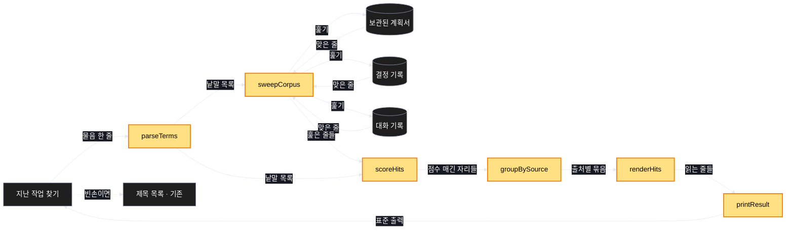
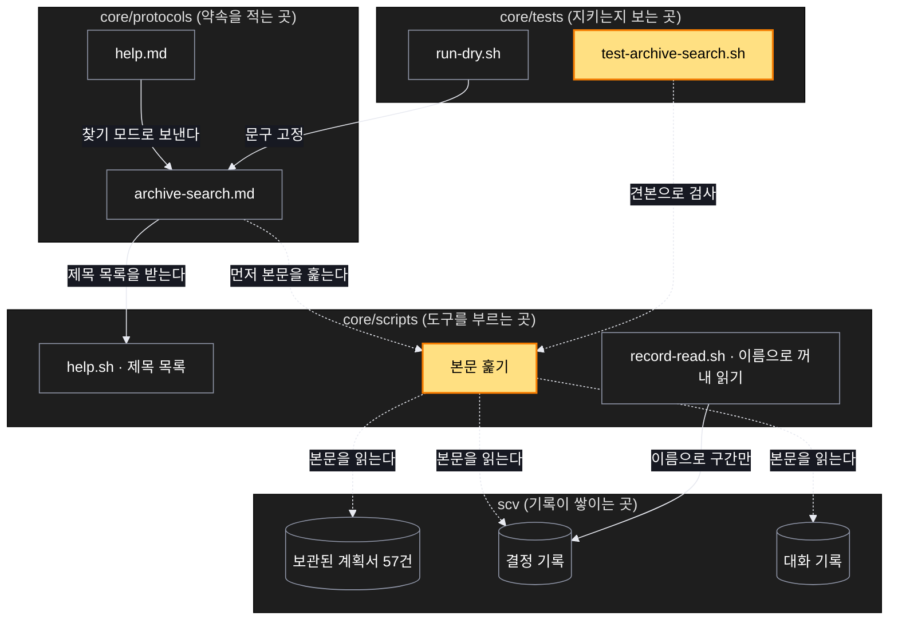

# Architecture — 지난 작업 찾기가 제목이 아니라 본문까지 훑는다

> 두 장의 그림으로 본다. **`/scv:work` 전에 읽고 고칠 것** — 그림은 모델이 그린 것이라 틀릴 수 있다.

## 1. Component data flow



노란색이 새로 만드는 부품이다. 빈손일 때 돌아가는 제목 목록은 이미 있는 것을 그대로 쓴다.

## 2. Position in whole architecture

> Source: scv graph (built 2026-09-18)



## 3. Screen mockups

### 지난 작업 찾기 결과

```screen
{
  "title": "지난 작업 찾기 — 결과",
  "body": [
    { "type": "header", "title": "\"회귀 검사 느려짐\" 으로 찾은 결과", "subtitle": "본문까지 훑었습니다" },
    { "type": "card", "title": "찾은 것",
      "body": [ { "type": "text", "value": "출처별로 묶고, 맞은 대목만 몇 줄씩 보입니다." } ] },
    { "type": "table",
      "columns": ["출처", "맞은 낱말", "대목"],
      "rows": [
        ["보관된 계획 · 회귀 계약 보수", {"badge":"2개","tone":"good"}, "회귀 검사가 관문을 공유해 한꺼번에 붉는다"],
        ["결정 기록 · 벽시계 단언 제거", {"badge":"2개","tone":"good"}, "부하가 초록·붉음을 정하던 문제"],
        ["대화 기록 · 0.52 릴리스", {"badge":"1개","tone":"muted"}, "관문 하나를 25건이 공유한다"]
      ] },
    { "type": "card", "title": "더 있을 때",
      "body": [ { "type": "text", "value": "상위 몇 건만 보이고 전체가 몇 건인지 함께 적습니다." } ] },
    { "type": "card", "title": "못 찾았을 때",
      "body": [ { "type": "text", "value": "없다고 말합니다. 비슷한 것을 대신 내놓지 않습니다." } ] }
  ],
  "functions": [
    { "marker": "1", "title": "찾은 것 묶음", "step": "groupBySource",
      "notes": ["한 계획에서 여러 번 맞으면 한 묶음으로", "많이 맞은 쪽이 앞에"] },
    { "marker": "2", "title": "출처와 대목 표", "step": "renderHits",
      "notes": ["어느 계획의 어느 줄인지 함께", "아주 긴 줄은 맞은 자리 앞뒤만"] },
    { "marker": "3", "title": "결과가 많을 때", "step": "scoreHits",
      "notes": ["상위 몇 건만 보이고 전체 수를 적는다", "흔한 낱말로 물으면 다시 좁히도록"] },
    { "marker": "4", "title": "못 찾았을 때", "step": "printResult",
      "notes": ["없다고 말한다", "제목 목록으로 돌아갈 수 있다"] }
  ],
  "validations": {
    "title": "무엇을 보여주고 무엇을 안 보여주는가",
    "columns": ["번호", "조건", "보여지는 것", "보여주지 않는 것"],
    "rows": [
      ["1, 2", "본문에서 맞음", "출처와 맞은 대목", "계획서 전체"],
      ["3", "맞은 것이 아주 많음", "상위 몇 건 + 전체 수", "전부 쏟아내기"],
      ["4", "아무것도 못 찾음", "없다는 한 줄", "비슷해 보이는 다른 계획"],
      ["4", "보관된 계획이 없음", "아직 없다는 안내", "오류로 끝내기"],
      ["2", "진행 중인 계획", "안 보임", "지난 것과 섞어 보이기"]
    ]
  }
}
```
