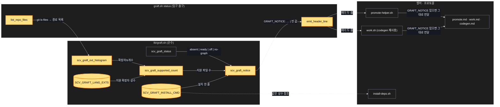
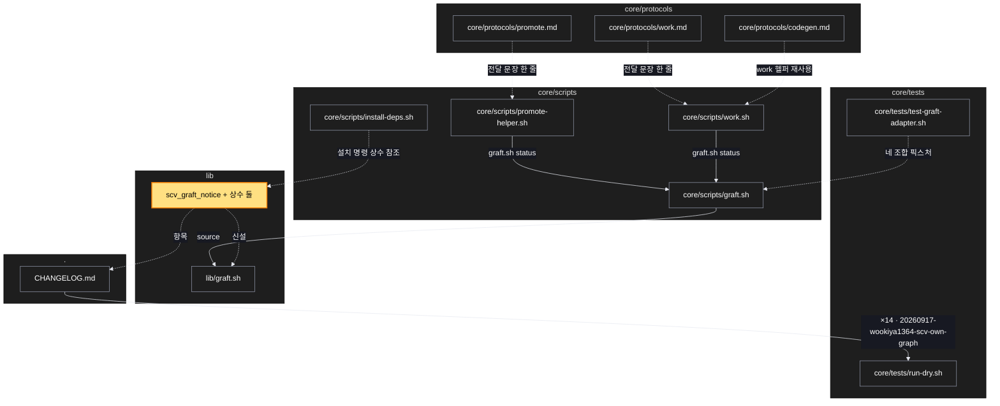

# Architecture — Graft 안내 — 계획·구현 때 먼저 알리고 설치까지

> Two-diagram view of this feature. **Review and edit before `/scv:work`** —
> diagrams are LLM-generated and may have inaccuracies.

## 1. Component data flow



## 2. Position in whole architecture

> Source: scv graph (built 2026-09-20)



## 3. Screen mockups

화면 없는 계획 — 구성도와 순서도가 큰 그림이다.

### Graft 안내 — 판별과 전달

```screen
{
  "title": "Graft 안내 — 판별과 전달",
  "diagram": [
    { "label": "구성", "code": "flowchart LR\n  F[\"① git ls-files\"] --> H[\"② 확장자 히스토그램\"]\n  H --> C[\"③ 지원 파일 수\"]\n  E[(\"④ 지원 확장자 상수\")] --> C\n  S[\"⑤ GRAFT_STATUS\"] --> N[\"⑥ 안내 한 줄\"]\n  C --> N\n  I[(\"⑦ 설치 명령 상수\")] --> N\n  N --> O[\"⑧ 헬퍼 헤더 → 프로토콜 전달\"]" },
    { "label": "순서", "code": "sequenceDiagram\n  autonumber\n  participant P as promote-helper / work.sh\n  participant G as graft.sh status\n  participant L as lib/graft.sh\n  P->>G: status\n  G->>L: scv_graft_status\n  alt absent\n    G->>L: histogram → supported_count\n    alt 지원 파일 > 0\n      L-->>G: GRAFT_NOTICE 한 줄\n    else 0\n      L-->>G: 빈 값 (침묵)\n    end\n  else ready / off\n    L-->>G: 빈 값\n  end\n  G-->>P: GRAFT_STATUS (+ GRAFT_NOTICE)\n  P-->>P: 헤더에 그대로 출력" }
  ],
  "functions": [
    { "marker": "1", "title": "git ls-files", "step": "list_repo_files", "notes": ["저장소가 아니거나 git 이 없으면 빈 목록 → 안내 없음(보수적)"] },
    { "marker": "2", "title": "확장자 히스토그램", "step": "scv_graft_ext_histogram", "notes": ["경로 → 확장자\\t개수. 순수, awk 표준입력 필터"] },
    { "marker": "3", "title": "지원 파일 수", "step": "scv_graft_supported_count", "notes": ["히스토그램 ∩ 지원 확장자 상수 → 정수"] },
    { "marker": "4", "title": "지원 확장자 상수", "notes": ["lib 한 곳. 초기값은 Graft 문서로 확인해 채우고 출처를 주석에"] },
    { "marker": "5", "title": "GRAFT_STATUS", "step": "scv_graft_status", "notes": ["기존 순수 함수 그대로: absent | ready | off | no-graph"] },
    { "marker": "6", "title": "안내 한 줄", "step": "scv_graft_notice", "notes": ["absent && 지원 파일 > 0 → 무엇이 좋아지는지 + 설치 명령", "그 외 → 빈 값", "우선순위 어휘 금지(검사 a)"] },
    { "marker": "7", "title": "설치 명령 상수", "notes": ["install-deps.sh 441행 문자열을 끌어올려 둘이 공유(4조)"] },
    { "marker": "8", "title": "헬퍼 헤더 → 프로토콜", "step": "emit_header_line", "notes": ["promote-helper·work 헤더에 GRAFT_NOTICE 줄", "promote·work·codegen 프로토콜: '있으면 그대로 전달' 한 문장"] }
  ],
  "validations": {
    "title": "실패 · 응답 표",
    "columns": ["번호", "조건", "응답", "메시지", "영향"],
    "rows": [
      ["1", "git 없음 / 저장소 아님", "빈 목록", "없음", "안내 없음 — 침묵이 기본"],
      ["6", "ready / off", "빈 값", "없음", "지금과 같은 출력"],
      ["6", "no-graph", "구현 중 결정", "graft init 안내 또는 없음", "Risks"],
      ["7", "설치 문자열이 두 곳에 정의", "T5 fail", "grep 2건", "4조 위반 — 상수 참조로"],
      ["8", "프로토콜이 문구를 바꿈/늘림", "T5 fail", "grep 불일치", "전달만 허용"]
    ]
  }
}
```
