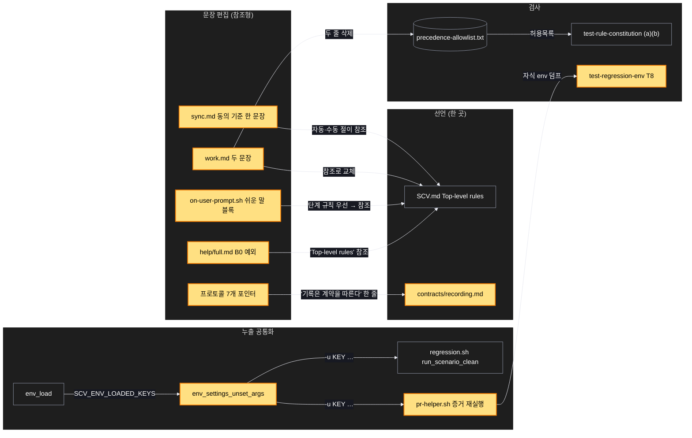
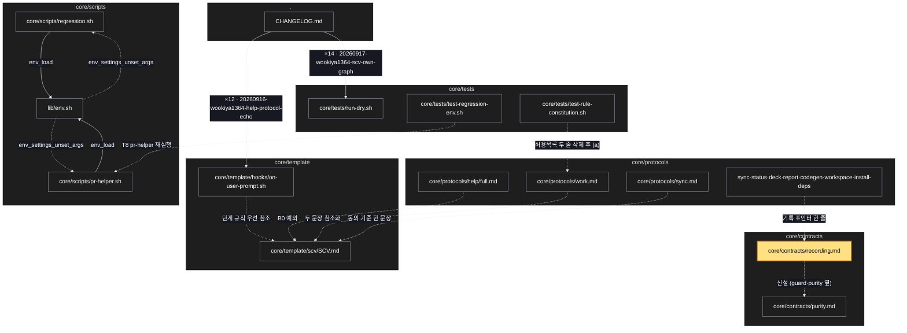

# Architecture — 규칙 충돌 후속

> Two-diagram view of this feature. **Review and edit before `/scv:work`** —
> diagrams are LLM-generated and may have inaccuracies.

## 1. Component data flow



## 2. Position in whole architecture

> Source: scv graph (built 2026-09-20)



## 3. Screen mockups

화면 없는 계획 — 구성도와 순서도가 큰 그림이다.

### 충돌 후속 — 무엇이 어디를 가리키게 되나

```screen
{
  "title": "충돌 후속 — 참조와 공통화",
  "diagram": [
    { "label": "구성", "code": "flowchart LR\n  C[\"① SCV.md Top-level rules\"]\n  B[\"② B0 예외 문장\"] --> C\n  P[\"③ 쉬운 말 블록 한 문장\"] --> C\n  W[\"④ work.md 두 문장\"] --> C\n  S[\"⑤ sync 동의 기준\"] --> C\n  R[\"⑥ contracts/recording.md\"]\n  N[\"⑦ 프로토콜 12개 포인터\"] --> R\n  U[\"⑧ env_settings_unset_args\"] --> G[\"regression.sh\"]\n  U --> H[\"⑨ pr-helper 재실행\"]\n  I[\"⑩ 래퍼 이슈 2건 (핸드오프)\"]" },
    { "label": "순서", "code": "sequenceDiagram\n  autonumber\n  participant W as work (구현)\n  participant D as 규칙 문서들\n  participant T as 검사 (a)(b)\n  participant X as 래퍼 저장소\n  W->>D: work.md 두 문장 참조화, 허용목록 두 줄 삭제\n  W->>T: (a) 통과?\n  alt 위반\n    T-->>W: 파일:줄 — 참조로 고침\n  end\n  W->>D: recording.md 신설 + 포인터 12\n  W->>T: (b) 기준선 이하?\n  W->>D: B0 예외 · 훅 문장 · sync 기준\n  W->>W: 지문 재계산\n  W->>X: (승인 후) 이슈 2건\n  W->>T: 전체 검사 · run-dry" }
  ],
  "functions": [
    { "marker": "1", "title": "SCV.md Top-level rules", "notes": ["변경 없음 — 모든 새 문장이 가리키는 곳"] },
    { "marker": "2", "title": "B0 예외 문장", "notes": ["주제가 명백히 다르면 묻지 않고 새로 열고 한 줄로 알린다", "더 좁은 범위 규칙 → 해소 순서 (2)"] },
    { "marker": "3", "title": "쉬운 말 블록 한 문장", "notes": ["실행 중 액션의 단계 규칙이 이 문구보다 먼저 — 해소 순서 참조", "템플릿 훅 → 지문 재계산"] },
    { "marker": "4", "title": "work.md 두 문장", "notes": ["Guardrails 문장은 codegen 140행 식으로", "effort 사용자 지시 문장은 7조 참조로", "허용목록 두 줄 삭제"] },
    { "marker": "5", "title": "sync 동의 기준", "notes": ["삭제 없는 갱신 자동, 삭제 있으면 미리보기+승인 — 한 문장", "자동 절·Step 0 이 참조"] },
    { "marker": "6", "title": "contracts/recording.md", "notes": ["누가·어디·형식·리댁션·짧은 턴 — 다섯 절", "기록 의무 본문은 여기만(4조)"] },
    { "marker": "7", "title": "프로토콜 12개 포인터", "notes": ["대화 있는 7개 신설 + 기존 5개 링크", "검사 (b) 기준선 이하"] },
    { "marker": "8", "title": "env_settings_unset_args", "step": "env_settings_unset_args", "notes": ["regression.sh 의 함수를 lib 로 — 정의 1, 호출 2"] },
    { "marker": "9", "title": "pr-helper 재실행", "notes": ["run-plan-tests 호출을 env -u … 로 감싼다", "test-regression-env T8"] },
    { "marker": "10", "title": "래퍼 이슈 2건", "notes": ["어댑터 소유 영역 — 여기서 안 고침", "사용자 승인 후 gh issue create, URL 을 ARCHIVED_AT 에"] }
  ],
  "validations": {
    "title": "실패 · 응답 표",
    "columns": ["번호", "조건", "응답", "메시지", "영향"],
    "rows": [
      ["2,3,4,5", "새 문장에 우선순위 어휘(비참조)", "검사 (a) fail", "파일:줄", "참조형으로 고침"],
      ["6,7", "기록 절차 본문이 두 문서에", "검사 (b) fail", "새 키", "계약 문서로 모음"],
      ["4", "허용목록에 work.md 줄 잔존", "T1 fail", "grep", "삭제"],
      ["8", "옛 settings_unset_args 정의 잔존", "T6 fail", "grep", "lib 함수로 교체"],
      ["9", "재실행 자식 env 에 SCV_LANG", "T7 fail", "env 덤프", "unset 인자 누락"],
      ["3", "지문 불일치", "digest --check fail", "재계산 필요", "compute-template-digest"]
    ]
  }
}
```
