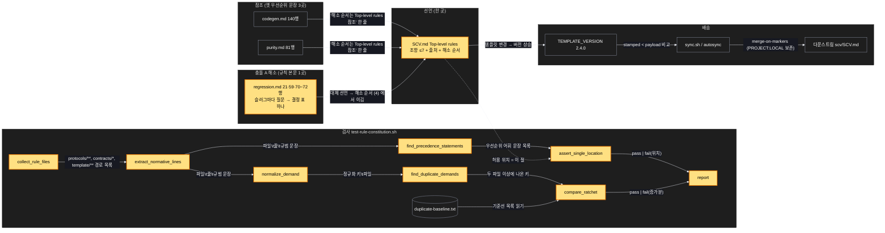
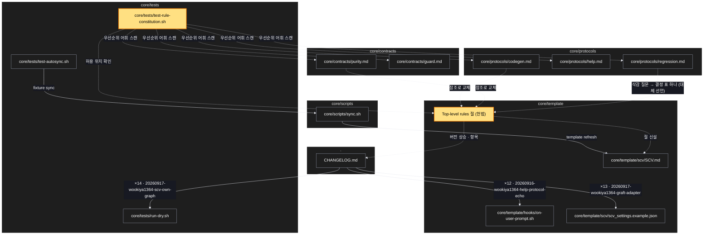

# Architecture — 규칙 헌법 — 최상위 불변식과 해소 순서 한 문장

> Two-diagram view of this feature. **Review and edit before `/scv:work`** —
> diagrams are LLM-generated and may have inaccuracies.

## 1. Component data flow

헌법 절 하나를 세 종류의 독자가 읽는다: 옛 우선순위 문장 자리(참조), 검사 스크립트(파이프라인),
동기화(다운스트림 배송).



## 2. Position in whole architecture

Where this feature sits in the system. New components highlighted in yellow.

> Source: scv graph (built 2026-09-20)



## 3. Screen mockups

화면이 없는 계획이다. 큰 그림 자리에 구성도와 순서도를 두고, 번호마다 역할을 오른쪽에 적는다.

### 규칙 헌법 — 구성과 검사 순서

```screen
{
  "title": "규칙 헌법 — 구성과 검사 순서",
  "diagram": [
    { "label": "구성", "code": "flowchart LR\n  C[\"① SCV.md Top-level rules\\n조항 ≤7 + 출처\"] --> O[\"② 해소 순서 한 문장\"]\n  R1[\"③ codegen.md 140행 → 참조\"] --> C\n  R2[\"③ purity.md 81행 → 참조\"] --> C\n  R3[\"③ regression.md 삭감 규칙 → 결정 표 하나\"] --> C\n  T[\"④ test-rule-constitution.sh\"] --> C\n  T --> B[(\"⑤ duplicate-baseline.txt\")]\n  C --> V[\"⑥ TEMPLATE_VERSION 2.4.0\"] --> S[\"sync.sh → 다운스트림\"]" },
    { "label": "순서", "code": "sequenceDiagram\n  autonumber\n  participant CI as 검사 실행\n  participant F as 규칙 파일들\n  participant A as 검사 a (유일성)\n  participant Bc as 검사 b (래칫)\n  participant BL as 기준선\n  CI->>F: collect_rule_files\n  F-->>CI: 규범 문장 목록\n  CI->>A: find_precedence_statements\n  alt SCV.md 밖에 비참조 우선순위 문장\n    A-->>CI: fail + 파일:줄\n  else\n    A-->>CI: pass\n  end\n  CI->>Bc: normalize_demand → find_duplicate_demands\n  Bc->>BL: 기준선 읽기\n  alt 후보 수 > 기준선\n    Bc-->>CI: fail + 늘어난 키\n  else\n    Bc-->>CI: pass\n  end\n  CI->>CI: report (종료 코드)" }
  ],
  "functions": [
    { "marker": "1", "title": "SCV.md Top-level rules 절", "notes": ["조항 3~7개, 각각 출처: 로 기존 원문 위치를 가리킨다", "조항 7: 사용자 지침에 양보하고 한 줄로 밝힌다", "다른 문서의 문장을 복제하지 않는다 — 요약 + 출처"] },
    { "marker": "2", "title": "해소 순서 한 문장", "notes": ["(1) 이 절의 조항 (2) 더 좁은 범위 (3) 실행 중 액션의 단계 규칙 > 상시 문구 (4) supersedes 선언한 나중 규칙", "선언 없이 어긋나면 충돌 = 버그. 어느 쪽을 따랐는지 한 줄로 밝히고 기록"] },
    { "marker": "3", "title": "옛 우선순위 문장 3곳 → 참조, regression 삭감 규칙 → 결정 표 하나", "step": "assert_single_location", "notes": ["codegen.md 140행, purity.md 81행, SCV.md 옛 절: 참조 한 줄로", "regression.md 21·59·70~72행: 독립된 실패 여럿은 결정 표 하나(슬러그별 행, 3택+추천). 옛 규칙 대체 선언 부착", "--ci 모드 규칙은 그대로", "invariant '원문 불변' 의 예외 4곳 전부"] },
    { "marker": "4", "title": "test-rule-constitution.sh", "step": "find_precedence_statements", "notes": ["검사 a: 우선순위 어휘 문장이 SCV.md 밖에 있으면 참조형이어야 함 (게이트)", "검사 b: 같은 요구가 두 파일 이상 → 후보 수 래칫", "--self-test: 심어 둔 위반 픽스처에서 반드시 실패"] },
    { "marker": "5", "title": "duplicate-baseline.txt", "step": "compare_ratchet", "notes": ["첫 실행 후보 목록을 고정", "줄면 갱신 가능, 늘면 실패"] },
    { "marker": "6", "title": "TEMPLATE_VERSION 2.4.0", "notes": ["다운스트림은 다음 Core 액션의 자동 동기화에서 새 절을 받는다", "merge-on-markers — PROJECT:LOCAL / SCV:WORKSPACE 보존", "커밋 안 된 SCV.md 가 있는 프로젝트는 DIRTY 로 거부 → 수동 sync 안내"] }
  ],
  "validations": {
    "title": "검사 실패 · 응답 표",
    "columns": ["번호", "조건", "응답", "메시지", "영향"],
    "rows": [
      ["1", "조항 수 < 3 또는 > 7", "T1 fail", "조항 수 N — 허용 3~7", "커밋 전 수정"],
      ["1", "출처: 없는 조항", "T1 fail", "조항 k 에 출처 없음", "커밋 전 수정"],
      ["3, 4", "SCV.md 밖의 비참조 우선순위 문장", "검사 a fail", "파일:줄 목록", "참조로 바꾸거나 어휘 목록 재검토"],
      ["4, 5", "중복 요구 후보 수 > 기준선", "검사 b fail", "새로 생긴 키와 파일 쌍", "중복 제거 또는 의도된 반복이면 기준선 갱신 (리뷰 필요)"],
      ["4", "--self-test 에서 픽스처가 통과함", "self-test fail", "검사기가 위반을 못 잡음", "검사기 수정 — 통과만 하는 검사는 없느니만 못하다"],
      ["6", "픽스처 프로젝트의 PROJECT:LOCAL 이 바뀜", "test-autosync fail", "블록 diff", "병합 정책 위반 — 릴리스 금지"],
      ["3", "regression.md 에 옛 '슬러그마다 질문' 문장이 남음 / 대체 선언 없음", "T10 fail", "grep 결과", "충돌 A 가 닫히지 않음 — 배송 직후 판정이 결정과 반대"]
    ]
  }
}
```
