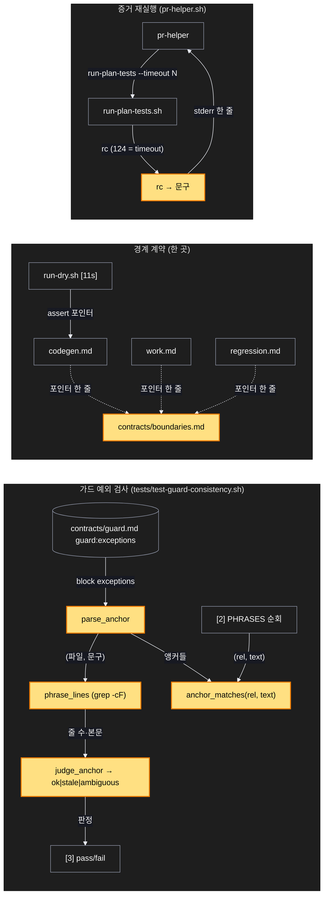
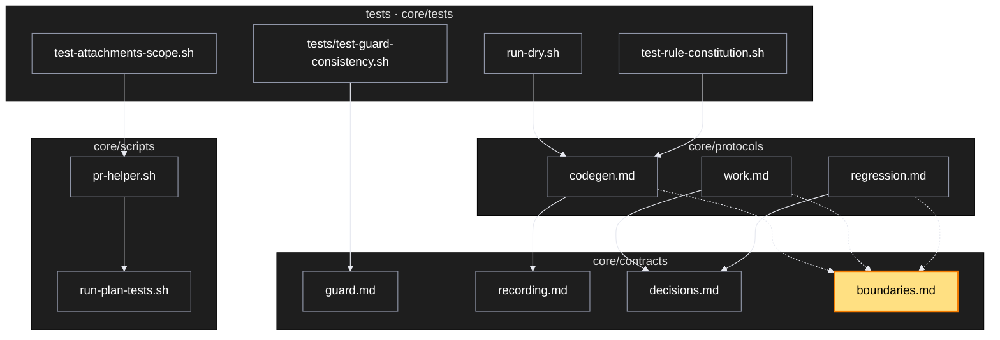

# Architecture — 후속 다섯

> Two-diagram view of this feature. **Review and edit before `/scv:work`** —
> diagrams are LLM-generated and may have inaccuracies.

## 1. Component data flow



## 2. Position in whole architecture

> Source: scv graph (built 2026-09-21)



## 3. Screen mockups

화면 없는 변경. 구성은 위 두 그림, 번호별 상세는 아래 한 장.

```screen
{
  "title": "가드 예외 앵커 — 문구 기준",
  "diagram": [
    { "label": "구성", "code": "flowchart LR\n  A[(\"① guard.md 예외 6줄\")] --> B[\"② parse_anchor\"] --> C[\"③ phrase_lines\"] --> D[\"④ judge_anchor\"] --> E[\"⑤ 보고\"]\n  F[\"⑥ [2] 문구 순회\"] --> G[\"⑦ anchor_matches\"]\n  B --> G" },
    { "label": "순서", "code": "sequenceDiagram\n  autonumber\n  participant T as test-guard-consistency.sh\n  participant F as 규칙 문서들\n  T->>T: block exceptions → 앵커 6\n  loop 앵커마다\n    T->>F: grep -cF \"문구\"\n    F-->>T: 일치 줄 수\n    alt 0줄\n      T-->>T: stale (문구 사라짐)\n    else 2줄 이상\n      T-->>T: ambiguous\n    else 1줄인데 PHRASES 미일치\n      T-->>T: stale (예외가 필요 없는 줄)\n    else\n      T-->>T: ok\n    end\n  end" }
  ],
  "functions": [
    { "marker": "2", "title": "앵커 파싱", "step": "parse_anchor", "notes": ["받는 값: 'path:\"문구\" — reason' 한 줄", "돌려주는 값: 파일, 문구", "순수"] },
    { "marker": "4", "title": "판정", "step": "judge_anchor", "notes": ["받는 값: 일치 줄 수, 줄 본문", "돌려주는 값: ok | stale | ambiguous", "순수"] },
    { "marker": "7", "title": "예외 대조", "step": "anchor_matches", "notes": ["받는 값: 파일, 줄 본문", "같은 파일의 앵커 문구를 본문이 담으면 예외", "줄 번호를 보지 않는다"] }
  ],
  "validations": {
    "title": "실패 · 응답 표",
    "columns": ["번호", "조건", "결과", "메시지"],
    "rows": [
      ["④", "문구가 0줄", "FAIL", "<anchor> (the excused phrase is no longer there)"],
      ["④", "문구가 2줄 이상", "FAIL", "<anchor> (ambiguous — phrase matches N lines)"],
      ["④", "1줄이나 검사 어휘 미일치", "FAIL", "<anchor> (line no longer needs an exception)"],
      ["⑦", "문구 순회 적중인데 앵커 없음", "FAIL", "<rel>:<line>: <text>"]
    ]
  }
}
