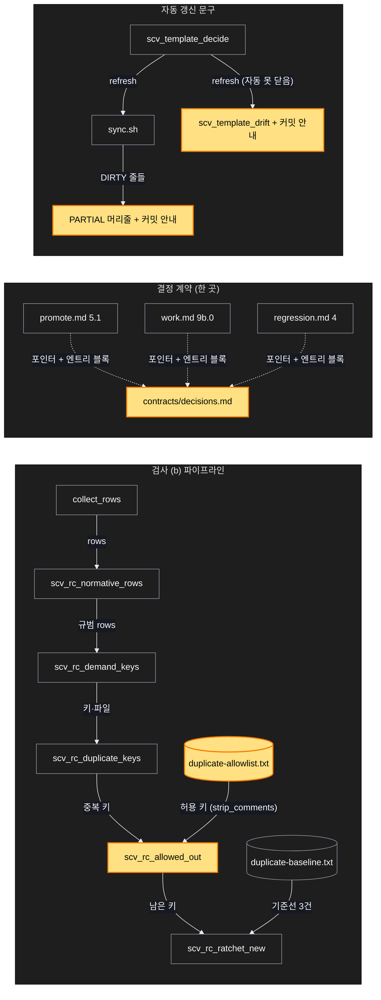
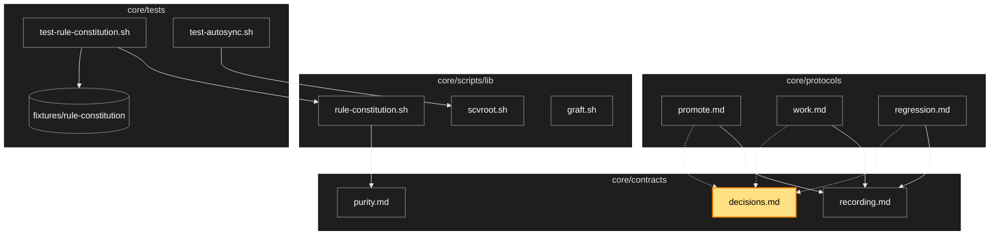

# Architecture — 미결 6건 후속

> Two-diagram view of this feature. **Review and edit before `/scv:work`** —
> diagrams are LLM-generated and may have inaccuracies.

## 1. Component data flow



## 2. Position in whole architecture

> Source: scv graph (built 2026-09-21)



## 3. Screen mockups

화면이 없는 변경이다. 구성은 위 두 그림이 담고, 번호별 상세는 아래 한 장으로 둔다.

```screen
{
  "title": "검사 (b) — 허용목록이 들어간 파이프라인",
  "diagram": [
    { "label": "구성", "code": "flowchart LR\n  A[\"① 규칙 문서들\"] --> B[\"② 규범 문장 → 키\"] --> C[\"③ 중복 키\"] --> D[\"④ 허용목록 빼기\"] --> E[\"⑤ 래칫(기준선)\"] --> F[\"⑥ 보고\"]\n  G[(\"⑦ duplicate-allowlist.txt\")] --> D\n  H[(\"⑧ duplicate-baseline.txt\")] --> E" },
    { "label": "순서", "code": "sequenceDiagram\n  autonumber\n  participant T as test-rule-constitution.sh\n  participant L as lib/rule-constitution.sh\n  T->>T: collect_rows (파일 읽기)\n  T->>L: normative_rows → demand_keys → duplicate_keys\n  T->>T: strip_comments(allowlist) — 이유 없는 줄이면 fail\n  T->>L: allowed_out(중복 키, 허용 키)\n  T->>L: ratchet_new(남은 키, 기준선)\n  alt 새 키 있음\n    L-->>T: 키 목록\n    T-->>T: ✖ FAIL (한 곳으로 모으거나 허용목록에 이유와 함께)\n  else 없음\n    T-->>T: ✓ ok\n  end" }
  ],
  "functions": [
    { "marker": "4", "title": "허용목록 빼기", "step": "scv_rc_allowed_out", "notes": ["받는 값: 중복 키 줄들, 허용 키 줄들", "돌려주는 값: 허용에 없는 키만", "순수 — 파일·환경을 만지지 않는다"] },
    { "marker": "5", "title": "래칫", "step": "scv_rc_ratchet_new", "notes": ["기존 그대로", "기준선은 3건으로 준다"] },
    { "marker": "7", "title": "허용목록 파일", "notes": ["형식: <키>\\t<이유>", "이유 없는 줄은 검사가 거부", "의도된 반복 6건: 쉬운 말 블록 2 · 언어 설정 포인터 1 · 훅 머리말 3"] }
  ],
  "validations": {
    "title": "실패 · 응답 표",
    "columns": ["번호", "조건", "결과", "메시지"],
    "rows": [
      ["④", "허용목록 줄에 이유가 없다", "FAIL", "허용목록 줄에 이유가 없다: <줄>"],
      ["⑤", "허용 뺀 후보가 기준선보다 많다", "FAIL", "중복 요구 후보가 기준선보다 늘었다 — 한 곳으로 모으거나 이유와 함께 허용목록에"],
      ["⑤", "후보 ≤ 기준선", "ok", "중복 요구 후보 N건, 기준선 이하 (허용 M건 제외)"]
    ]
  }
}
```
