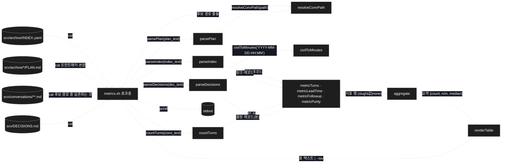
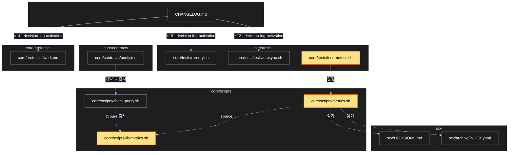

# Architecture — 과정 계기판

> 이 기능의 그림 두 장. **`/scv:work` 전에 검토·수정** — LLM 이 그린 것이라 틀릴 수 있다.

## 1. Component data flow

효과층 하나(metrics.sh)가 파일 넷을 읽어 문자열로 넘기고, 순수 함수들(lib/metrics.sh)이 문자열만
받아 레코드 → 지표 → 표로 바꾸고, 효과층이 표를 찍는다.



## 2. Position in whole architecture

새 파일 셋(노란색)이 어디에 붙는지. 기존 구조는 SCV 그래프의 핵심 노드와 공동 변경 쌍에서 가져왔다.

> Source: scv graph (built 2026-09-21)



## 3. Screen mockups

화면 없는 변경. 구성과 순서는 아래 두 그림, 번호별 상세는 그 옆.

```screen
{
  "title": "과정 계기판 — metrics.sh",
  "screenRefs": [
    { "calls": "1", "name": "터미널", "element": "bash core/scripts/metrics.sh [--tsv]", "when": "사용자가 직접 실행할 때 (액션 연결 없음)" }
  ],
  "diagram": [
    { "label": "구성", "code": "flowchart LR\n  A[(\"① 입력 파일 넷\")] --> B[\"② readInputs (효과)\"]\n  B --> C[\"③ parseIndex\"]\n  B --> D[\"④ parsePlan → resolveConvPath\"]\n  B --> E[\"⑤ countTurns\"]\n  B --> F[\"⑥ parseDecisions → civilToMinutes\"]\n  C --> G[\"⑦ metric× 4\"]\n  D --> G\n  E --> G\n  F --> G\n  G --> H[\"⑧ aggregate\"] --> I[\"⑨ renderTable\"] --> J[(\"⑩ stdout\")]" },
    { "label": "순서", "code": "sequenceDiagram\n  autonumber\n  participant U as 사용자\n  participant M as metrics.sh\n  participant L as lib/metrics.sh (순수)\n  U->>M: bash metrics.sh [--tsv]\n  M->>M: INDEX.yaml · DECISIONS.md 읽기\n  M->>L: parseIndex(text)\n  L-->>M: 계획 레코드\n  loop 계획마다\n    M->>L: parsePlan(PLAN.md text)\n    L-->>M: conv 경로 · supersedes 수 · 순수 절 유무\n    M->>L: resolveConvPath(path)\n    L-->>M: 후보 경로 2개\n    alt 후보 중 실존\n      M->>L: countTurns(conv text)\n      L-->>M: 턴 수\n    else 없음\n      M->>M: 턴 수 = none\n    end\n  end\n  M->>L: parseDecisions(text) → civilToMinutes\n  L-->>M: slug · verdict · 분\n  M->>L: metric×4 → aggregate → renderTable\n  L-->>M: 표 텍스트\n  M-->>U: stdout (exit 0)" }
  ],
  "functions": [
    { "marker": "1", "title": "입력 파일 넷", "notes": ["역할: 이미 디스크에 있는 기록만 — 아카이브 색인, 계획서, 대화 파일, 결정 로그", "받는 값: SCV_DIR (기본 scv)", "쓰기 없음, 네트워크 없음"] },
    { "marker": "2", "title": "readInputs", "step": "readInputs", "notes": ["역할: 파일을 문자열로 읽어 순수부에 넘긴다 (유일한 입구 효과)", "하는 일: 후보 경로 중 실존하는 첫 파일을 고른다 — 판단은 여기서 끝", "실패: 파일이 없으면 그 계획은 none, 스크립트는 계속"] },
    { "marker": "3", "title": "parseIndex", "step": "parseIndex", "notes": ["받는 값: INDEX.yaml 텍스트 → 돌려주는 값: slug\\tstatus\\tobsoleted_by 줄들", "순수"] },
    { "marker": "4", "title": "parsePlan · resolveConvPath", "step": "parsePlan", "notes": ["받는 값: PLAN.md 텍스트 → conv 경로들 · supersedes 개수 · 순수 절 유무(0|1)", "resolveConvPath: 경로 → [그대로, conversations/archive/<basename>]", "순수 — 실존 확인은 ②가"] },
    { "marker": "5", "title": "countTurns", "step": "countTurns", "notes": ["받는 값: 대화 텍스트 → '## Turn N —' 헤딩 수", "코드 블록 안의 유사 문구는 세지 않는다", "순수"] },
    { "marker": "6", "title": "parseDecisions · civilToMinutes", "step": "parseDecisions", "notes": ["받는 값: DECISIONS.md 텍스트 → slug\\tverdict\\t분", "refs 의 scv/(promote|archive)/<slug>/ 에서 slug, 헤더 시각을 분 정수로", "템플릿 행 [YYYY-MM-DD HH:MM] 은 버림 · date 호출 없음", "순수"] },
    { "marker": "7", "title": "지표 네 개", "step": "metricTurns", "notes": ["턴 수: 계획 ↔ 대화 링크가 있는 계획만 (raw_sources 기준)", "리드타임: 같은 slug 의 adopted 시각 → archived 시각, 둘 다 있을 때만", "후속 재발: obsoleted_by 의 대상 ∪ supersedes 비어 있지 않음 (합집합, 이중 계산 없음)", "순수 절 보유: '## 순수함수 · 파이프라인' 헤딩 유무"] },
    { "marker": "8", "title": "aggregate", "step": "aggregate", "notes": ["받는 값: 지표 행 → count · 적용 범위 n/m · 중앙값", "none 은 셈에서 빠지고 m 에만 든다", "순수"] },
    { "marker": "9", "title": "renderTable", "step": "renderTable", "notes": ["받는 값: 요약 → 표 텍스트 (기본) 또는 TSV (--tsv)", "unmatched 결정 행은 TSV 에 남긴다", "순수"] }
  ],
  "statesTitle": "데이터 모양 (레코드 형식)",
  "states": [
    { "marker": "3", "label": "계획 레코드", "body": [ { "type": "table", "columns": ["slug", "status", "obsoleted_by"], "rows": [["20260807-…-plan-grammar", "planned", ""], ["20260807-…-decision-log-activation", "obsolete", "20260818-…-regression-contract-repair"]] } ] },
    { "marker": "6", "label": "결정 레코드", "body": [ { "type": "table", "columns": ["slug", "verdict", "분"], "rows": [["20260921-…-followup-five", "adopted", "…"], ["20260921-…-followup-five", "archived", "…"]] } ] },
    { "marker": "9", "label": "표 (기본 출력)", "body": [ { "type": "table", "columns": ["지표", "값", "적용 범위", "중앙값"], "rows": [["계획당 대화 턴 수", "…", "20/63", "…"], ["승인→보관 리드타임(분)", "…", "n/63", "…"], ["후속 재발률", "…", "63/63", "—"], ["순수 절 보유율", "28/63", "63/63", "—"]] } ] }
  ],
  "validations": {
    "title": "실패 · 응답 표",
    "columns": ["번호", "조건", "결과", "출력", "데이터 영향"],
    "rows": [
      ["②", "INDEX.yaml 없음", "exit 0", "표 대신 'no archive index' 한 줄 (stderr)", "없음"],
      ["②", "계획의 대화 파일이 두 후보 경로 모두에 없음", "계속", "그 계획 턴 수 = none, 적용 범위 분모에만", "없음"],
      ["⑥", "결정 헤더가 템플릿 행", "버림", "—", "없음"],
      ["⑥", "refs 가 promote/archive 경로가 아님", "계속", "--tsv 에 unmatched 행", "없음"],
      ["⑥", "시각 형식 오류", "버림", "그 결정은 리드타임에서 빠짐", "없음"],
      ["⑦", "adopted 만 있고 archived 없음", "계속", "리드타임 none", "없음"]
    ]
  }
}
```
