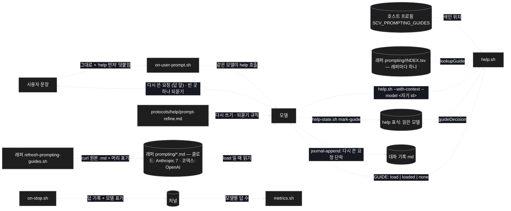
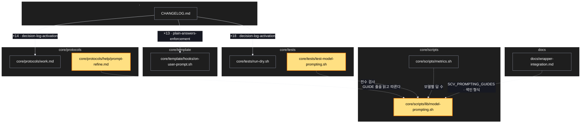

# Architecture — 모델별 프롬프팅

> 이 기능의 그림 두 장. **`/scv:work` 전에 검토·수정** — LLM 이 그린 것이라 틀릴 수 있다.

## 1. Component data flow

사용자 문장은 그대로 모델에 간다. help 가 "무엇을 읽을지" 를 정하고, 모델이 원문을 읽어 요청을 다시 쓰고, 빈 곳은 묻는다.



## 2. Position in whole architecture

새 파일(노란색)이 help 규약 · help 스크립트 · 계기판 옆에 붙는다. 기존 구조는 SCV 그래프의 핵심 노드와 공동 변경 쌍.

> Source: scv graph (built 2026-09-27)



## 3. Screen mockups

화면 없는 변경. 구성과 순서는 아래 두 그림, 번호별 상세는 그 옆.

```screen
{
  "title": "모델별 프롬프팅 — help 가 원문을 보고 다시 쓰고, 빈 곳은 묻는다",
  "screenRefs": [
    { "calls": "1", "name": "매 턴 (help 가 불리는 턴)", "element": "사용자가 메시지를 보냄", "when": "짧은 확인 턴이 아닐 때" }
  ],
  "diagram": [
    { "label": "구성", "code": "flowchart LR\n  U[\"① 사용자 문장 (그대로)\"] --> H[\"② help.sh --model\"]\n  I[(\"③ 래퍼 색인 · 원문 7\")] --> H\n  S[(\"④ 표식: 읽은 모델\")] --> H\n  H --> G[\"⑤ GUIDE: load/loaded/none\"]\n  G --> R[\"⑥ 다시 쓰기 (원문 규칙)\"]\n  R --> Q{\"⑦ 빈 곳을 알아낼 수 있나\"}\n  Q -->|예| A[\"⑧ 다시 쓴 요청으로 진행\"]\n  Q -->|아니오| Z[\"⑨ 소크라테스 되묻기 하나\"]\n  R --> C[(\"⑩ 대화 기록: 다시 쓴 요청\")]" },
    { "label": "순서", "code": "sequenceDiagram\n  autonumber\n  participant U as 사용자\n  participant M as 모델\n  participant H as help.sh\n  participant F as 원문 md\n  U->>M: 로그인 버그 고쳐줘\n  M->>H: --model <자기 id>\n  alt 색인에 있고 처음/바뀜\n    H-->>M: GUIDE: load <원문 경로>\n    M->>F: 원문 읽기\n    M->>H: mark-guide\n  else 이미 읽음\n    H-->>M: GUIDE: loaded\n  else 모름 · 없음 · off\n    H-->>M: GUIDE: none (지금처럼 답)\n  end\n  M->>M: 원문 규칙으로 다시 쓰기 · 빈 곳 찾기\n  alt 끝 조건 등을 알아낼 수 없음\n    M-->>U: 다시 쓴 요청 + 질문 하나 (추천 답)\n  else 채울 수 있음\n    M-->>U: 다시 쓴 요청 (채운 근거 한 줄) → 진행\n  end" }
  ],
  "functions": [
    { "marker": "1", "title": "사용자 문장", "notes": ["역할: 원래 요청 — 지워지거나 바뀌지 않는다", "매 턴 훅은 'help 먼저' 만 덧붙인다 (지금과 같음)"] },
    { "marker": "2", "title": "help.sh --model", "step": "readInputs", "notes": ["받는 값: 모델이 넘긴 자기 모델 id (시스템 안내에 있음)", "하는 일: 색인 조회 · 표식 비교 → GUIDE 줄", "실패: 무엇이 없든 GUIDE: none, exit 0"] },
    { "marker": "3", "title": "래퍼 색인 · 원문", "step": "lookupGuide", "notes": ["클로드 래퍼: Anthropic 원문 7 · 코덱스 래퍼: OpenAI 원문 — 영문 그대로, 머리에 출처 · 날짜 · 저작권자", "id 정확히 일치 — claude-opus-5 ≠ claude-opus-5-5", "코어에는 없다 (호스트 중립)"] },
    { "marker": "4", "title": "help 표식 — 읽은 모델", "step": "guideDecision", "notes": ["이 컨텍스트에서 읽은 모델 id 한 필드", "압축 · clear · 재개 때 비운다 → 다시 load"] },
    { "marker": "5", "title": "GUIDE 줄", "step": "guideLine", "notes": ["load: 모델 원문 + 공통 원문 경로", "loaded: 한 줄", "원문이 90일 넘으면 갱신 명령"] },
    { "marker": "6", "title": "다시 쓰기", "notes": ["원문이 그 모델에 권하는 요소로: 무엇을 · 끝 조건 · 범위 · 멈출 조건 · 피할 것", "적용한 원문 규칙 근거 한 줄", "답 앞에 짧게 보인다 — 숨은 변형 없음"] },
    { "marker": "7", "title": "빈 곳 찾기", "notes": ["대화 · 저장소 · 계획서에서 먼저 찾는다", "찾으면 묻지 않는다 (피로)"] },
    { "marker": "9", "title": "소크라테스 되묻기", "notes": ["가장 결과를 크게 바꾸는 빈 곳 하나 · 추천 답과 함께", "구현 방법은 묻지 않는다", "사용자가 거절하면 추천 답으로 진행하고 기록"] },
    { "marker": "10", "title": "대화 기록", "notes": ["턴 블록에 **다시 쓴 요청**: 단락", "멈춤 훅이 저널 답 기록에 모델 표기 → 계기판 모델별 답 수"] }
  ],
  "validations": {
    "title": "되묻지 않을 때 · 조용할 때",
    "columns": ["번호", "조건", "결과"],
    "rows": [
      ["②", "프로필 키 · 색인 없음 (오래된 래퍼)", "GUIDE: none — 지금처럼"],
      ["②", "모델 id 모름 · 색인에 없음", "GUIDE: none"],
      ["②", "SCV_MODEL_PROMPTING=off", "GUIDE: none"],
      ["⑥", "짧은 확인 턴", "다시 쓰기 · 되묻기 없음"],
      ["⑦", "빈 곳을 알아낼 수 있음", "묻지 않고 채움 + 근거 한 줄"],
      ["⑨", "빈 곳이 여럿", "가장 큰 하나만, 나머지는 다음 턴"]
    ]
  }
}
```
