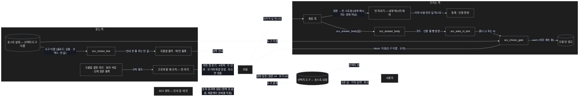

# Architecture — 결정은 고르는 선택지로

> 이 기능의 그림 두 장. **`/scv:work` 전에 검토·수정** — LLM 이 그린 것이라 틀릴 수 있다.

## 1. Component data flow

묻는 쪽은 호스트 설정의 도구 이름과 규칙 한 자리가 모델을 선택지 도구로 이끈다. 지키는 쪽은 종료 훅이 마지막 답을 보고, 글로
묻고 끝났으면 같은 턴에 한 번 막는다.



## 2. Position in whole architecture

새 자리(노란색)는 규칙 한 자리와 새 검사뿐이다. 나머지는 이미 함께 바뀌어 온 도움말 규약 · 매 턴 훅 · 종료 훅 · 모델별 프롬프팅
묶음 안에서 바뀐다.

> Source: scv graph (built 2026-10-01)

```mermaid
%%{init: {'theme':'base', 'themeVariables': {'primaryColor':'#1e1e1e','primaryTextColor':'#fff','primaryBorderColor':'#9096a8','lineColor':'#e7e9f0','secondaryColor':'#2d2d2d','tertiaryColor':'#1e1e1e','background':'#171922','edgeLabelBackground':'#171922'}}}%%
flowchart TB
  subgraph "core/protocols"
    HELP[core/protocols/help.md]
    FULL[core/protocols/help/full.md]
    REG[core/protocols/regression.md]
  end
  subgraph "core/contracts"
    HPC[core/contracts/host-profile.md]
    CH[core/contracts/choices.md]:::new
  end
  subgraph "core/scripts"
    HS[core/scripts/help.sh]
    MPL[core/scripts/lib/model-prompting.sh]
    MPS[core/scripts/model-prompting.sh]
  end
  subgraph "core/template"
    UPH[core/template/hooks/on-user-prompt.sh]
    STH[core/template/hooks/on-stop.sh]
  end
  subgraph "core/tests"
    THS[core/tests/test-help-shape.sh]
    TMP[core/tests/test-model-prompting.sh]
    TCQ[core/tests/test-choice-questions.sh]:::new
  end
  THS -->|"×9 · decision-log-activation"| TMP
  MPL -->|"×7 · per-model-prompting"| TMP
  HELP -->|"×7 · plain-answers-enforcement"| UPH
  MPS -->|"×6 · prompting-read-verdict"| MPL
  HELP -->|"×5 · plain-language"| THS
  HELP -->|"×5 · help-load-once"| FULL
  STH -->|"×4 · forced-help-invocation"| UPH
  HELP -->|"×4 · help-body-diet"| HS
  HELP -->|"×4 · plain-language"| REG
  HELP -.->|"결정 자리가 가리킴"| CH
  FULL -.->|"가리킴"| CH
  REG -.->|"삭감이 가리킴"| CH
  HPC -.->|"선택지 도구 키"| CH
  TCQ -.->|"판정 픽스처"| MPL
  TCQ -.->|"막기 · 도구 없음 불변"| STH
  classDef new fill:#FFE082,stroke:#F57C00,stroke-width:2px,color:#000
```



## 3. Screen mockups

화면을 새로 그리는 변경은 아니다(선택지 창은 호스트 내장). 묻는 쪽과 지키는 쪽을 각각 구성 · 순서 두 그림과 번호별 상세로 둔다.

### 묻는 쪽 — 선택지로 묻기

```screen
{
  "title": "선택지로 묻기 — 결정은 호스트의 선택지 도구로",
  "screenRefs": [
    { "calls": "3", "name": "결정이 나오는 모든 턴 (사람 턴 · 자동 알림 턴, SCV 단계 안팎)", "element": "모델이 사용자에게 고르게 할 때", "when": "호스트 설정에 선택지 도구 이름이 있을 때" }
  ],
  "diagram": [
    { "label": "구성", "code": "flowchart LR\n  HP[(\"① 호스트 설정 — 도구 이름\")] --> CL[\"② 안내 한 줄\"]\n  CL --> M[\"③ 모델\"]\n  R[\"④ 고르게 할 때 규칙 — 한 자리\"] --> M\n  M --> T[(\"⑤ 선택지 도구 (질문 ≤4 · 보기 ≤4)\")]\n  T --> U[\"⑥ 사용자\"]\n  U --> T" },
    { "label": "순서", "code": "sequenceDiagram\n  autonumber\n  participant M as 모델\n  participant T as 선택지 도구\n  participant U as 사용자\n  M->>M: 결정 n개 (중요한 순, 추천 첫 보기)\n  alt n ≤ 4\n    M->>T: 질문 n개\n  else n > 4\n    M->>T: 질문 4개\n    T-->>M: 답\n    M->>T: 나머지 질문\n  end\n  T-->>U: 선택지 창\n  alt 고름\n    U->>T: 선택 · 기타 입력\n    T-->>M: 답 → 진행\n  else 취소 · 무응답\n    T-->>M: 취소\n    M-->>U: 한 줄 알림 후 멈춤 (질문 문장 없이)\n  end" }
  ],
  "functions": [
    { "marker": "1", "title": "호스트 설정 — 선택지 도구 이름", "notes": ["역할: 도구 이름을 코어 밖에서 준다 — 코어는 이름을 모른다", "클로드 래퍼: 어댑터 설정에 이름 · 코덱스: 빈 값", "받는 값 → 돌려주는 값: 설정 파일 → 도구 이름 | 빈 값"] },
    { "marker": "2", "title": "안내 한 줄", "step": "scv_choice_line", "notes": ["역할: 도구가 있을 때만 모델에게 도구 이름과 규칙 요지를 앞쪽에 싣는다", "받는 값 → 돌려주는 값: 도구 이름 → 한 줄 | 빈 값", "자리: 도움말 출력 또는 매 턴 블록 — 비용 상한을 재고 고른다"] },
    { "marker": "3", "title": "모델", "notes": ["역할: 고를 것을 선택지 도구로 묻는다 — 글 속 표로 묻지 않는다", "단계 밖 질문(작업 끝 '다음에 무엇을 할까요?')도 같은 방식"] },
    { "marker": "4", "title": "고르게 할 때 규칙 — 한 자리", "notes": ["역할: 묻는 방식을 한 곳에만 적는다 (최상위 규칙 4 — 한 요구 한 자리)", "보기 설명에 그 보기를 고르면 생길 문제를 막는 방법까지 담는다", "도움말 결정 자리 · 회귀 삭감 · 단계 질문 블록 · SCV 원칙은 이곳을 가리킨다", "도구가 없으면 지금처럼 번호로 답하는 결정 표"] },
    { "marker": "5", "title": "선택지 도구 (호스트 내장)", "notes": ["창 하나에 질문 최대 4개 · 질문 하나에 보기 최대 4개", "첫 보기에 추천 '(추천)', 직접 입력은 '기타'"] },
    { "marker": "6", "title": "사용자", "notes": ["고르거나 '기타'에 직접 쓰거나 취소한다", "취소 · 무응답은 추천으로 바꾸지 않는다"] }
  ],
  "validations": {
    "title": "묻는 방식 표",
    "columns": ["번호", "조건", "묻는 방식"],
    "rows": [
      ["④⑤", "결정 하나", "질문 하나 · 첫 보기가 추천 '(추천)'"],
      ["④⑤", "질문이 4개 초과 (예: 결정 7개)", "중요한 것부터 4개 → 이어서 3개"],
      ["④⑤", "보기가 4개 초과 (예: 모델 정책 5가지)", "두 단계 — 묶음을 고른 뒤 그 안에서"],
      ["④⑤", "이름 · 제목 같은 자유 입력", "추천값 1~2개를 보기로, 직접 입력은 '기타'"],
      ["④⑤", "보기를 고르면 생길 문제", "따로 늘어놓지 않고 막는 방법을 보기 설명에"],
      ["⑤⑥", "취소 · 무응답", "추천으로 진행하지 않음 · 한 줄 알리고 멈춤"],
      ["①", "도구 없음 (코덱스 · 기본)", "지금처럼 번호로 답하는 결정 표"]
    ]
  }
}
```

### 지키는 쪽 — 종료 훅의 선택지 판정

```screen
{
  "title": "종료 훅의 선택지 판정 — 글로 묻고 끝내면 같은 턴에 한 번 막는다",
  "screenRefs": [
    { "calls": "1", "name": "모든 턴의 끝 (사람 턴 · 자동 알림 턴)", "element": "모델이 답을 끝내려 할 때", "when": "호스트 설정에 선택지 도구 이름이 있을 때" }
  ],
  "diagram": [
    { "label": "구성", "code": "flowchart LR\n  A[\"① 마지막 답\"] --> B[\"② 본문 추리기 (코드 · 인용 줄 뺌)\"]\n  B --> C[\"③ 묻나 판정\"]\n  C --> D[\"④ 막기 판정\"]\n  H[(\"⑤ 호스트 설정 — 도구 이름\")] --> D\n  D -->|block| E[\"⑥ 막는 출력 — 이유에 도구 이름 · 규칙\"]\n  D -->|warn| F[(\"⑦ 다음 턴 경고\")]" },
    { "label": "순서", "code": "sequenceDiagram\n  autonumber\n  participant M as 모델\n  participant S as 종료 훅\n  participant P as 판정 (순수)\n  M->>S: 끝내기 (마지막 답)\n  S->>P: 본문 추리기 → 묻나\n  alt 글로 묻고 끝남 · 도구 있음 · 처음\n    P-->>S: block\n    S-->>M: 막음 + 이유 (도구 이름 · 4개씩 · 추천 첫 보기)\n    M->>M: 선택지 도구로 다시 묻기\n  else 이미 계속 중\n    P-->>S: warn\n    S-->>M: 통과 · 다음 턴 경고\n  else 묻지 않음 · 도구 없음\n    P-->>S: ok\n    S-->>M: 통과 (지금과 같음)\n  end" }
  ],
  "functions": [
    { "marker": "1", "title": "마지막 답", "notes": ["역할: 판정 재료 — 호스트가 준 마지막 메시지", "받는 값: 종료 훅 입력"] },
    { "marker": "2", "title": "본문 추리기", "step": "scv_answer_body", "notes": ["역할: 코드 블록과 인용 줄(다시 쓴 요청)을 뺀다 — 인용 속 물음표를 질문으로 보지 않게", "받는 값 → 돌려주는 값: 답 → 본문"] },
    { "marker": "3", "title": "묻나 판정", "step": "scv_asks_in_text", "notes": ["역할: 글로 묻거나 번호로 고르게 하면서 끝났는가", "잡을 것: '번호만 알려 주세요' · '…할까요? (추천: 예)' · 'answer by number' · 물음표로 끝남", "잡지 않을 것: 정보 표 · 본문 중간의 물음표 · 평서문 끝", "받는 값 → 돌려주는 값: 본문 → 1 | 0"] },
    { "marker": "4", "title": "막기 판정", "step": "scv_choice_gate", "notes": ["역할: 같은 턴 한 번만 막는다 — 이미 계속 중이면 경고로 넘긴다", "받는 값 → 돌려주는 값: (묻나, 도구 이름, 계속 중) → ok | block | warn", "등록 판정(0.62.0)과 겹치면 한 번에 한 이유씩"] },
    { "marker": "5", "title": "호스트 설정 — 도구 이름", "notes": ["빈 값이면 판정 없이 통과 — 코덱스 · 기본은 지금과 같다"] },
    { "marker": "6", "title": "막는 출력", "notes": ["이유 문장에 도구 이름 · 추천 첫 보기 · 4개씩 나누기 · 보기 5개 이상 두 단계", "모델이 이유만 읽고 바로 다시 물을 수 있게"] },
    { "marker": "7", "title": "다음 턴 경고", "notes": ["이미 계속 중일 때 한 줄 — 무한 반복을 막는다", "기존 다음 턴 경고 통로를 쓴다"] }
  ],
  "validations": {
    "title": "판정 · 응답 표",
    "columns": ["번호", "조건", "응답", "본문 · 메시지", "기록 · 데이터 영향"],
    "rows": [
      ["③④", "글로 묻고 끝남 + 도구 있음 + 처음", "block", "'도구 이름으로 다시 물어라 — 추천 첫 보기, 4개씩'", "없음 (같은 턴 한 번)"],
      ["④", "이미 계속 중", "통과", "—", "다음 턴 경고 한 줄"],
      ["②③", "정보 표 · 인용 줄 · 코드 블록의 물음표", "통과", "—", "없음"],
      ["③", "평서문으로 끝남 (예: 취소 뒤 멈춤)", "통과", "—", "없음"],
      ["④⑤", "도구 없음 (코덱스 · 기본)", "통과", "—", "없음 — 지금과 바이트 단위로 같음"],
      ["④", "자동 알림 턴", "판정함", "등록 판정은 지금처럼 건너뜀", "없음"]
    ]
  }
}
```
