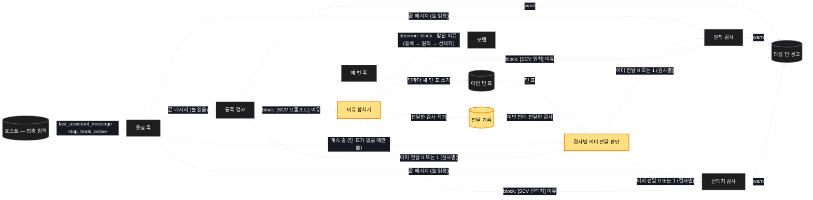
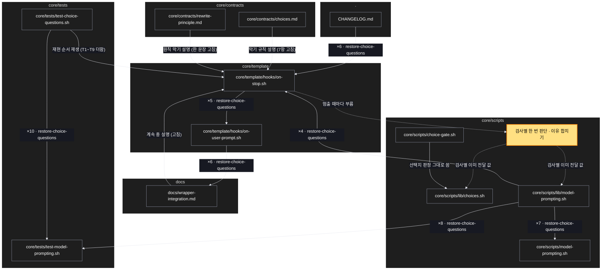

# Architecture — 검사마다 한 턴에 한 번 — 선택지 검사가 다른 검사에 밀리지 않는다

> Two-diagram view of this feature. **Review and edit before `/scv:work`** —
> diagrams are LLM-generated and may have inaccuracies.

## 1. Component data flow

종료 훅은 멈출 때마다 끝 메시지를 늘 읽고 세 검사를 모두 판정한다. 검사마다 "이번 턴에 이미 전달했나"를 따로 보고, block 인
이유를 하나로 합쳐 낸다. 노란색이 새로 생기는 것이다.



## 2. Position in whole architecture

바뀌는 곳은 종료 훅과 세 판정이 있는 묶음 안이다. 새로 생기는 것(노란색)은 검사별 한 번 판단과 이유 합치기 순수 함수뿐이고,
나머지는 0.64.0 선택지 계획에서 함께 바뀌어 온 파일들이다.

> Source: scv graph (built 2026-10-02)



## 3. Screen mockups

화면을 새로 그리는 변경은 아니다. 종료 훅을 백엔드 한 장으로 둔다 — 부르는 곳, 구성 · 순서 두 그림, 번호별 상세, 전달 기록의
모양, 판정 · 응답 표.

### 종료 훅 — 멈춤마다 세 검사, 검사마다 한 턴에 한 번

```screen
{
  "title": "종료 훅 — 멈춤마다 세 검사, 검사마다 한 턴에 한 번",
  "screenRefs": [
    { "calls": "1", "name": "모든 턴의 끝 (사람 턴 · 자동 알림 턴)", "element": "모델이 답을 끝내려 할 때 — 막힌 뒤 다시 끝낼 때도", "when": "SCV 가 수화된 저장소에서 멈출 때마다" }
  ],
  "diagram": [
    { "label": "구성", "code": "flowchart LR\n  A[\"① 멈춤 입력 — 끝 메시지 · 계속 중\"] --> J[\"② 세 검사 판정\"]\n  T[(\"③ 이번 턴 표\")] --> D[\"④ 검사별 이미 전달 판단\"]\n  R[(\"⑤ 전달 기록\")] --> D\n  J --> G[\"⑥ 검사별 ok · block · warn\"]\n  D --> G\n  G -->|block| C[\"⑦ 이유 합치기 → 한 번의 막기\"]\n  C --> R\n  G -->|warn| W[(\"⑧ 다음 턴 경고\")]" },
    { "label": "순서", "code": "sequenceDiagram\n  autonumber\n  participant M as 모델\n  participant S as 종료 훅\n  participant P as 판정 (순수)\n  participant F as 전달 기록\n  M->>S: 끝내기 (끝 메시지)\n  S->>P: 세 검사 판정 + 검사별 이미 전달\n  F-->>P: 이번 턴에 전달한 검사\n  alt 걸린 검사 중 아직 전달 안 한 것이 있음\n    P-->>S: block 목록\n    S->>F: 전달한 검사 적기\n    S-->>M: 막음 + 합친 이유 (등록 → 원칙 → 선택지)\n    M->>M: 고쳐서 다시 끝내기\n  else 걸렸지만 모두 이미 전달함\n    P-->>S: warn\n    S-->>M: 통과 · 다음 턴 경고\n  else 걸린 검사 없음\n    P-->>S: ok\n    S-->>M: 통과\n  end" }
  ],
  "functions": [
    { "marker": "1", "title": "멈춤 입력", "step": "readStopInput", "notes": ["역할: 판정 재료 — 호스트가 준 끝 메시지와 계속 중 값", "받는 값 → 돌려주는 값: 훅 입력 JSON → 끝 메시지 · 계속 중", "바뀜: 다른 검사가 막아도 끝 메시지를 늘 읽는다"] },
    { "marker": "2", "title": "세 검사 판정", "step": "judgeGates", "notes": ["역할: 등록 · 원칙 · 선택지가 각각 걸리는가 — 판정 기준은 그대로", "받는 값 → 돌려주는 값: 끝 메시지 · 등록 상태 · 스위치 · 도구 → 검사별 걸림 0|1"] },
    { "marker": "3", "title": "이번 턴 표", "notes": ["역할: 턴을 가른다 — 매 턴 훅이 사람 턴 · 자동 알림 턴마다 새로 쓴다", "없거나 깨지면 ④가 지금 동작(계속 중 값)으로 돌아간다"] },
    { "marker": "4", "title": "검사별 이미 전달 판단", "step": "deliveredFlags", "notes": ["역할: 이 검사가 이번 턴에 이미 이유를 전달했나 — 검사마다 따로", "받는 값 → 돌려주는 값: 턴 표 · 전달 기록 · 계속 중 → 검사별 0|1", "다른 검사의 막기에 함께 실린 것도 전달로 센다(사용자 결정)"] },
    { "marker": "5", "title": "전달 기록", "notes": ["역할: 이번 턴에 이유를 전달한 검사 목록 — 턴 표와 함께 적는다", "다른 턴 표면 비어 있는 것으로 본다"] },
    { "marker": "6", "title": "검사별 ok · block · warn", "step": "gateDecisions", "notes": ["역할: 기존 세 판정 함수 그대로 — 세 번째 값만 검사별 이미 전달로 넣는다", "받는 값 → 돌려주는 값: (걸림, 이미 전달) → ok | block | warn"] },
    { "marker": "7", "title": "이유 합치기 → 한 번의 막기", "step": "composeReason", "notes": ["역할: block 인 검사들의 이유를 등록 → 원칙 → 선택지 순으로 한 번에 싣는다", "받는 값 → 돌려주는 값: block 검사 목록 → 막기 이유 한 줄", "상한: 검사 셋이 각각 한 번 — 한 턴 최대 세 번 막힘"] },
    { "marker": "8", "title": "다음 턴 경고", "notes": ["역할: 이미 전달한 검사가 또 걸리면 막지 않고 한 줄 남긴다 — 무한 반복을 막는다", "기존 경고 통로 그대로"] }
  ],
  "statesTitle": "데이터 모양 (전달 기록)",
  "states": [
    { "marker": "5", "label": "전달 기록 — 한 턴 분", "body": [ { "type": "table", "columns": ["칸", "값", "비고"], "rows": [["턴 표", "이번 턴 표와 같은 값", "다르면 비어 있는 것으로 봄"], ["전달한 검사", "등록 · 원칙 · 선택지 중 전달한 것", "검사마다 한 번만 더해짐"]] } ] }
  ],
  "validations": {
    "title": "판정 · 응답 표",
    "columns": ["번호", "조건", "응답", "본문 · 메시지", "기록 · 데이터 영향"],
    "rows": [
      ["②⑥⑦", "등록 없음 + 글 결정 표로 끝 (처음 멈춤)", "block", "[SCV 프롬프트] + [SCV 선택지] 함께", "전달 기록에 등록 · 선택지"],
      ["④⑥", "등록에만 막힌 뒤 이어 쓴 답이 글로 물음", "block", "[SCV 선택지]", "전달 기록에 선택지 더함"],
      ["④⑥", "등록에만 막힌 뒤 이어 쓴 답에 문제 표", "block", "[SCV 원칙]", "전달 기록에 원칙 더함"],
      ["④⑧", "걸렸지만 그 검사는 이미 전달함", "통과", "—", "다음 턴 경고 한 줄"],
      ["③④", "이번 턴 표가 없거나 깨짐", "지금 동작", "계속 중이면 막지 않음", "다음 턴 경고 한 줄"],
      ["②", "사람 없는 실행 · 스위치 off", "통과", "—", "없음 — 지금과 같음"],
      ["②", "자동 알림 턴", "판정함", "등록 검사는 지금처럼 건너뜀", "원칙 · 선택지는 검사별 한 번"]
    ]
  }
}
```
