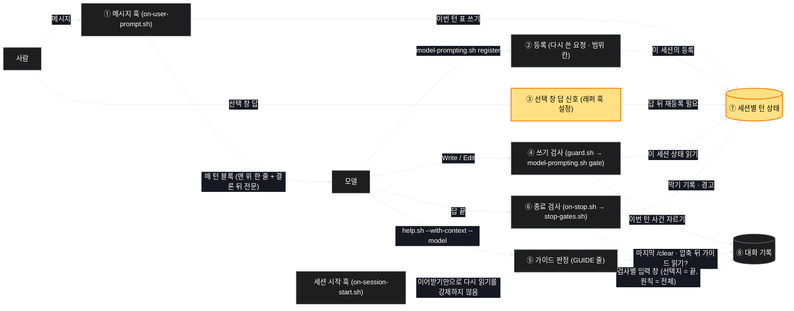
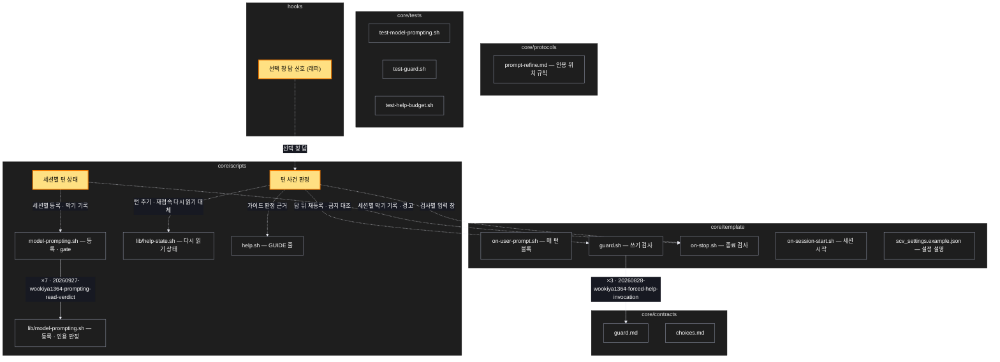

# Architecture — 다시 쓴 요청이 일 내내 맞게

> Two-diagram view of this feature. **Review and edit before `/scv:work`** —
> diagrams are LLM-generated and may have inaccuracies.

## 1. Component data flow

이 계획의 구성 요소가 무엇을 주고받는지. 판정의 근거가 프로젝트 공용 파일에서 '이 세션의 상태 + 대화 기록'으로 옮겨 간다.



## 2. Position in whole architecture

Where this feature sits in the system. New components highlighted in yellow.

> Source: scv graph (built 2026-10-03)



## 3. Screen mockups

### 턴 상태 판정 (훅 — 화면 없음)

```screen
{
  "title": "턴 상태 판정 — 다시 쓴 요청이 일 내내 맞게",
  "screenRefs": [
    { "calls": "1", "name": "Claude Code 대화 화면", "element": "메시지 입력", "when": "사람이 메시지를 보낼 때" },
    { "calls": "3", "name": "Claude Code 대화 화면", "element": "선택 창", "when": "선택 창에서 답을 고를 때" },
    { "calls": "4", "name": "Claude Code 대화 화면", "element": "파일 편집", "when": "모델이 파일을 고치려 할 때" },
    { "calls": "6", "name": "Claude Code 대화 화면", "element": "답 끝", "when": "모델이 턴을 끝낼 때" }
  ],
  "diagram": [
    { "label": "구성", "code": "flowchart LR\n  H[\"① 메시지 훅\"] -->|이번 턴 표| S[(\"⑦ 세션별 턴 상태\")]\n  R[\"② 등록\"] -->|다시 쓴 요청 · 범위 칸| S\n  C[\"③ 선택 창 답 신호\"] -->|답 뒤 재등록 필요| S\n  G[\"④ 쓰기 검사\"] -->|이 세션 상태| S\n  G -->|이번 턴 사건| T[(\"⑧ 대화 기록\")]\n  P[\"⑤ 가이드 판정\"] -->|마지막 경계 뒤 가이드 읽기| T\n  X[\"⑥ 종료 검사\"] -->|검사별 입력 창| T\n  X -->|막기 기록 · 경고| S" },
    { "label": "순서", "code": "sequenceDiagram\n  autonumber\n  participant U as 사람\n  participant H as ① 메시지 훅\n  participant M as 모델\n  participant G as ④ 쓰기 검사\n  participant X as ⑥ 종료 검사\n  U->>H: 메시지\n  H->>M: 매 턴 블록 (⑤ 가이드 판정 포함)\n  M->>M: ② 등록\n  M->>U: 선택 창\n  U-->>M: ③ 답\n  M->>G: 편집 시도\n  alt 답 뒤 재등록 없음 또는 범위 칸 금지\n    G-->>M: 거절 (다시 등록하라)\n    M->>M: ② 다시 등록 (또는 그대로 한 줄)\n  end\n  G-->>M: 허용\n  M->>X: 답 끝\n  alt 맨 위 한 줄 또는 결론 뒤 전문 없음\n    X-->>M: 같은 턴 한 번 막기\n  end" }
  ],
  "functions": [
    { "marker": "1", "title": "메시지 훅", "step": "readHookInput", "notes": ["역할: 사람 메시지마다 이 세션의 이번 턴 표를 새로 쓰고 매 턴 블록을 싣는다", "받는 값 → 돌려주는 값: 훅 입력(세션 id · 메시지) → 이번 턴 표 · 매 턴 블록"] },
    { "marker": "2", "title": "등록", "notes": ["역할: 다시 쓴 요청과 범위 칸을 이 세션의 등록으로 적는다", "받는 값 → 돌려주는 값: 항목 줄 · 다시 쓴 요청 → 이 세션의 등록", "선택 창 답 뒤에는 '그대로' 한 줄도 받는다"] },
    { "marker": "3", "title": "선택 창 답 신호", "notes": ["역할: 선택 창 답이 왔음을 이 세션 상태에 알린다(래퍼가 준다)", "받는 값 → 돌려주는 값: 선택 창 답 사건 → 답 뒤 재등록 필요", "선택 창이 없는 호스트는 해당 없음"] },
    { "marker": "4", "title": "쓰기 검사", "step": "decideWriteGate", "notes": ["역할: 편집을 허용할지 정한다(답 뒤 재등록 · 범위 칸 금지 대조)", "받는 값 → 돌려주는 값: 이 세션 상태 · 이번 턴 사건 · 대상 → 허용 / 거절(사유)"] },
    { "marker": "5", "title": "가이드 판정", "step": "decideGuideLoad", "notes": ["역할: 지금 모델의 가이드를 다시 읽어야 하는지 정한다", "받는 값 → 돌려주는 값: 이번 턴 사건 · 모델 → load / loaded"] },
    { "marker": "6", "title": "종료 검사", "step": "decideStopGates", "notes": ["역할: 턴을 끝내도 되는지 정한다(맨 위 한 줄 · 결론 뒤 전문 · 선택지 · 원칙)", "받는 값 → 돌려주는 값: 이 세션 상태 · 검사별 답 창 → 막기 / 경고 / 통과"] },
    { "marker": "7", "title": "세션별 턴 상태", "step": "loadSessionTurn", "notes": ["역할: 이번 턴 표 · 등록 · 막기 기록 · 경고를 세션마다 따로 둔다", "받는 값 → 돌려주는 값: 세션 id → 이 세션의 상태(저장은 saveSessionTurn)"] },
    { "marker": "8", "title": "대화 기록", "step": "sliceTurnEvents", "notes": ["역할: 이번 턴 사건(등록 · 선택 창 답 · 편집 · /clear · 압축 경계 · 가이드 읽기)의 근거 — 읽기만 한다", "받는 값 → 돌려주는 값: 대화 기록 끝부분 → 이번 턴 사건 목록"] }
  ],
  "statesTitle": "데이터 모양 (세션별 턴 상태 · 대화 기록에서 보는 사건)",
  "states": [
    { "marker": "7", "label": "세션별 턴 상태", "body": [
      { "type": "table", "columns": ["칸", "뜻", "비고"], "rows": [
        ["세션 id", "상태의 주인", "하위 세션을 가를 근거는 확인 필요"],
        ["이번 턴 표", "사람 메시지마다 새로", "사람 메시지를 받은 세션에만 생김"],
        ["등록", "다시 쓴 요청 · 범위 칸 · 시각", "답 뒤에는 '그대로' 한 줄 허용"],
        ["막기 기록", "검사마다 이번 턴 한 번", "세션끼리 섞이지 않음"],
        ["경고", "다음 턴에 실을 한 줄", "이 세션에만"]
      ] }
    ] },
    { "marker": "8", "label": "대화 기록에서 보는 사건", "body": [
      { "type": "table", "columns": ["사건", "쓰는 곳"], "rows": [
        ["등록(다시 쓴 요청)", "④ 재등록 판정"],
        ["선택 창 답", "④ 재등록 판정"],
        ["편집", "④ 금지 대조"],
        ["/clear · 압축 경계", "⑤ 가이드 판정"],
        ["가이드 원문 읽기", "⑤ 가이드 판정"]
      ] }
    ] }
  ],
  "validations": {
    "title": "실패 · 응답 표",
    "columns": ["번호", "조건", "응답", "본문 · 메시지", "기록 · 데이터 영향"],
    "rows": [
      ["4", "선택 창 답 뒤 다시 등록 없이 편집", "거절", "다시 등록하라 + 등록 명령", "없음"],
      ["4", "범위 칸에 변경 금지가 있는데 편집", "거절", "범위가 바뀌었으면 다시 등록하라", "없음"],
      ["5", "마지막 /clear · 압축 뒤 가이드 읽기 없음", "GUIDE: load", "읽을 원문 경로 · 읽음 표시 명령", "없음"],
      ["6", "맨 위 한 줄 또는 결론 뒤 전문 없음", "같은 턴 한 번 막기, 이미 계속 중이면 다음 턴 경고", "빠진 쪽을 이름으로", "이 세션의 막기 기록 · 경고"],
      ["6", "64KB 를 넘는 답", "검사마다 필요한 쪽을 판정", "지금 검사 문구 그대로", "없음"],
      ["6", "사람 메시지를 받지 않은 하위 세션의 종료", "통과", "없음", "리드 상태에 쓰지 않음"],
      ["1~8", "판정할 수 없음(기록 없음 · 형식 이상)", "의견 없음(통과)", "없음", "없음"]
    ]
  }
}
```
