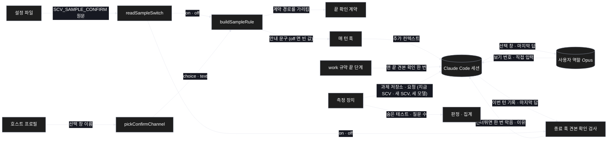

# Architecture — 끝내기 전 결과 견본 확인 — 대충 말해도 원하는 결과로

> Two-diagram view of this feature. **Review and edit before `/scv:work`** —
> diagrams are LLM-generated and may have inaccuracies.

## 1. Component data flow

규칙이 설정 · 호스트 프로필에서 매 턴 안내로 만들어져 세션에 실리고, 긴 작업은 work 규약 끝에서 한 번 확인하며, 종료 훅 검사가 견본 확인 없이 끝내려는 턴을 한 번 막고, 측정 장치가 세 모델로 지금 SCV 와 나란히 효과를 잰다.



## 2. Position in whole architecture

이 기능이 SCV 전체에서 닿는 곳. 새 부분은 노란색, 새 연결은 점선.

> Source: scv graph (built 2026-10-05)

```mermaid
%%{init: {'theme':'base', 'themeVariables': {'primaryColor':'#1e1e1e','primaryTextColor':'#fff','primaryBorderColor':'#9096a8','lineColor':'#e7e9f0','secondaryColor':'#2d2d2d','tertiaryColor':'#1e1e1e','background':'#171922','edgeLabelBackground':'#171922'}}}%%
flowchart TB
  subgraph "."
    CL[CHANGELOG.md]
  end
  subgraph "docs"
    WI[wrapper-integration.md]
  end
  subgraph "core/template"
    UP[on-user-prompt.sh]
    OS[on-stop.sh]
    SET[scv_settings.example.json]
  end
  subgraph "core/scripts"
    MP[lib/model-prompting.sh]
    HP[lib/host-profile.sh]
    SG[lib/stop-gates.sh]
    NF[견본 확인 문구 함수]:::new
    NG[견본 확인 검사 판정]:::new
  end
  subgraph "core/protocols"
    WK[work.md]
  end
  subgraph "core/contracts"
    NC[끝 확인 계약]:::new
  end
  subgraph "core/tests"
    TMP[test-model-prompting.sh]
    TRC[test-rule-constitution.sh]
    NT[test-verify-by-sample.sh]:::new
  end
  subgraph "tools"
    NB[측정 장치]:::new
  end
  CL -->|"×15 · settings-always-present"| SET
  CL -->|"×15 · plain-answers-enforcement"| UP
  CL -->|"×15 · decision-log-activation"| WK
  CL -->|"×12 · plain-answers-enforcement"| WI
  UP -->|"×8 · scv-always-on"| SET
  MP -->|"×8 · per-model-prompting"| TMP
  WK -->|"×8 · decision-log-activation"| TRC
  NF -.->|"안내 문구"| UP
  NF -.->|"SCV_SAMPLE_CONFIRM"| SET
  NF -.->|"선택 창 이름"| HP
  NF -.->|"같은 라이브러리에 둠"| MP
  NC -.->|"매 턴 안내가 가리킴"| UP
  NC -.->|"끝 단계에서 참조"| WK
  NT -.->|"T1~T6"| NF
  NT -.->|"T16~T18"| NG
  NT -.->|"본문 한 곳 검사"| TRC
  NG -.->|"막음 이유"| OS
  NG -.->|"한 턴에 한 번"| SG
  NG -.->|"SCV_SAMPLE_CONFIRM"| SET
  NC -.->|"검사 이유가 가리킴"| OS
  NB -.->|"과제 6개 × 3번 · 세 모델 측정"| UP
  classDef new fill:#FFE082,stroke:#F57C00,stroke-width:2px,color:#000
```



## 3. Screen mockups

### 견본 확인 선택 창

```screen
{
  "title": "끝 확인 — 결과 견본 선택 창",
  "body": [
    { "type": "header", "title": "결과 확인", "subtitle": "실제 명령으로 만든 결과입니다. 원하신 모양인가요?", "marker": "1" },
    { "type": "card", "title": "견본 (실제 결과의 첫 몇 줄)", "marker": "2", "body": [
      { "type": "text", "value": "제목,마감일,완료,태그" },
      { "type": "text", "value": "보고서,2026-10-07,아니오,work;urgent" }
    ] },
    { "type": "button", "label": "1. 이대로 좋음 (추천)", "variant": "primary", "marker": "A" },
    { "type": "button", "label": "2. 직접 입력 — 다른 점을 한 번에", "marker": "B" }
  ],
  "functions": [
    { "marker": "1", "title": "질문", "step": "buildSampleRule",
      "notes": ["결과물이 바뀌는 일의 끝, 보고 직전에 한 번", "결과물이 바뀌지 않는 일(내부 결함 수정 · 구조 정리)에는 뜨지 않음", "긴 작업(work)은 맨 끝에 한 번"] },
    { "marker": "2", "title": "견본",
      "notes": ["실제로 만든 결과의 첫 몇 줄 — 지어낸 예시가 아님", "입력 형식처럼 견본으로 드러나지 않는 바깥 조건은 일 시작 전에 따로 물음"] }
  ],
  "actions": [
    { "marker": "A", "title": "이대로 좋음", "notes": ["마무리하고 보고"] },
    { "marker": "B", "title": "직접 입력", "notes": ["다른 점을 한 번에 받아 고친 뒤 다시 견본 확인", "확인은 두 번까지 — 남는 것은 가정을 밝히고 마무리", "글 칸 없는 '다른 점 적기' 식 보기는 만들지 않음"] }
  ],
  "validations": [
    { "marker": "1", "when": "매 턴", "condition": "선택 창 이름이 없는 호스트(코덱스 모양)", "message": "글 질문 한 번으로 같은 확인", "shownAs": "답 끝의 질문" },
    { "marker": "B", "when": "두 번째 확인 뒤", "condition": "아직 다른 점이 남음", "message": "남은 것을 가정으로 밝히고 마무리", "shownAs": "보고의 확인하지 못한 것" },
    { "marker": "1", "when": "설정", "condition": "SCV_SAMPLE_CONFIRM=off", "message": "이 창을 띄우지 않음 — 지금 SCV 와 같은 동작", "shownAs": "없음" },
    { "marker": "1", "when": "턴 끝(종료 훅)", "condition": "파일을 바꿨는데 마지막 편집 뒤 이 창도 '결과물 변화 없음' 줄도 없음", "message": "한 번 막고 견본 확인 또는 '결과물 변화 없음' 한 줄을 요구 — 자동 알림 턴 · 설정 off · 확인 두 번 · 취소는 막지 않음", "shownAs": "멈춤 메시지" }
  ]
}
```

### 매 턴 안내 조립

```screen
{
  "title": "매 턴 안내 조립 (훅)",
  "screenRefs": [
    { "calls": "1", "name": "매 턴 훅 — 사람 메시지마다", "element": "사람이 보낸 메시지", "when": "자동 알림이 아닌 사람 턴" }
  ],
  "diagram": [
    { "label": "구성", "code": "flowchart LR\n  S[\"설정 파일\"] --> A[\"① readSampleSwitch\"]\n  P[\"호스트 프로필\"] --> B[\"② pickConfirmChannel\"]\n  A --> C[\"③ buildSampleRule\"]\n  B --> C\n  C --> D[\"④ 매 턴 훅 출력\"]" },
    { "label": "순서", "code": "sequenceDiagram\n  autonumber\n  participant U as 사람 메시지\n  participant H as 매 턴 훅\n  participant L as 순수 함수\n  U->>H: 메시지\n  H->>L: 설정 원문 · 선택 창 이름\n  alt 설정 off\n    L-->>H: 빈 값 (지금 SCV 와 같은 출력)\n  else 켬\n    L-->>H: 안내 문구 (선택 창 또는 글 질문)\n  end\n  H-->>U: 추가 컨텍스트" }
  ],
  "functions": [
    { "marker": "1", "title": "readSampleSwitch", "step": "readSampleSwitch", "notes": ["설정 원문 → on · off", "없거나 엉뚱한 값은 on, off(대소문자 무관)만 off"] },
    { "marker": "2", "title": "pickConfirmChannel", "step": "pickConfirmChannel", "notes": ["선택 창 이름 → choice · text", "빈 값이면 text(글 질문 한 번)"] },
    { "marker": "3", "title": "buildSampleRule", "step": "buildSampleRule", "notes": ["on · off, choice · text → 세 줄 안팎 문구", "off 면 빈 값, 자세한 본문은 계약을 가리킴"] },
    { "marker": "4", "title": "매 턴 훅 출력", "notes": ["문구를 추가 컨텍스트로 내보냄 — 부수효과(출구)"] }
  ],
  "validations": {
    "title": "설정 · 호스트별 결과",
    "columns": ["번호", "조건", "결과", "비고"],
    "rows": [
      ["1", "설정 없음", "on", "기본 켬"],
      ["1", "OFF · off", "off", "지금 SCV 와 같은 출력"],
      ["2", "선택 창 이름 없음(코덱스 모양)", "text", "글 질문 한 번"],
      ["3", "off", "빈 값", "블록에 아무것도 더하지 않음"]
    ]
  }
}
```
