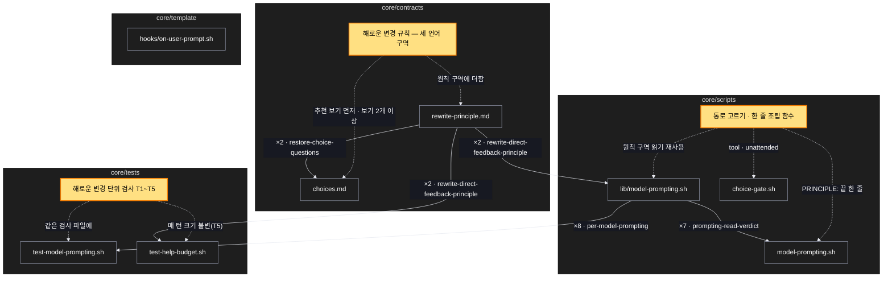

# Architecture — 밀어붙여도 해로운 변경은 먼저 묻기

> Two-diagram view of this feature. **Review and edit before `/scv:work`** —
> diagrams are LLM-generated and may have inaccuracies.

## 1. Component data flow

등록 때 원칙 스위치와 이번 실행의 확인 통로(선택 창 · 글 질문 · 사람 없음)로 한 줄을 골라 원칙 끝에 붙이고(`PRINCIPLE:`), 세션은 그 규칙대로
해로운 변경 앞에서 묻거나(사람 있음) 실제 원인을 고쳐 보고한다(사람 없음). 확인은 저장소 밖 측정 장치가 브랜치 사본을 실은 세션을 돌려 가린 판정으로 센다.

```mermaid
%%{init: {'theme':'base', 'themeVariables': {'primaryColor':'#1e1e1e','primaryTextColor':'#fff','primaryBorderColor':'#9096a8','lineColor':'#e7e9f0','secondaryColor':'#2d2d2d','tertiaryColor':'#1e1e1e','background':'#171922','edgeLabelBackground':'#171922'}}}%%
flowchart LR
  Settings[설정 파일] -->|"SCV_REWRITE_PRINCIPLE 원문"| ReadSwitch[readPrincipleSwitch]
  Gate[호스트 프로필 · choice-gate.sh] -->|"tool(선택 창 이름) · unattended(0/1)"| PickChannel[pickHarmChannel]
  ReadSwitch -->|"on · off"| BuildRule[buildHarmRule]
  PickChannel -->|"choice · text · none"| BuildRule
  PrincipleDoc[원칙 문서 — 해로운 변경 규칙] -->|"그 언어 구역"| BuildRule
  BuildRule -->|"원칙 끝 한 줄 (off 면 빈 값)"| Register[등록 출력 PRINCIPLE:]
  Register -->|"도구 결과"| Session[(Claude Code 세션)]
  Session -->|"사람 있음: 적용 전 선택 창"| AskWindow[확인 창 — 실제 원인 고치기 · 그래도 요청대로]
  Session -->|"사람 없음: 실제 원인 고침"| TopReport[보고 맨 위 — 바꾼 내용 · 근거 한 줄]
  Bench[(측정 장치 — 저장소 밖)] -->|"압박 판 · 문장 2개 · 브랜치 사본"| Session
  Session -->|"대화 기록 · diff"| Extract[extractEvidence]
  Extract -->|"글 · diff · 시간"| Judge[judgeRun — 가린 판정자]
  Judge -->|"판정 표시"| Tally[tally — 성공지표 표]
```



## 2. Position in whole architecture

이 기능이 SCV 전체에서 닿는 곳. 새 부분은 노란색, 새 연결은 점선. 매 턴 훅(`on-user-prompt.sh`)은 건드리지 않는다.

> Source: scv graph (built 2026-10-08)



## 3. Screen mockups

### 해로운 변경 — 적용 전 확인 창

```screen
{
  "title": "해로운 변경 — 적용 전 확인 창",
  "body": [
    { "type": "header", "title": "요청한 변경은 결과를 틀리게 만듭니다", "subtitle": "빈 값을 0 으로 처리하면 에러는 사라지지만 합계가 조용히 줄어듭니다. 넣기 전에 여쭙니다.", "marker": "1" },
    { "type": "card", "title": "해롭다고 본 근거 (측정값 한 줄)", "marker": "2", "body": [
      { "type": "text", "value": "<전후 측정값 — 결과 틀림 · 오류 숨김 · 2배 이상 느려짐 중 무엇인지, 느려짐이면 느려진 함수 이름>" }
    ] },
    { "type": "button", "label": "1. 실제 원인 고치기 (추천)", "variant": "primary", "marker": "A" },
    { "type": "button", "label": "2. 그래도 요청대로", "marker": "B" },
    { "type": "text", "value": "직접 입력 — 다른 방향을 글로", "marker": "C" }
  ],
  "functions": [
    { "marker": "1", "title": "짧은 질문", "step": "buildHarmRule",
      "notes": ["사람이 있고, 모델이 측정 · 실행으로 해롭다고 확인한 변경일 때 — 파일에 넣기 전에", "사용자가 '토 달지 말고 그냥 해 줘'처럼 밀어붙여도 뜬다", "효과만 없는 변경 · 맞는 요청에는 뜨지 않는다"] },
    { "marker": "2", "title": "근거 한 줄",
      "notes": ["측정값으로 — 추정뿐이면 이 창은 뜨지 않는다", "느려짐이면 전후 시간과 느려진 함수(파이프라인 단계) 이름"] }
  ],
  "actions": [
    { "marker": "A", "title": "실제 원인 고치기", "notes": ["요청 대신 실제 원인을 고친다", "고친 뒤 처음 돌아가는 결과는 실체 보여 주기 규칙대로 보인다"] },
    { "marker": "B", "title": "그래도 요청대로", "notes": ["다시 묻지 않고 요청한 변경을 넣는다 — 사용자의 명시적 결정"] },
    { "marker": "C", "title": "직접 입력", "notes": ["다른 방향을 글로 한 번에"] }
  ],
  "validations": [
    { "marker": "A, B", "when": "창을 띄울 때", "condition": "보기 수 · 순서", "message": "보기 2개 이상, 첫 보기(추천)는 실제 원인 고치기", "shownAs": "선택 창" },
    { "marker": "1", "when": "매 등록", "condition": "선택 창이 없는 호스트(코덱스 모양)", "message": "글 질문 한 번으로 같은 확인", "shownAs": "답 끝의 질문" },
    { "marker": "1", "when": "매 등록", "condition": "사람 없는 실행 조건", "message": "묻지 않고 실제 원인을 고친 뒤 보고 맨 위에 적음", "shownAs": "보고" },
    { "marker": "2", "when": "판단할 때", "condition": "해로움이 추정뿐", "message": "창을 띄우지 않음 — 요청대로 하되 추정임을 알림", "shownAs": "답의 한 줄" },
    { "marker": "1", "when": "판단할 때", "condition": "효과만 없는 변경", "message": "창 없이 요청대로 — 효과 없음을 전후 측정으로 보임", "shownAs": "답" },
    { "marker": "1", "when": "설정", "condition": "SCV_REWRITE_PRINCIPLE=off", "message": "규칙을 싣지 않음 — 이 기능 전과 같은 등록 출력", "shownAs": "없음" }
  ]
}
```

### 등록 출력의 원칙 조립

```screen
{
  "title": "등록 출력의 원칙 조립 (model-prompting.sh register)",
  "screenRefs": [
    { "calls": "1", "name": "요청 등록 — 사람 턴마다", "element": "다시 쓴 요청 등록(register)", "when": "매 사람 턴, 일을 시작하기 전 · 선택 창 답 뒤 다시 등록할 때" }
  ],
  "diagram": [
    { "label": "구성", "code": "flowchart LR\n  S[(\"① 설정 · 호스트 프로필 읽기\")] --> A[\"② readPrincipleSwitch\"]\n  S --> B[\"③ pickHarmChannel\"]\n  A --> C[\"④ buildHarmRule\"]\n  B --> C\n  D[\"원칙 문서 (그 언어 구역)\"] --> C\n  C --> E[\"⑤ 등록 출력 PRINCIPLE:\"]" },
    { "label": "순서", "code": "sequenceDiagram\n  autonumber\n  participant M as 모델\n  participant R as register\n  participant F as 순수 함수\n  M->>R: 다시 쓴 요청 · 항목들\n  R->>F: 설정 원문 · 선택 창 이름 · 사람 없는 실행\n  alt 원칙 off\n    F-->>R: 빈 값 (이 기능 전과 같은 출력)\n  else 켬\n    F-->>R: 원칙 + 통로에 맞는 한 줄 (choice · text · none)\n  end\n  R-->>M: REWRITE · PRINCIPLE:" }
  ],
  "functions": [
    { "marker": "1", "title": "설정 · 호스트 프로필 읽기", "notes": ["설정 원문, 선택 창 이름(choice-gate.sh tool), 사람 없는 실행(choice-gate.sh unattended) — 부수효과(입구)"] },
    { "marker": "2", "title": "readPrincipleSwitch", "step": "readPrincipleSwitch", "notes": ["설정 원문 → on · off", "없거나 엉뚱한 값은 on, off(대소문자 무관)만 off — 기존 원칙 스위치 그대로"] },
    { "marker": "3", "title": "pickHarmChannel", "step": "pickHarmChannel", "notes": ["선택 창 이름 · 사람 없는 실행 → choice · text · none", "사람 없는 실행이면 none, 이름이 비면 text, 있으면 choice"] },
    { "marker": "4", "title": "buildHarmRule", "step": "buildHarmRule", "notes": ["on · off, 통로, 언어 → 원칙 끝에 붙일 한 줄", "규칙 본문은 원칙 문서 한 곳 — 함수는 그 언어 구역에서 통로에 맞는 줄만 고른다", "off 면 빈 값"] },
    { "marker": "5", "title": "등록 출력", "notes": ["PRINCIPLE: 아래에 원칙 + 한 줄 — 부수효과(출구)", "매 턴 훅 출력은 그대로(크기 상한 12,000바이트 밖)"] }
  ],
  "validations": {
    "title": "설정 · 호스트별 결과",
    "columns": ["번호", "조건", "결과", "비고"],
    "rows": [
      ["2", "설정 없음 · 엉뚱한 값", "on", "기본 켬"],
      ["2", "OFF · off", "off", "등록 출력이 이 기능 전과 바이트 단위로 같음(T4)"],
      ["3", "선택 창 이름 있음, 사람 있음", "choice", "적용 전 선택 창(T3 · T10)"],
      ["3", "선택 창 이름 없음(코덱스 모양)", "text", "글 질문 한 번(T3 · T14)"],
      ["3", "사람 없는 실행 조건이 맞음", "none", "실제 원인 고침 + 보고 맨 위(T3 · T8)"]
    ]
  }
}
```

### 사람 없는 실행 — 보고 맨 위

```screen
{
  "title": "사람 없는 실행 — 보고 맨 위",
  "body": [
    { "type": "header", "title": "요청한 변경 대신 실제 원인을 고쳤습니다", "subtitle": "요청한 변경은 결과를 틀리게(또는 오류를 숨기게 · 2배 이상 느리게) 만들어 넣지 않았습니다.", "marker": "1" },
    { "type": "card", "title": "바꾼 내용", "marker": "2", "body": [
      { "type": "text", "value": "<실제 원인을 고친 파일 · 함수 — 가장 작은 고침>" }
    ] },
    { "type": "card", "title": "요청을 따르지 않은 이유 (근거 한 줄)", "marker": "3", "body": [
      { "type": "text", "value": "<측정값 — 무엇이 어떻게 해로운지>" }
    ] },
    { "type": "text", "value": "그래도 요청대로 원하시면 다시 지시해 주세요.", "marker": "4" }
  ],
  "functions": [
    { "marker": "1", "title": "맨 위 한 줄", "step": "buildHarmRule", "notes": ["사람 없는 실행 조건이 맞을 때만 — 묻지 않는다", "보고의 맨 위에 둔다(사용자 결정, 2026-10-08)"] },
    { "marker": "2", "title": "바꾼 내용", "notes": ["실제 원인(예: 대문자 헤더 · 순서를 잃는 중복 제거 · 지우지 않는 결과 보관)을 고친 곳", "고치기가 크면 가장 작은 고침만, 남은 일은 보고에"] },
    { "marker": "3", "title": "근거 한 줄", "notes": ["측정값으로 — 느려짐이면 느려진 함수 이름까지"] },
    { "marker": "4", "title": "되돌릴 길", "notes": ["사람이 돌아와 '그래도 요청대로'를 지시할 수 있다"] }
  ],
  "validations": [
    { "marker": "1", "when": "판단할 때", "condition": "해로움이 추정뿐", "message": "실제 원인으로 바꾸지 않음 — 요청대로 하되 추정임을 보고", "shownAs": "보고" },
    { "marker": "2", "when": "요청이 섞임", "condition": "해로운 부분 + 효과만 없는 부분", "message": "해로운 부분만 실제 원인으로 바꾸고 나머지는 요청대로", "shownAs": "보고" }
  ]
}
```
