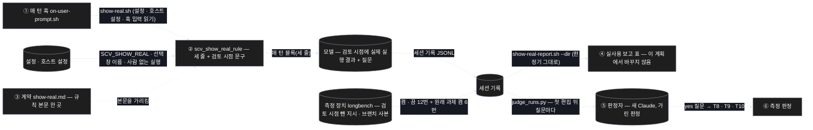
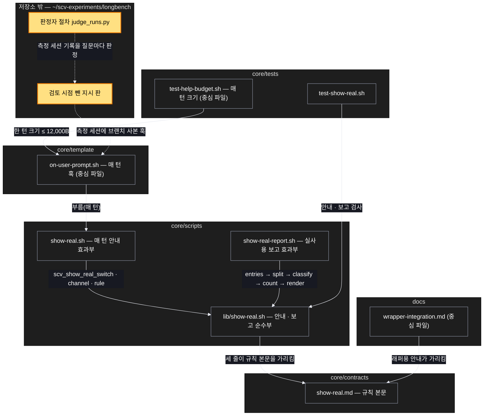

# Architecture — 검토 시점에 실제 결과 보여 주기 — 실체 보여 주기 다시 재기

> Two-diagram view of this feature. **Review and edit before `/scv:work`** —
> diagrams are LLM-generated and may have inaccuracies.

## 1. Component data flow

매 턴 안내가 검토 시점 문구를 싣고, 저장소 밖 측정 장치가 켬 · 끔을 재며, 판정자(새 Claude)가 질문마다 판정한다 — 판정기 개선은 뺐다(2026-10-10).



## 2. Position in whole architecture

Where this feature sits in the system. New components highlighted in yellow.

> Source: scv graph (built 2026-10-09)



## 3. Screen mockups

### 매 턴 안내 — 검토 시점 문구

```screen
{
  "title": "매 턴 안내 — 실체 보여 주기 세 줄",
  "body": [
    { "type": "header", "title": "[SCV 실체 보여 주기]", "subtitle": "결과물이 바뀌는 일이면 처음 돌아가는 순간에 가장 작은 것을 실제로 실행한다", "marker": "1" },
    { "type": "text", "value": "<둘째 줄 — 사용자가 검토 시점을 정해 두었으면 그 시점을 지키고, 그때 요약 대신 실제로 돌린 결과(명령 출력 · 함수 호출 결과)를 그대로 보이고 묻는다. 정확한 문구는 구현에서 정한다>", "marker": "2" },
    { "type": "text", "value": "결과물이 바뀌지 않는 일은 보여 주지도 묻지도 말고 '결과물 변화 없음'이라고 적는다", "marker": "3" }
  ],
  "functions": [
    { "marker": "1", "title": "첫째 줄 — 언제", "step": "scv_show_real_rule",
      "notes": ["지금과 같음 — 결과물이 바뀌는 일, 처음 돌아가는 순간"] },
    { "marker": "2", "title": "둘째 줄 — 검토 시점과 묻는 통로", "step": "scv_show_real_rule",
      "notes": ["사용자가 정한 검토 시점(예: '구현 한 덩어리마다 커밋하고 검토 요청')은 그대로 — 앞당기지 않는다", "그 시점에 요약 대신 실제로 돌린 결과를 그대로 보인다", "묻는 통로는 지금과 같음 — 선택 창(보기 2개 이상) · 글 질문 한 번 · 사람이 없으면 보고에 남김"] },
    { "marker": "3", "title": "셋째 줄 — 결과물 변화 없음",
      "notes": ["지금과 같음 — 보여 주지도 묻지도 않는다"] }
  ],
  "validations": [
    { "marker": "1, 2, 3", "when": "매 턴", "condition": "SCV_SHOW_REAL=off", "message": "세 줄을 싣지 않음 — 이 기능 전과 바이트 단위로 같음", "shownAs": "없음" },
    { "marker": "2", "when": "매 턴", "condition": "사람 없는 실행 · 자동 알림 턴", "message": "묻지 않고 실제 결과를 보고에 남김", "shownAs": "보고" },
    { "marker": "2", "when": "검토 시점", "condition": "돌려 볼 수 없음(실행 환경 없음 등)", "message": "못 돌린 이유를 한 줄로 밝히고 지금처럼 묻는다 — 실제 결과로 꾸미지 않음", "shownAs": "답의 한 줄" },
    { "marker": "1, 2, 3", "when": "매 턴", "condition": "한 턴 출력 크기", "message": "12,000바이트 이하(클로드 래퍼 기준 지금 11,336)", "shownAs": "크기 검사" }
  ]
}
```

### 실사용 보고 판정 — 이 계획에서 뺌

> 순서 판정(편집 → 실행 → 결과를 보인 뒤 질문)을 만들어 정답 표본 40개로 쟀으나 잘못 잡음 7개(기준 2 이하)로 미달이라
> 되돌렸다(사용자 결정, 2026-10-10). 실사용 보고 판정은 개발 브랜치 그대로이고, 이번 측정은 판정자가 판정한다.

### 측정 — 검토 시점 뺀 과제 켬 · 끔 + 원래 과제

```screen
{
  "title": "측정 — 저장소 밖 장치(longbench)",
  "diagram": [
    { "label": "순서", "code": "sequenceDiagram\n  autonumber\n  participant P as ① 준비\n  participant R as ② · ③ 실행\n  participant J as ④ 판정\n  P->>P: 기준 · 정답 표본 · 멈춤 문턱 고정\n  P->>R: 검토 시점 뺀 지시 판 · 브랜치 사본\n  R->>R: 뺀 과제 켬 6 · 끔 6\n  R->>R: 원래 과제 켬 6\n  R->>J: 세션 기록 · 숨은 테스트\n  alt 목표 달성 · 문턱 안\n    J-->>P: 코어 릴리스 → 두 래퍼\n  else 못 미침 · 문턱 넘음\n    J-->>P: 멈추고 사용자와 다시 정함\n  end" }
  ],
  "functions": [
    { "marker": "1", "title": "준비 — 돌리기 전에 고정",
      "notes": ["6과제 지시에서 '커밋 뒤 검토 요청' 줄만 뺀 판, 원래 지시와의 차이 기록", "판정 기준 · 정답 표본 40 · 멈춤 문턱을 기준 문서에", "브랜치 사본은 측정 세션에만 — 사용자 설치본은 건드리지 않음"] },
    { "marker": "2", "title": "효과 측정",
      "notes": ["검토 시점 뺀 6과제 × 켬 · 끔 × 1번 = 12번, 같은 과제는 하나씩", "끔 = 같은 사본에서 SCV_SHOW_REAL=off"] },
    { "marker": "3", "title": "문구 측정",
      "notes": ["원래 6과제 × 켬 1번 = 6번", "검토 창 앞 실제 실행 결과 · 첫 검토 창 앞당김 여부", "비교는 T9(0.66.0) 기록"] },
    { "marker": "4", "title": "판정",
      "notes": ["판정자(새 Claude)가 첫 편집 뒤 질문마다 — 절차는 결과를 열기 전에 고정", "숨은 테스트(v2) · 선택 창 수 · 실행 시간도 함께"] }
  ],
  "validations": [
    { "marker": "2, 4", "when": "판정", "condition": "실제 결과를 먼저 보여 준 과제", "message": "켬 4/6 이상 · 끔보다 3 이상", "shownAs": "T8" },
    { "marker": "3, 4", "when": "판정", "condition": "검토 창 앞 실제 실행 결과", "message": "4/6 이상 · 첫 검토 창 앞당김 0", "shownAs": "T9" },
    { "marker": "2, 4", "when": "판정", "condition": "숨은 테스트", "message": "켬이 끔보다 2과제 이상 덜 통과하면 멈춤", "shownAs": "T10" },
    { "marker": "2, 4", "when": "판정", "condition": "실행당 선택 창 수 · 실행 시간 중앙값", "message": "1.5배 이상이면 멈춤", "shownAs": "T10" },
    { "marker": "2, 3", "when": "실행 중", "condition": "장치 고장(세션 시작 실패 · 기록 없음 · 관리자 실패)", "message": "그 실행만 다시", "shownAs": "기준 문서" }
  ]
}
```
