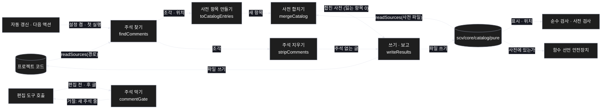
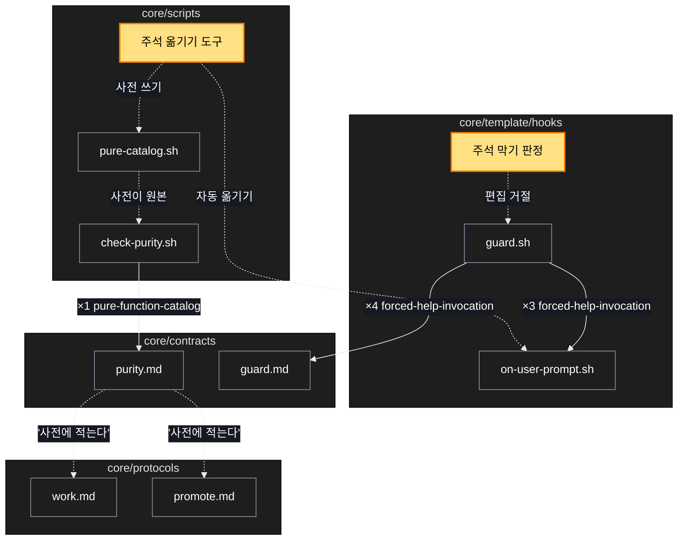

# Architecture — 코드 주석을 없애고 순수 함수 사전에만

> 두 장의 그림. **`/scv:work` 전에 검토하고 고칠 것** — 모델이 그린 그림이라 틀린 곳이 있을 수 있음.

## 1. 구성 흐름

```mermaid
%%{init: {'theme':'base', 'themeVariables': {'primaryColor':'#1e1e1e','primaryTextColor':'#fff','primaryBorderColor':'#9096a8','lineColor':'#e7e9f0','secondaryColor':'#2d2d2d','tertiaryColor':'#1e1e1e','background':'#171922','edgeLabelBackground':'#171922'}}}%%
flowchart LR
  Code[(프로젝트 코드)] -->|"readSources(경로)"| Find[주석 찾기<br>findComments]
  Catalog[(scv/core/catalog/pure)] -->|"readSources(사전 파일)"| Merge[사전 합치기<br>mergeCatalog]
  Find -->|"조각 · 위치"| ToEntry[사전 항목 만들기<br>toCatalogEntries]
  ToEntry -->|"새 항목"| Merge
  Find -->|"조각"| Strip[주석 지우기<br>stripComments]
  Merge -->|"합친 사전 (잃는 항목 0)"| Write[쓰기 · 보고<br>writeResults]
  Strip -->|"주석 없는 글"| Write
  Write -->|"파일 쓰기"| Code
  Write -->|"파일 쓰기"| Catalog
  Edit[편집 도구 호출] -->|"편집 전 · 후 글"| Gate[주석 막기<br>commentGate]
  Gate -->|"거절: 새 주석 줄"| Edit
  Catalog -->|"표시 · 위치"| Purity[순수 검사 · 사전 검사]
  Catalog -->|"사전에 있는가"| Decl[함수 선언 안전장치]
  AutoSync[자동 갱신 · 다음 액션] -->|"설정 켬 · 첫 실행"| Find
```

## 2. 전체 속 위치

새 부품은 노란색.

> Source: scv graph (built 2026-11-22)

```mermaid
%%{init: {'theme':'base', 'themeVariables': {'primaryColor':'#1e1e1e','primaryTextColor':'#fff','primaryBorderColor':'#9096a8','lineColor':'#e7e9f0','secondaryColor':'#2d2d2d','tertiaryColor':'#1e1e1e','background':'#171922','edgeLabelBackground':'#171922'}}}%%
flowchart TB
  subgraph "core/scripts"
    PC[pure-catalog.sh]
    CP[check-purity.sh]
    MIG[주석 옮기기 도구]:::new
  end
  subgraph "core/template/hooks"
    GD[guard.sh]
    UP[on-user-prompt.sh]
    CG[주석 막기 판정]:::new
  end
  subgraph "core/contracts"
    PU[purity.md]
    GM[guard.md]
  end
  subgraph "core/protocols"
    WK[work.md]
    PR[promote.md]
  end
  CP -->|"×1 pure-function-catalog"| PU
  GD -->|"×4 forced-help-invocation"| GM
  GD -->|"×3 forced-help-invocation"| UP
  MIG -.->|"사전 쓰기"| PC
  CG -.->|"편집 거절"| GD
  PC -.->|"사전이 원본"| CP
  MIG -.->|"자동 옮기기"| UP
  PU -.->|"'사전에 적는다'"| WK
  PU -.->|"'사전에 적는다'"| PR
  classDef new fill:#FFE082,stroke:#F57C00,stroke-width:2px,color:#000
```
