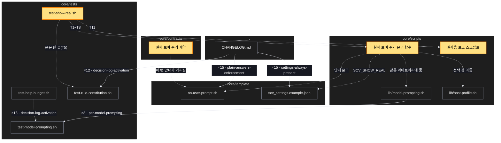

# Architecture — 처음 돌아가는 순간 실제 결과를 보여 주기 — 대충 말해도 원하는 결과로

> Two-diagram view of this feature. **Review and edit before `/scv:work`** —
> diagrams are LLM-generated and may have inaccuracies.

## 1. Component data flow

설정 · 호스트 프로필에서 매 턴 안내가 만들어져 세션에 실리고(막는 검사 없음), 세션 기록을 읽는 실사용 보고가 켜기 전 · 켠 뒤 세 숫자를 표 한 장으로 낸다. 설치본 확인은 저장소 밖 긴 과제 장치로 한다.

```mermaid
%%{init: {'theme':'base', 'themeVariables': {'primaryColor':'#1e1e1e','primaryTextColor':'#fff','primaryBorderColor':'#9096a8','lineColor':'#e7e9f0','secondaryColor':'#2d2d2d','tertiaryColor':'#1e1e1e','background':'#171922','edgeLabelBackground':'#171922'}}}%%
flowchart LR
  Settings[설정 파일] -->|"SCV_SHOW_REAL 원문"| ReadSwitch[readShowRealSwitch]
  Profile[호스트 프로필] -->|"선택 창 이름"| PickChannel[pickConfirmChannel]
  ReadSwitch -->|"on · off"| BuildRule[buildShowRealRule]
  PickChannel -->|"choice · text"| BuildRule
  BuildRule -->|"계약 경로를 가리킴"| Contract[실체 보여 주기 계약]
  BuildRule -->|"안내 문구 (off 면 빈 값)"| PromptHook[매 턴 훅]
  PromptHook -->|"추가 컨텍스트"| Session[(Claude Code 세션)]
  Session -->|"대화 기록"| Transcripts[(세션 기록)]
  Transcripts -->|"기간별 기록 항목"| Split[splitSessions]
  Split -->|"사람 턴 묶음"| Classify[classifyTurns]
  Classify -->|"턴마다 표시"| Count[countShowReal]
  Count -->|"기간별 세 숫자"| Render[renderReport]
  Render -->|"표 한 장 (켜기 전 · 켠 뒤)"| ReportOut[실사용 보고 출력]
  Bench[(긴 과제 장치 — 저장소 밖)] -->|"과제 6개 × 1번 (T9)"| Session
```



## 2. Position in whole architecture

이 기능이 SCV 전체에서 닿는 곳. 새 부분은 노란색, 새 연결은 점선.

> Source: scv graph (built 2026-10-06)



## 3. Screen mockups

### 처음 돌아가는 결과 — 확인 창

```screen
{
  "title": "처음 돌아가는 결과 — 확인 창",
  "body": [
    { "type": "header", "title": "처음 돌아가는 결과", "subtitle": "가장 작은 것을 실제로 실행한 결과입니다. 이대로 계속할까요, 고칠 점이 있나요?", "marker": "1" },
    { "type": "card", "title": "실행 결과 (그대로)", "marker": "2", "body": [
      { "type": "text", "value": "$ <가장 작은 실행 명령>" },
      { "type": "text", "value": "<실제 출력의 첫 몇 줄>" }
    ] },
    { "type": "button", "label": "1. 이대로 계속 (추천)", "variant": "primary", "marker": "A" },
    { "type": "button", "label": "2. 고칠 점이 있어요", "marker": "B" },
    { "type": "text", "value": "직접 입력 — 고칠 점을 한 번에", "marker": "C" }
  ],
  "functions": [
    { "marker": "1", "title": "짧은 질문", "step": "buildShowRealRule",
      "notes": ["결과물이 바뀌는 일에서, 처음 돌아가는 순간에", "설명은 한두 줄", "결과물이 바뀌지 않는 일에는 뜨지 않음 — '결과물 변화 없음'만 적음"] },
    { "marker": "2", "title": "실행 결과",
      "notes": ["실제로 실행한 결과 그대로 — 지어낸 예시가 아님", "크면 첫 몇 줄과 전체 위치", "글이 아니면(화면 · 이미지) 실제로 띄운 화면, 또는 종류 · 크기 · 여는 법", "아직 돌릴 것이 없으면 돌아가는 첫 순간까지 미룸"] }
  ],
  "actions": [
    { "marker": "A", "title": "이대로 계속", "notes": ["다음 단계로 진행"] },
    { "marker": "B", "title": "고칠 점이 있어요", "notes": ["고칠 점을 듣고 고친 뒤 다시 실제 결과를 보여 줌"] },
    { "marker": "C", "title": "직접 입력", "notes": ["고칠 점을 글로 한 번에"] }
  ],
  "validations": [
    { "marker": "A, B", "when": "창을 띄울 때", "condition": "보기 수", "message": "보기는 2개 이상 — 하나짜리 창은 만들지 않음", "shownAs": "선택 창" },
    { "marker": "1", "when": "매 턴", "condition": "선택 창 이름이 없는 호스트(코덱스 모양)", "message": "글 질문 한 번으로 같은 확인", "shownAs": "답 끝의 질문" },
    { "marker": "1", "when": "설정", "condition": "SCV_SHOW_REAL=off", "message": "안내를 싣지 않음 — 지금 SCV 와 같은 동작", "shownAs": "없음" },
    { "marker": "1", "when": "결과물이 안 바뀌는 일", "condition": "내부 결함 수정 · 구조 정리", "message": "보여 주지도 묻지도 않고 '결과물 변화 없음'", "shownAs": "답의 한 줄" },
    { "marker": "1", "when": "무인 실행", "condition": "자동 알림으로 이어진 턴", "message": "묻지 않고, 보여 준 결과를 보고에만 남김", "shownAs": "보고" },
    { "marker": "2", "when": "결과를 보일 때", "condition": "비밀값 · 개인 정보가 들어 있음", "message": "기존 가림 필터로 가린 뒤 보임", "shownAs": "실행 결과" }
  ]
}
```

### 매 턴 안내 조립

```screen
{
  "title": "매 턴 안내 조립 (훅)",
  "screenRefs": [
    { "calls": "1", "name": "매 턴 훅 — 사람 메시지마다", "element": "사람이 보낸 메시지", "when": "자동 알림이 아닌 사람 턴" }
  ],
  "diagram": [
    { "label": "구성", "code": "flowchart LR\n  S[\"설정 파일\"] --> A[\"① readShowRealSwitch\"]\n  P[\"호스트 프로필\"] --> B[\"② pickConfirmChannel\"]\n  A --> C[\"③ buildShowRealRule\"]\n  B --> C\n  C --> D[\"④ 매 턴 훅 출력\"]" },
    { "label": "순서", "code": "sequenceDiagram\n  autonumber\n  participant U as 사람 메시지\n  participant H as 매 턴 훅\n  participant L as 순수 함수\n  U->>H: 메시지\n  H->>L: 설정 원문 · 선택 창 이름\n  alt 설정 off\n    L-->>H: 빈 값 (지금 SCV 와 같은 출력)\n  else 켬\n    L-->>H: 안내 문구 (선택 창 보기 2개 이상 또는 글 질문)\n  end\n  H-->>U: 추가 컨텍스트" }
  ],
  "functions": [
    { "marker": "1", "title": "readShowRealSwitch", "step": "readShowRealSwitch", "notes": ["설정 원문 → on · off", "없거나 엉뚱한 값은 on, off(대소문자 무관)만 off"] },
    { "marker": "2", "title": "pickConfirmChannel", "step": "pickConfirmChannel", "notes": ["선택 창 이름 → choice · text", "빈 값이면 text(글 질문 한 번)"] },
    { "marker": "3", "title": "buildShowRealRule", "step": "buildShowRealRule", "notes": ["on · off, choice · text → 두세 줄 문구", "off 면 빈 값, 자세한 본문은 계약을 가리킴"] },
    { "marker": "4", "title": "매 턴 훅 출력", "notes": ["문구를 추가 컨텍스트로 내보냄 — 부수효과(출구)", "종료 훅에는 아무것도 더하지 않음 — 막는 검사 없음"] }
  ],
  "validations": {
    "title": "설정 · 호스트별 결과",
    "columns": ["번호", "조건", "결과", "비고"],
    "rows": [
      ["1", "설정 없음", "on", "기본 켬"],
      ["1", "OFF · off", "off", "지금 SCV 와 같은 출력(바이트 단위)"],
      ["2", "선택 창 이름 없음(코덱스 모양)", "text", "글 질문 한 번"],
      ["3", "off", "빈 값", "블록에 아무것도 더하지 않음"]
    ]
  }
}
```

### 실사용 보고

```screen
{
  "title": "실사용 보고 (스크립트)",
  "screenRefs": [
    { "calls": "5", "name": "실사용 보고 — 사람이 명령으로 돌림", "element": "보고 명령(켜기 전 · 켠 뒤 기간)", "when": "켠 뒤 며칠이 지났을 때(기간은 사용자와 정함)" }
  ],
  "diagram": [
    { "label": "구성", "code": "flowchart LR\n  T[(\"⑤ 세션 기록 읽기\")] --> S[\"⑥ splitSessions\"]\n  S --> C[\"⑦ classifyTurns\"]\n  C --> N[\"⑧ countShowReal\"]\n  N --> R[\"⑨ renderReport\"]\n  R --> O[\"⑩ 보고 출력\"]" },
    { "label": "순서", "code": "sequenceDiagram\n  autonumber\n  participant P as 사람\n  participant X as 보고 스크립트\n  participant F as 순수 단계\n  P->>X: 켜기 전 · 켠 뒤 기간\n  X->>X: 세션 기록 읽기 (입구)\n  X->>F: 기록 항목들\n  F-->>X: 기간별 세 숫자 · 표\n  X-->>P: 표 한 장 (출구)" }
  ],
  "functions": [
    { "marker": "5", "title": "세션 기록 읽기", "notes": ["사용자 자신의 세션 기록만, 기간 안의 것만 — 부수효과(입구)"] },
    { "marker": "6", "title": "splitSessions", "step": "splitSessions", "notes": ["기록 항목 → 사람 턴 단위 묶음"] },
    { "marker": "7", "title": "classifyTurns", "step": "classifyTurns", "notes": ["턴마다 결과물 변화 · 첫 실제 결과 표시 · 완료 보고 · 이후 수정 요구 · 확인 창 표시"] },
    { "marker": "8", "title": "countShowReal", "step": "countShowReal", "notes": ["기간별 세 숫자 — (a) 보여 준 비율 (b) 완료 뒤 수정 요구 (c) 확인 창 수"] },
    { "marker": "9", "title": "renderReport", "step": "renderReport", "notes": ["숫자 → 표 한 장(켜기 전 · 켠 뒤)"] },
    { "marker": "10", "title": "보고 출력", "notes": ["표를 출력 — 부수효과(출구)"] }
  ],
  "validations": {
    "title": "보고 표 모양 · 지킬 것",
    "columns": ["번호", "칸", "단위", "비고"],
    "rows": [
      ["8", "결과물이 바뀐 일 중 처음 돌아가는 결과를 보여 준 비율", "기간마다", "(a)"],
      ["8", "완료 보고 뒤에 나온 사용자 수정 요구", "세션당", "(b) — 줄어드는지 본다"],
      ["8", "확인 창 수", "세션당", "(c) — 늘어난 정도를 본다"],
      ["10", "보고 내용", "—", "다른 프로젝트 내용 · 메일 주소 · 비밀값 없음(공개 저장소)"]
    ]
  }
}
```
